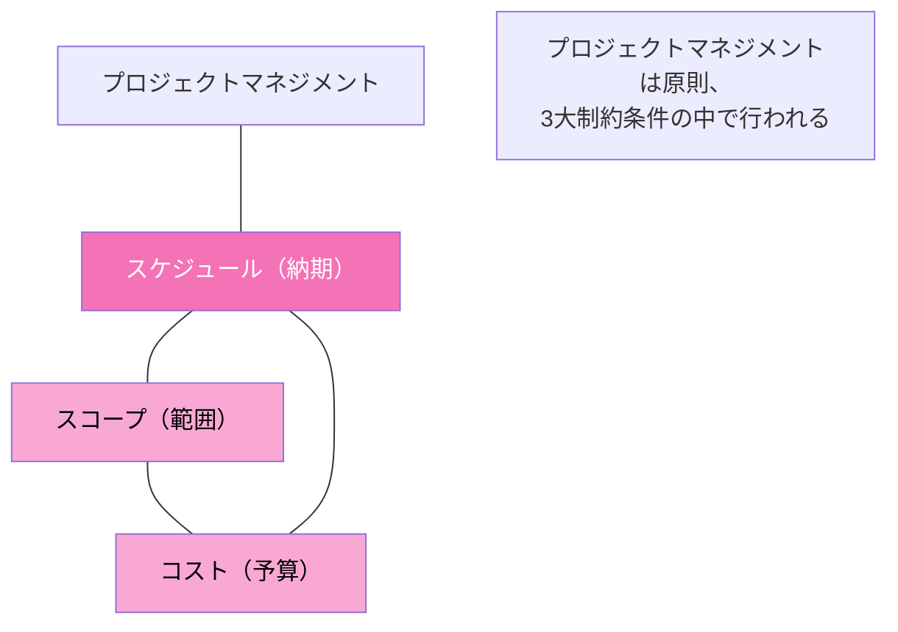
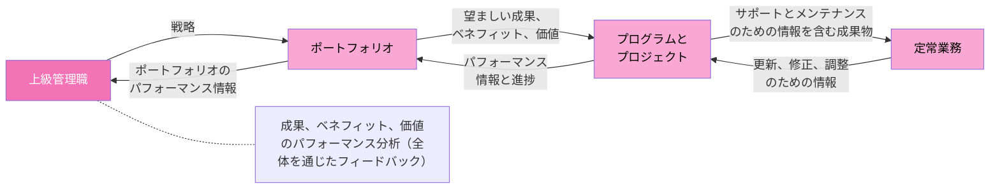
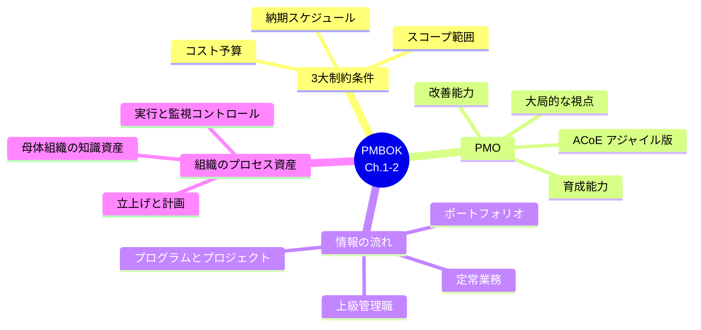

# PMBOK ナレッジノート（Chapter 1〜2：プロジェクトの基本／価値実現システム）

---

## 1. プロジェクトマネジメントで重視する3大制約条件

プロジェクトでは、**有期性（納期）**が重要な要素です。しかし、納期までに成果物を開発するためには、「スコープ（範囲）」と「コスト（予算）」という要素も考慮する必要があります。

> **納期・スコープ・コスト**の3つをまとめて「プロジェクトの3大制約条件」といいます。
> 一般的に **QCD**（Q: Quality＝品質、C: Cost＝コスト、D: Delivery＝スケジュール）とも呼ばれます。

プロジェクトマネジメントにおいては、3大制約条件のバランスを保ちながら、成果物を効果的に開発することが求められます。

なお、これらの3大制約条件は、プロジェクトで採用する**開発アプローチ（開発法）**により、重視される要素が異なります。

### 3大制約条件の関係図

### まとめ
- プロジェクトマネジメントは業種や職種を問わず、多くの業務で利用されている
- プロジェクトの3大制約条件は、**スケジュール・スコープ・コスト**の3つである
- 開発アプローチにより、重視する制約条件は異なる

---

## 2. PMOに求められる能力

**PMO**は「プロジェクト・マネジメント・オフィス」という意味だけでなく、以下のような意味を持つこともあります。
- ポートフォリオ・マネジメント・オフィス
- プロダクト・マネジメント・オフィス

PMBOK Guideでは、PMOには以下のような特定の能力が必要であるとしています。

| 能力 | 内容 |
|---|---|
| **育成能力** | さまざまなプロジェクトマネジメントのスキルなどを理解・開発・応用し、評価できるという、実現能力および成果思考の能力を育成する能力 |
| **大局的な視点** | 個々のプロジェクトの成果だけに着目するのではなく、組織全体の成功という大局的な視点を維持する能力 |
| **改善能力** | 各プロジェクトから得られた貴重な知識を移転するために、組織全体でプロジェクトの結果を定期的に共有し、将来のプロジェクト実施を強化する活動を改善する能力 |

### 補足：ACoE（Agile Center of Excellence）
アジャイル型開発を進める組織では、PMOと同じ立場としてACoEを配置している場合もあります。ACoEは、チームのコーチング、組織全体でのアジャイルスキルの構築などの支援に重きを置く管理部門です。

### まとめ
- PMOとは、プロジェクトが適切に進んでいることを確認する部門のこと
- PMOはさまざまな形態がある
- PMOには、**育成能力・大局的な視点の維持・将来のプロジェクト実施を強化する活動の改善**などの能力が求められる

---

## 3. 情報の流れ（Chapter 2 - Sec.09）

価値実現システムの効果を高めるためには、**情報の流れ**が重要になります。価値実現システムはガバナンスと連携することで、適切なプロダクトが提供できるようになります。

仮にプロジェクトマネジャーであれば、求められる成果を上司から提示され、その成果に向けてプロジェクトを進行させていきます。またプロジェクトの状況や進捗を上司へ報告していくことになります。

プロジェクトで成果物が完成したら、プロジェクトマネジャーは定常業務を担当するステークホルダーへ、そのあとのサポートを依頼します。また、そのステークホルダーが成果物を利用したことで、何かしらの調整や修正が必要になった場合、その依頼をプロジェクトチームに伝えます。

### 情報の流れ図

**ポイント**：情報は「上から下（戦略・望ましい成果）」と「下から上（進捗・パフォーマンス情報）」の**双方向**で流れる。

---

## 4. 組織のプロセス資産の具体例（Chapter 2）

**組織のプロセス資産**とは、過去に実施されたプロジェクトの情報など、これから実施するプロジェクトで利用できそうな内部資源のことです。自身のプロジェクトではどのようなプロセス資産を利用しているのかを考えながら確認しましょう。

### 組織のプロセス資産の具体例

| 種類 | 内容 |
|---|---|
| **プロジェクトの立ち上げと計画で利用できるもの** | ・ベンダーのリスト ・計画書などのテンプレート ・母体組織の品質に対する方針 ・プロジェクトの進め方（プロジェクトライフサイクル）など |
| **プロジェクトの実行と監視・コントロールで利用できるもの** | ・課題が発生した場合の対処法 ・資源の管理方法 ・課題管理表などのテンプレート ・標準化された作業の進め方 など |
| **母体組織の知識資産** | ・労務時間のデータ ・予算などの財務データ ・構成管理手順などのデータ ・過去のプロジェクトで得られた教訓 など |

上記の表からわかるように、組織のプロセス資産はプロジェクトの立ち上げから実行・監視コントロールに至るまで、さまざまな場面で重要になるものです。また、プロジェクト業務をスムーズに進めるためには、**過去のプロジェクトの蓄積をデータとして保存し、このような組織のプロセス資産として利用できるようにする**必要があります。

### まとめ
- 組織のプロセス資産とは、過去に実施されたプロジェクトの情報など、これから実施するプロジェクトで利用できそうな内部資源のこと
- はじめてのプロジェクトでも、組織のプロセス資産を利用している
- 過去のプロジェクトの蓄積をデータとして保存することが重要である

---

## 全体まとめ（クイックリファレンス）

