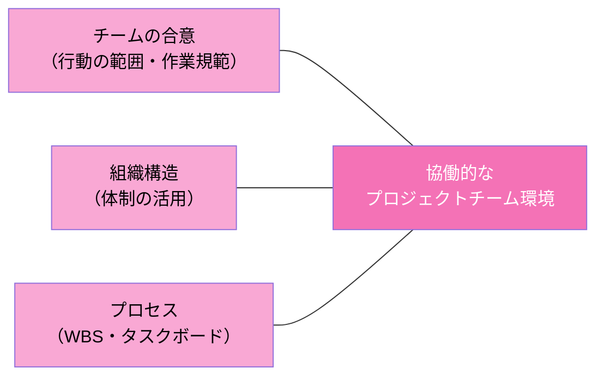
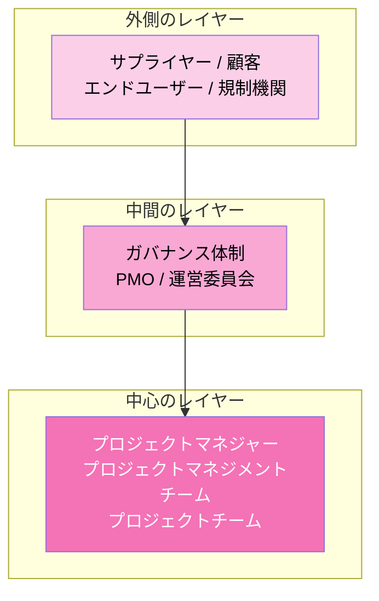
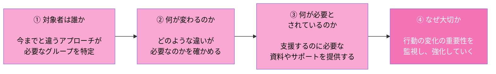
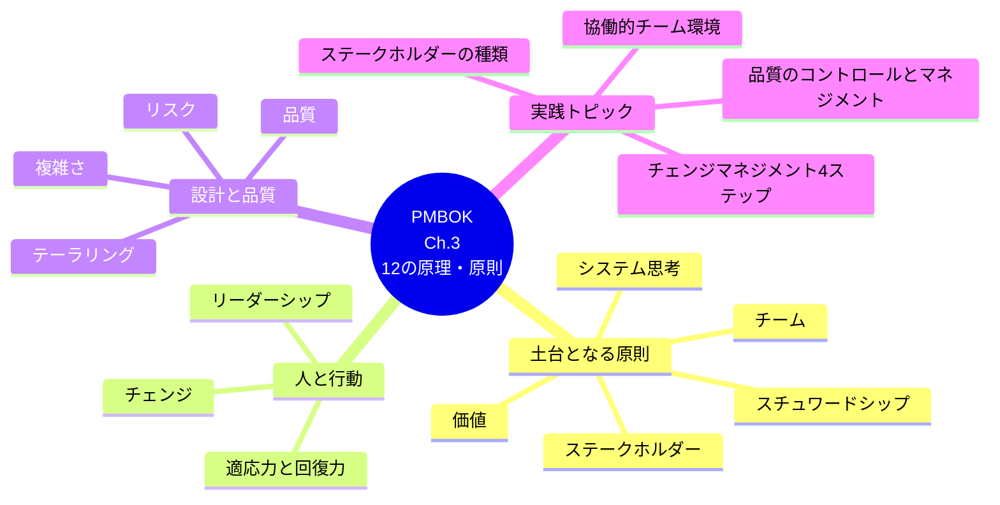

# PMBOK ナレッジノート（Chapter 3：プロジェクトマネジメント標準 - 12の原理・原則）

---

## 1. 12の原理・原則の概要

12の原理・原則はプロジェクトマネジメントの土台となる考え方であり、実業務の振り返りとして利用できます。あらゆるプロジェクト実務者のフィードバックをもとに作成されたものであり、**優先順位がなく、重なりがある**のが特徴です。

| No. | 原理・原則 | 概要 |
|---|---|---|
| 1 | **スチュワードシップ** | 誠実さ、コンプライアンス遵守など、プロジェクトマネジャーに求められるもの |
| 2 | **チーム** | プロジェクトは1人ではなく、チームによって実行される |
| 3 | **ステークホルダー** | ステークホルダーを特定・分析し、効果的に関わる |
| 4 | **価値** | 何を提供するのか、また、ベネフィットは継続的に評価されている |
| 5 | **システム思考** | 変更が発生したらプロジェクト内のあらゆるところに影響が出るなど、プロジェクト内における構成要素の関係性 |
| 6 | **リーダーシップ** | 個人とチームのニーズに対応するために、ビジョン、動機付け、励まし、共感などにより影響を与える |
| 7 | **テーラリング** | プロジェクトの状況に合わせて、開発アプローチを設計する |
| 8 | **品質** | 開発する成果物は、ステークホルダーの受入基準を満たしている必要がある |
| 9 | **複雑さ** | 人の影響や、新しいことに臨むことで、プロジェクトの複雑さは増し、その複雑性に対応する必要がある |
| 10 | **リスク** | リスクに対してどのように臨むのか、許容度はどの程度なのか。継続的にリスクに晒されている状態を評価する |
| 11 | **適応力と回復力** | プロジェクトには変化が発生するため、柔軟性が必要である |
| 12 | **チェンジ** | プロジェクトの成果により、母体組織にはあらゆる変化が発生する。影響を受ける人には継続的にアプローチする |

### まとめ
- 12の原理・原則はプロジェクトマネジメントの土台となる考え方であり、実業務の振り返りとして利用できる
- 12の原理・原則はあらゆるプロジェクト実務者のフィードバックをもとに作成されたものである
- 12の原理・原則には優先順位がなく、重なりがある

---

## 2. 協働的なチーム環境を構築するために必要な要素

協働的なプロジェクトチーム環境の構築には、**チームの合意・組織構造・プロセス**の3つの要素が必要とされています。

| 3つの要素 | 概要 |
|---|---|
| **チームの合意** | 「何をもって合意となるのか」という、行動の範囲や作業規範などのチームのルールのこと。プロジェクトの開始時に明確にし、合意を取りながらプロジェクトを進める。また、チームの合意は状況に応じてアップデートされる |
| **組織構造** | プロジェクトの進行に合わせて、組織構造を上手に利用する必要がある。たとえば、プロジェクトチームで成果物を開発したあとで、テストの実施や出荷判定をする組織などを組成する場合もある |
| **プロセス** | プロジェクトにおいて、タスクを明確にするためにWBS（Work Breakdown Structure：作業分解構成図）やタスクボードを利用し、チーム内で誰が、何を、いつまでに行うかを共通認識として定義する |

上記の表を見てわかるように、協働的なチーム環境を構築するためには、**プロジェクトの開始時に合意の方法を定義し、誰が何をするのかを明確にして、組織を上手に利用すること**が必要となります。

### まとめ
- プロジェクトチームは、多様なスキルや知識、経験を行使する個人から構成される
- チームの合意とは、何をもって合意となるのかという行動の範囲や作業規範などのチームのルールのことであり、プロジェクトの開始時に明確にする必要がある
- 協働的なプロジェクトチーム環境の構築には、チームの合意・組織構造・プロセスの3つの要素を含む

---

## 3. ステークホルダーの種類

PMBOK Guideには「ステークホルダーを特定し、分析し、プロジェクトの最初から最後まで積極的に関与してもらうようにすると、成功につながりやすくなる」という記述があります。積極的関与のことを**「エンゲージメント」**と表現する場合もあります。

プロジェクトにおいては、**各ステークホルダーがどのようにして、いつ、どのくらいの頻度で、どのような状況で関与したいと思っているのかを見極めること**も必要です。

### ステークホルダーの種類（同心円構造）

中心に近いほどプロジェクトへの関与度・実行責任が高く、外側に行くほど間接的な関係者（顧客・規制機関など）になります。

### まとめ
- ステークホルダーは、影響を受けると感じるプロジェクト関係者（個人、グループ、組織）のことを指す
- ステークホルダーであるという認識は主観である
- プロジェクトの期間中、ステークホルダーに積極的に関与してもらうと、成功につながりやすい

---

## 4. リーダーシップスキルを高める方法

リーダーシップは**誰でも持てるスキル**です。PMBOK Guideでは、メンバーが以下のスキルや技法を組み合わせて実践することで、リーダーシップの洞察力を深められると説明しています。

- チームを合意された目標に注力させる
- プロジェクトの成果へ動機付けるビジョンを明確にする
- 最善の進め方について合意形成する
- プロジェクトの進行への阻害要因を克服する
- プロジェクトで発生した対立（コンフリクト）を解決する
- 仲間であるメンバーにコーチングなどを行う
- 前向きな振る舞いや貢献を評価する
- スキルを高める機会を提供する
- 協働的な意思決定を促進する
- 効果的なコミュニケーションと積極的傾聴法を適用する
- チームメンバーに責任と権限を与える

### まとめ
- リーダーシップは、望ましい成果を目指すプロジェクトチームの内外の人々に影響を与える態度、才能、特性、振る舞いから成る
- リーダーシップは、誰でも持つことができるスキルである
- プロジェクトに関わる誰もがリーダーシップを発揮することで、プロジェクトを円滑に進めることができる

---

## 5. 品質のコントロールと品質のマネジメント

プロジェクトにおいて、開発する成果物に対する品質を**成果物品質**といいます。また、プロジェクトの活動とプロセスが適切であることで確認できる品質を**プロジェクト品質**といいます。この両方を満たすことで、高品質を提供することが可能になります。

- 成果物品質を担保するためには **品質のコントロール** を実施
- プロジェクト品質を担保するためには **品質のマネジメント** を実施

なお、PMOなどの管理部門がプロジェクトチームを招集し、作業状況を確認する会議やレビューを実施するケースがあります。そのような会議やレビューは、主にプロジェクト品質を担保するために実施します。

### 品質のコントロール vs 品質のマネジメント

| 要素 | 品質のコントロール | 品質のマネジメント |
|---|---|---|
| **働き** | 品質基準を比較し、開発した成果物が要求事項を満たしていることを評価する | 作業プロセスの妥当性を評価する |
| **実施する部門** | プロジェクトチーム | 組織内の第三者（PMO、品質保証部） |
| **利用される手段** | テスト、検査 | 監査、レビュー |

### まとめ
- 品質とは、プロダクト、サービス、また所産の一群の特性が要求事項を満たしている度合いのこと
- 成果物品質とは、プロジェクトで開発する成果物に対する品質のこと
- プロジェクト品質とは、プロジェクトの活動とプロセスが適切であることで確認できる品質のこと

---

## 6. 複雑さをもたらす要因

複雑さは、プロジェクトの**どのタイミングでも発生する可能性**があります。

| 複雑さの要因 | 概要 |
|---|---|
| **人の振る舞い** | 人々の行動、物腰、態度、経験の組み合わせ。また、プロジェクトの目標と対立する個人の課題などの各人の主観的な要素、異なるタイムゾーンや話す言語、文化的規範 |
| **システムの振る舞い** | 異なるシステムを統合する場合、プロジェクトの成果や成功に影響を与える脅威を引き起こすなど、プロジェクトの要素間の相互依存 |
| **不確かさと曖昧さ** | 「不確かさ」とは、課題と出来事などの理解と認識が欠如しており、不明または予測不可能な状態のこと。「曖昧さ」とは、期待されていることや状況を把握する方法が不明で、最適な選択が明確でなく、選択肢がたくさんある状態のこと（例：初めて取引をする顧客から要求事項を明確に定められない状況は「不確かさ」と「曖昧さ」がある） |
| **技術革新** | プロジェクトの中で利用する新しい技術 |

### まとめ
- 複雑さとは、マネジメントするのが困難な、プロジェクトやプロジェクト環境の特性のこと
- 複雑さをもたらす要因には、人の振る舞い、システムの振る舞い、不確かさと曖昧さ、技術革新がある
- プロジェクトチームは、その複雑さの程度や影響を減らすように対処する必要がある

---

## 7. 適応力と回復力を支える能力

プロジェクトで適応力と回復力を備えるため、**コンティンジェンシー予備**（リスクに備えた予備費用）を用意することも1つの方法です。

- 迅速かつ短期にフィードバックを与え、行動の改善を繰り返し行うこと
- 各分野に詳しいメンバーが所属する、幅広い知識を持つチームであること
- 内外のステークホルダーへの関与を促す、オープンかつ透明性の高い計画があること
- アイデアをテストし、新たなアプローチを試すための小規模なプロトタイプと実験を進めていること
- 組織におけるオープンな対話があること
- 過去の取り組みや、類似または同様の取り組みによって学んだことにもとづく理解（教訓への理解）

これらはPMBOK Guideに記載されている内容の一部です。オープンな対話や透明性のある計画など、**ステークホルダーと協働できる適切な環境と、常に作業プロセスを見直して改善していること**が必要だとわかります。

### まとめ
- 適応力とは、変化する状況に対応する能力のこと
- 回復力とは、影響を緩和する能力と、挫折や失敗から迅速に回復する能力のこと
- 適応力と回復力を支える能力としては、ステークホルダーと協働できる適切な環境と、常に作業プロセスを改善していることが必要である

---

## 8. チェンジマネジメントとは

顧客などのプロジェクト依頼者は、「新しいシステムを利用できる」という理由だけで、新しいシステムの採用を望むわけではありません。大切なのは、使い慣れた古いシステムにこだわるより、**新しいシステムがもたらす恩恵のほうが重要である**と、顧客に判断してもらうことです。

その判断を促すため、プロジェクトチームは教育や新規システムの文書化などのツールを利用し、顧客が新しいシステムの恩恵を受けられるように支援して、変革を進めます。この変革は強制的ではなく、**動機付けのアプローチを採り入れて進める**必要があります。

> 現状から望ましい状態へと移行するための体系的なアプローチを**チェンジマネジメント**といいます。

### チェンジマネジメントのアプローチ（4ステップ）

このアプローチは、組織や人の状況に合わせたカスタマイズが可能です。

### まとめ
- すべてのステークホルダーが変化を受け入れることはないため、変革は挑戦的な課題である
- チェンジマネジメントとは、現状から望ましい状態に移行するための体系的なアプローチのこと
- 変革は強制的に進めるのではなく、動機付けのアプローチを採り入れる必要がある

---

## 全体まとめ（クイックリファレンス）

