# PMBOK ナレッジノート（Chapter 4：プロジェクトマネジメント標準 - 8つのパフォーマンス領域）

> PMBOK Guide 第7版で定義される「8つのパフォーマンス領域」（ステークホルダー／チーム／開発アプローチとライフサイクル／計画／プロジェクト作業／デリバリー／測定／不確かさ）を1本にまとめたナレッジノートです。

---

## 目次

1. 12の原理・原則とパフォーマンス領域の関係
2. ステークホルダー・パフォーマンス領域
3. チーム・パフォーマンス領域
4. 開発アプローチとライフサイクル・パフォーマンス領域
5. 計画・パフォーマンス領域
6. プロジェクト作業・パフォーマンス領域
7. デリバリー・パフォーマンス領域
8. 測定・パフォーマンス領域
9. 不確かさ・パフォーマンス領域
10. 4章 全体まとめ（クイックリファレンス）

---

## 1. 12の原理・原則とパフォーマンス領域の関係

PMBOK Guide 第7版では、プロジェクトの成果を効率的に提供するための行動指針として「12の原理・原則」を提示しています。この12の原理・原則にもとづいて定義されているのが「パフォーマンス領域」です。

### パフォーマンス領域とは

PMBOK Guide 第6版まではプロセスベースでしたが、さまざまな開発アプローチに対応するため、第7版ではパフォーマンス領域という考え方が採用されています。

> **パフォーマンス領域**とは、プロジェクトの成果を効果的に提供するために不可欠な、相互に関連する活動群のことです。

各パフォーマンス領域は相互に関連し合っており重なりがありますが、**優先順位や実施順番はありません**。

### パフォーマンス領域の概要（8つの領域）

| No. | パフォーマンス領域 | 概要 |
|---|---|---|
| 1 | **ステークホルダー** | ステークホルダーは誰か。エンゲージメントを高めるためにどのようにコミュニケーションを取るのが妥当なのか |
| 2 | **チーム** | リーダーシップとは何か。チームにどのような要素があるのか。権限を委譲し、内発的動機付けを意識して、感情的知性を利用する |
| 3 | **開発アプローチとライフサイクル** | 開発する成果物に応じて、予測型・適応型・ハイブリッド型の開発アプローチを利用する。開発アプローチにより成果物の提供頻度も変わる |
| 4 | **計画** | 開発アプローチにもとづき見積りをして、プロジェクトスケジュールを立案する。コミュニケーションや資源の計画についても立案する |
| 5 | **プロジェクト作業** | 制約条件のバランスを取り、ベンダーと契約を締結し、暗黙知を形式知にする |
| 6 | **デリバリー** | 成果物を定義してWBSを作成し、成果物品質を考慮して、開発した成果物を提供する |
| 7 | **測定** | アーンドバリューマネジメントやバーンダウンチャートなど進捗を確認するツールを利用して、作業状況を可視化し、プロジェクトの状況を測定する |
| 8 | **不確かさ** | 不確かさ、複雑さ、曖昧さ、リスクとは何か。リスクへの対応方法について検討する |

### まとめ
- パフォーマンス領域とは、プロジェクトの成果を効果的に提供するために不可欠な、相互に関連する活動群のこと
- 12の原理・原則とパフォーマンス領域は相互に関連している
- 各パフォーマンス領域に優先順位や順番はない

---

## 2. ステークホルダー・パフォーマンス領域

### ステークホルダーのエンゲージメントを高め、維持するには

ステークホルダーとの良好な関係を維持するためには、以下のようなサイクルを回し続ける必要があります。

ステークホルダーの特定は、主にプロジェクトの最初の段階で行います。しかし、プロジェクトの最初の段階ではあまり詳細な情報を得ていない場合もあり、プロジェクトに関わるすべてのステークホルダーを特定するのは困難です。とくにプロジェクト期間が長く、関わるステークホルダーが多い場合は、より難易度が上がります。そのため、**ステークホルダーの特定は、各工程で継続的に実施する必要があります**。

#### まとめ
- ステークホルダーとの良好な関係を維持するには、エンゲージメントサイクルを回し続ける必要がある
- ステークホルダーの特定は主にプロジェクトの最初の段階で行うが、各工程で継続的に実施する必要がある

---

### ステークホルダー分析①：セイリエンスモデル（突出モデル）

ステークホルダーを分析して、その結果を可視化するケースがあります。その際に利用する分析方法の1つが**セイリエンスモデル（突出モデル）**です。3つの観点からステークホルダーを分類する方法です。

| 観点 | 内容 |
|---|---|
| **権力** | 該当ステークホルダーがどの程度の権力を持っているのかという観点 |
| **正当性** | 該当ステークホルダーのプロジェクト参加の妥当性がどの程度あるのかという観点 |
| **緊急性** | 該当するステークホルダーが発言をした場合に、即時対応が必要であるのかという観点 |

3つの円が交差する部分（＝権力・正当性・緊急性のすべてを兼ね備える）にいるステークホルダーは、プロジェクトにおいてとくに重要な存在となります。

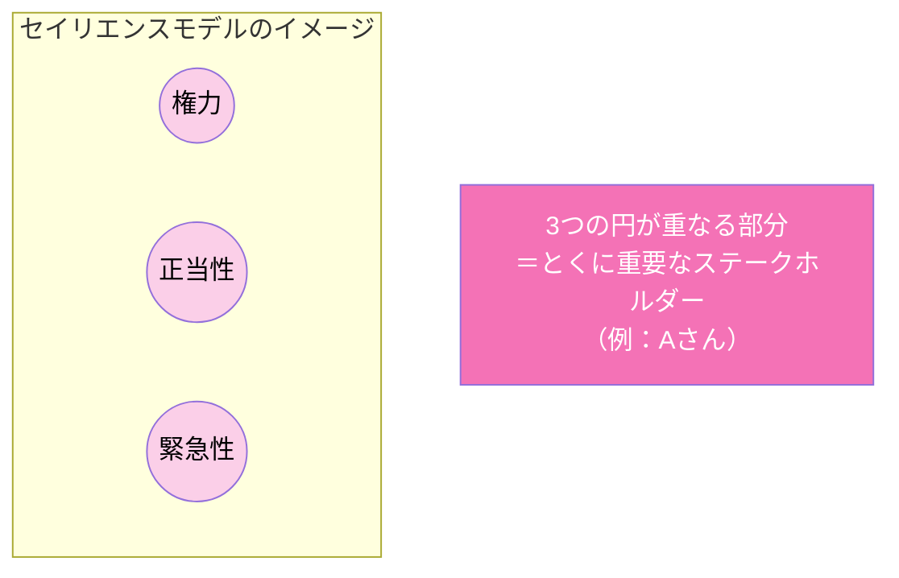

---

### ステークホルダー分析②：権力と関心度のグリッド

可視化の分析方法としては、セイリエンスモデルのほかに「**権力と関心度のグリッド**」があります。セイリエンスモデルとは異なり、こちらは権力と関心度の2軸でステークホルダーを分類します。**小規模なプロジェクトで、ステークホルダーとプロジェクトの関係が単純である場合**に有用とされています。

| | 関心度：低 | 関心度：高 |
|---|---|---|
| **権力：高** | 満足な状態を保つ | 注意深くマネジメントする |
| **権力：低** | 監視する | 常に情報を伝える |

たとえば、権力が高く関心が低いステークホルダーには、プロジェクトに関与しない社内の上層部などが該当します。そのようなステークホルダーには、タイミングよく情報を伝え、満足な状態を維持することが必要です。

#### まとめ
- ステークホルダー分析の代表的な手法に、セイリエンスモデル（権力・正当性・緊急性）と権力と関心度のグリッド（権力・関心度）がある
- 分析結果をもとに、ステークホルダーごとに最適な関与のレベルを見極める

---

### ステークホルダー登録簿

**ステークホルダー登録簿（Stakeholder Register）**とは、各ステークホルダーの氏名・連絡先などの個人情報、プロジェクトに対する要求、現時点における積極的関与（エンゲージメント）などを記載する一覧表のことです。

分析結果をもとに作成する文書であり、記載する情報は非常に機微な内容を含むため、適切な文書管理が求められます。また、ステークホルダーが入れ替わる場合は更新が必要です。

| 分類 | 記載する情報 |
|---|---|
| **識別情報**（人物が特定できる情報） | 氏名、連絡先、役職など |
| **現時点の情報**（現時点の要求事項を記載） | 要求事項、関与のタイプ（抵抗・中立・支援・指導 など） |

**ステークホルダー登録簿の例**

| 分類 | 氏名 | 連絡先 | 役職 | 要求事項 | 関与のタイプ |
|---|---|---|---|---|---|
| 顧客 | 大塚 和美 | ***@**.jp | 営業課長 | 業務が楽になること | 中立 |
| 顧客 | 半田 純一 | ***@**.jp | 開発課長 | システムの利便性を重視してほしい | 支援型 |
| チーム | 中田 良子 | ***@**.jp | メンバー | 定期的な情報共有 | 抵抗 |
| 分析リーダー | 水谷 葉子 | ***@**.jp | リーダー | 顧客を満足させ、次の案件につなげること | 支援型 |

※ 関与のタイプは「抵抗・中立・支援型・指導」などで表します。

#### まとめ
- ステークホルダー登録簿とは、各ステークホルダーの識別情報と現時点の要求事項・関与度をまとめた一覧表のこと
- 権力のあるステークホルダーに優先順位を付け、集中してアプローチするために活用する
- 記載する情報には機微な内容が含まれるため、適切な文書管理が求められる

---

### ステークホルダーとのコミュニケーション

ステークホルダーとの信頼関係を築き、コミュニケーションを促すためには、ソフトスキルの適用が必要です。ソフトスキルには、相手の意図などを観察する**積極的傾聴**、対立を適切に解決する**コンフリクトマネジメント**などがあります。

さらに、プロジェクトでは以下の3つのコミュニケーション方法を目的に応じて使い分ける必要があります。

| 種類 | 特徴 | 主な用途 |
|---|---|---|
| **プッシュ型** | 特定の受け手に一方的に情報を送信する。情報が届いたか、理解されたかまでは把握できない | 情報量が多い場合、対象者の人数が多い場合 |
| **プル型** | ポータルサイトなど、受け手が自ら情報を取得しに行く方法。受け手側の主体的なアクセスが必要 | 情報量が大量な場合、対象者が多い場合 |
| **双方向型** | 会議・電話・Web会議など、双方向のやり取りを通じて深い対話が可能 | 複数のステークホルダーが共通の理解を深める必要がある議題 |

#### まとめ
- ステークホルダーとの信頼関係構築には、積極的傾聴やコンフリクトマネジメントなどのソフトスキルが必要
- コミュニケーション方法にはプッシュ型・プル型・双方向型があり、目的に応じて使い分ける

---

### ステークホルダー関与度評価マトリックス

**ステークホルダー関与度評価マトリックス（Stakeholder Engagement Assessment Matrix）**とは、各ステークホルダーの現在の関与度（Current：C）と望まれる関与度（Desired：D）を可視化し、望まれるレベルまで高めるためのアプローチを検討するツールです。

関与度は、以下のように5段階で定義されます。

| 関与度 | 内容 |
|---|---|
| **① 不認識** | プロジェクトの存在を知らない |
| **② 抵抗** | プロジェクトの進行を望まず、支持もしない |
| **③ 中立** | プロジェクトを認識しているが、支持も抵抗もしない |
| **④ 支援** | プロジェクトを支持し、成功に向けて協力する |
| **⑤ 指導** | プロジェクトの成功に向けて積極的に関与する |

**ステークホルダー関与度評価マトリックスの例（イメージ）**

| ステークホルダー | 不認識 | 抵抗 | 中立 | 支援 | 指導 |
|---|---|---|---|---|---|
| Aさん | | | C | → D | |
| Bさん | | C | → | D | |

（C＝現在の関与度、D＝望まれる関与度。CからDへのギャップを埋めるアプローチを検討する）

このマトリックスを利用することで、対象のステークホルダーへのアプローチに関する情報共有が容易になります。さらに、チームメンバーが同じアプローチを共有できれば、エンゲージメントをマネジメントしやすくなります。

#### まとめ
- ステークホルダー関与度評価マトリックスは、現在の関与度（C）と望まれる関与度（D）のギャップを可視化するツール
- 関与度は「不認識・抵抗・中立・支援・指導」の5段階で定義される
- チーム内でアプローチを共有することで、エンゲージメントをマネジメントしやすくなる

---

## 3. チーム・パフォーマンス領域

### パフォーマンスの高いチームに共通する要素

パフォーマンスの高いチームには、共通する要素があります。

| 要素 | 内容 |
|---|---|
| **共通理解** | プロジェクトのビジョンと目標を全員が認識し、内面化していることが求められる。全員が自らの役割・責任を理解し、遂行できるようにする |
| **フィードバック** | 定期的にコーチングなどを実施し、メンバーに何を期待しているのかを明確にする |
| **ガイダンス** | プロジェクトチームが協力して業務ガイドラインやチームのルールを文書化することは、チームのコミュニケーションや問題解決を促進する。メンバー全員を同じ方向に向かわせるため、チーム全体に対するガイダンスが必要になる場合もある |
| **評価** | プロジェクトチームが優れた成果を上げている分野を称賛したり、改善の余地がある分野を指摘したりすることは、個人やチームの成長に役立つ |

### マネジメントとリーダーシップの違い

マネジメント活動には**集権型**と**分権型**の2つがあります。

- **サーバントリーダーシップ**：メンバーに具体的な作業指示を行わず、メンバーを支援する支援型のリーダーシップのこと
- **マネジメントは手段に焦点**を当てており、**リーダーシップは人に焦点**を当てている

#### まとめ
- チームの文化は、組織文化の範囲内で展開される
- 安心でき、メンバーが互いに尊重し、支え合うなどの適切なチーム文化が存在すると、パフォーマンスの高いチームを構築することが可能である
- 効果的なリーダーシップの目的の1つは、パフォーマンスが高いプロジェクトチームを作ること

---

### 動機付けとエンゲージメント

ステークホルダーやチームメンバーの意欲（貢献意欲）を高めるには動機付けが必要ですが、動機付けだけでは不十分で、**エンゲージメント（環境も含めた関与の促進）**が重要な要素となります。

| 種類 | 内容 | 特徴 |
|---|---|---|
| **外発的動機付け** | 昇給、監視、統制、競争、評価などによる動機付け | 得られる報酬は金銭的・精神的だが、持続性がない |
| **内発的動機付け** | 人の好奇心や探求心、向上心に関連し、成長していると感じることによる動機付け | 持続性がある |

外発的動機付けだけでは持続的な意欲を得にくいため、内発的動機付けをうまく取り込む方法を考えることが大切です。プロジェクトビジョンから得られる意義を、各ステークホルダーの内発的動機付けに関連付けることが重要になります。

エンゲージメント（貢献意欲）を高めるには、定期的にマネジメントとメンバーの双方でビジョンを確認し合い、プロジェクトビジョンを内面化させる必要があります。また、メンバーがプロジェクトを進める上でどのような環境を望んでいるのかを確認し、少しずつ改善することも重要です。

#### まとめ
- 動機付けには外発的動機付け（持続性が低い）と内発的動機付け（持続性が高い）がある
- 内発的動機付けに関連付けることで、貢献意欲（エンゲージメント）を高めやすくなる
- 動機付けに加えて、メンバーが望む環境を整えることも重要である

---

### コンフリクトマネジメントの5つのアプローチ

**コンフリクト**とは、プロジェクトで発生する意見の対立・衝突のことです。プロジェクトでは必ずコンフリクトが発生するため、状況に応じて適切なアプローチを使い分ける必要があります。1つのアプローチだけを適用するのではなく、コンフリクトの背景や内容に応じて使い分けることが求められます。

| アプローチ | 内容 |
|---|---|
| **① 撤退・回避** | コンフリクトから身を引き、解決を先送りにする。合意ができる人が現れるまで決断を先延ばしにする場合もある |
| **② 鎮静・適応** | 意見が異なった部分よりも、同意・協調できる部分を強調する。根本的な解決ではないため、コンフリクトが再発する可能性がある |
| **③ 妥協** | 全員がある程度、満足できる解決策を模索する。すぐに行動に移すことができるため、解決が難しい根深いコンフリクトの一時的な対処として利用される場合がある |
| **④ 強制・指示** | 権力を行使して緊急事態を考慮するなど、相手に対して自分の意見を押し通す。すぐに行動に移すことができるため、解決が難しい根深いコンフリクトの一時的な対処として利用される場合がある |
| **⑤ 協力・問題解決**（協働） | 双方が納得するまで話し合う解決策。コンフリクトを完全に解決するという点において最良とされる。しかし、解決に時間が掛かるため、有期性という要素を持つプロジェクトには状況により適切でない場合がある |

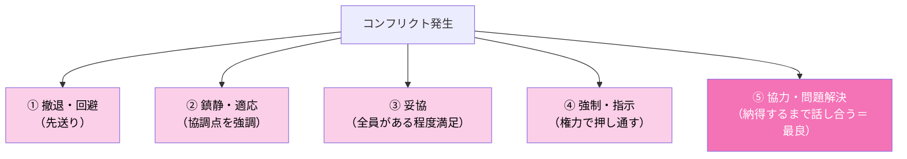

#### まとめ
- コンフリクトとは、プロジェクトで発生する意見の対立・衝突のこと
- プロジェクトでは必ずコンフリクトが発生するため、5つのアプローチを使い分けてコンフリクトを解決する

---

## 4. 開発アプローチとライフサイクル・パフォーマンス領域

### 開発アプローチの基本的な種類

開発アプローチには、**予測型**、**反復型**、**漸進型**、**アジャイル型**、**ハイブリッド型**があります。予測型はウォーターフォール型とも呼ばれます。反復型・漸進型・アジャイル型は、顧客の要求や環境の変化に柔軟に適応できる開発アプローチであるため、総称して「**適応型**」と呼ばれる場合もあります。

### 各開発アプローチの特性

| 開発アプローチ | 要求事項 | 納品 | 実行回数 | 特徴 |
|---|---|---|---|---|
| **予測型** | 固定 | 1回の納品 | 1回実行 | プロジェクト全体で計画を固定するため、変更によってコストに影響を与えないようマネジメントする |
| **反復型** | 変動 | 1回の納品 | 是正されるまで反復 | 各工程で顧客からフィードバックをもらい、ソリューションの正しさを確認する |
| **漸進型** | 変動 | 頻繁で小さな納品 | 増分ごとに1回実行 | 納品までのスピードを重視する |
| **アジャイル型** | 変動 | 頻繁で小さな納品 | 是正されるまで反復 | 頻繁な納品とフィードバックを通して、早期に価値を提供する |

### まとめ
- 開発アプローチとは、プロジェクトで採用する開発法のこと
- 開発アプローチには、予測型、反復型、漸進型、アジャイル型、ハイブリッド型がある
- プロジェクトの開始からクローズまでの一連のフェーズのことを「プロジェクトライフサイクル」という

---
### 開発アプローチの選択に影響を与える要因

プロジェクトにおいて、開発アプローチには予測型・反復型・漸進型・アジャイル型・ハイブリッド型という5種類があります。このうち、予測型と適応型（反復型・漸進型・アジャイル型）のどちらを選択するかに影響する要因について、PMBOK Guideでは**3つのカテゴリー**に分けて説明しています。

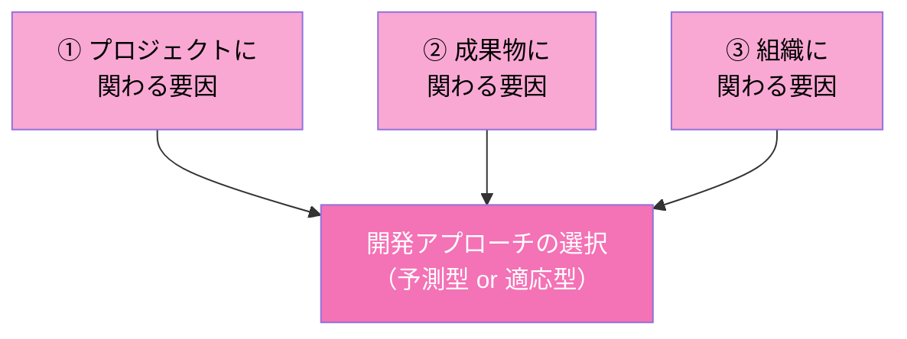

### ① カテゴリー「プロジェクト」に関わる要因

| 要因 | 内容 |
|---|---|
| **ステークホルダーの関与** | 適応型ではプロセス全体を通してステークホルダーの積極的な関与が必要。アジャイル型のイテレーション内で実施するレビューやレトロスペクティブ（振り返り）では、ステークホルダーからのフィードバックを得てプロダクトバックログを更新する場合がある |
| **スケジュールの制約条件** | 完成品ではなく、完成品の一部の機能を早い段階で提供する必要がある場合は「適応型」が妥当 |
| **資金調達の可能性** | 資金調達に不安がある環境でのプロジェクトにおいては、「適応型」は少ない投資で完成品の一部の機能を市場に早期にリリースできるため、最小の投資で市場に価値を提供し、市場シェアの獲得が可能になる |

### ② カテゴリー「成果物」に関わる要因

2つ目のカテゴリーは「成果物」（プロダクト、サービス、所産）です。プロジェクトで提供する成果物の視点から、予測型と適応型のどちらが妥当か検討します。

| 要因 | 内容 |
|---|---|
| **イノベーションの度合い・要求事項の確実性** | 要求事項が明確な成果物であれば「予測型」が妥当。高度な技術革新を伴う成果物やチームに経験がない成果物、要求事項が不安定な場合は「適応型」が妥当 |
| **スコープの安定性・変更の容易さ** | 成果物のスコープが安定していて、変更される可能性が低い場合は「予測型」が妥当。スコープに多くの変更があると予測されるときは「適応型」が妥当 |
| **デリバリーオプション** | 大規模プロジェクトで、最終プロダクトを一括提供する必要があるプロジェクトであれば「予測型」が妥当。部分的に開発・提供できるプロダクトであれば「適応型」が妥当 |
| **安全要求事項** | 厳格な安全要求事項があるプロダクトの開発には、事前に綿密な計画を立てるため「予測型」が妥当。規制の厳しい環境では、事前の入念な計画立案が適当 |

### ③ カテゴリー「組織」に関わる要因

3つ目のカテゴリーは「組織」です。ここでいう組織とは、みなさんが所属している会社を指します。会社の構造や文化からの視点で、どちらの開発アプローチが妥当か考えます。

なお、PMBOK Guideでは、組織として適応型のアプローチを効果的に運用するためには、経営層を始めとする組織全体で、組織の方針、働き方、報告などの根本的な姿勢を変える必要があると説明しています。

| 要因 | 内容 |
|---|---|
| **組織構造** | 多くの階層、厳格な報告体系、および硬直的な官僚主義を含む組織構造では「予測型」が妥当。「硬直的な官僚主義」とは、変化への対応に柔軟でなく、指示・命令系統が明確になっている組織構造のこと。組織がフラットな構造であり、社員が自ら考え行動できる自律的な組織であれば「適応型」が妥当 |
| **文化** | 管理と指示の文化を持つ組織であれば、作業が計画され、規則的に進捗状況を評価するため「予測型」が妥当。社員が自ら考え行動できる組織文化であれば「適応型」が妥当 |
| **プロジェクトチームの規模・地理的分散** | チームが大きく、複数拠点でテレワークなどを利用するバーチャルチームが存在している場合は「予測型」が妥当。ただし、この場合でも「適応型」アプローチを適用することは可能。メンバーの人数が少なく、1カ所に配置されたチームであれば「適応型」が妥当 |

#### まとめ
- 開発アプローチの選択には、「プロジェクト」「成果物」「組織」の3つのカテゴリーの要因が影響する
- 各カテゴリーには複数の判断要因があり、要求事項の確実性やスコープの安定性、組織文化などを総合的に検討する必要がある

---

### フェーズゲート

将来の要求や環境の変化が予測できるプロジェクトであれば、細かくフェーズゲート（チェックポイント）を設定します。**フェーズゲート**とは、現時点でプロジェクトに何らかの異常が発生していないかを確認するためのチェックポイントのことです。

将来の変化が予測できるプロジェクトでは、要件定義工程・設計工程・開発工程など、いくつかのマネジメント工程を設定しておくことが望ましいとされています。そのようにすることで、要求事項の変化などの状況に柔軟な対応が可能となり、手戻りが発生するリスクを軽減できます。

#### まとめ
- フェーズゲートとは、現時点でプロジェクトに何らかの異常が発生していないかを確認するためのチェックポイントのこと
- 将来の変化が予測できるプロジェクトでは、フェーズゲートを設定しておく必要がある

---

## 5. 計画・パフォーマンス領域

### 計画に影響を与える要因

プロジェクトごとに計画は異なり、プロジェクトの見積りやスケジュールに影響を与える要因もさまざまです。

| 要因 | 内容 |
|---|---|
| **開発アプローチ** | プロジェクトの開始時に具体的なリリースが存在している場合や、事前に概要の計画を立案しそのあとにプロトタイプを使ってフェーズを進める場合など、計画立案のタイミングや詳細度が異なる。予測型とアジャイル型の違いによっても、計画立案のタイミングや詳細度は異なる |
| **成果物** | 物理的な成果物を提供するプロジェクトであれば、事前に入念な計画を立てる。デジタルプロダクトを提供する場合は、状況の変化に適応できる計画が望ましい |
| **組織の要求事項** | 組織の文化などにより、プロジェクトマネジャーが計画を立案する場合がある |
| **市場の状況** | 市場の変化が激しい場合、プロダクトを市場に提供するまでの期間が短いほうがよいため、計画を最小限にする |
| **法規制による制約** | 政府機関などの規制機関や法令により、事前に特定の計画文書を求められる場合がある |

#### まとめ
- 妥当な計画は、プロジェクトを効果的に進めるために重要である
- 新たなニーズや状況の変化に対応するため、適切な計画を決めることが重要
- 市場や規制機関などの外部環境も、計画に影響を与える

---

### 見積りの種類

開発アプローチの特徴に応じて、利用しやすい見積りの種類があります。

| 見積りの種類 | 内容 |
|---|---|
| **確定的見積り** | 「30カ月」など、ピンポイントで見積る |
| **確率論的見積り** | 「30〜40カ月」など、範囲を持たせて発生確率に沿って見積る。範囲で見積る場合は「三点見積り」を利用する |
| **絶対的見積り** | 特定の情報を利用して、工数・日数・コストを見積る。見積技法として、類推見積り、パラメトリック見積り、ボトムアップ見積りなどを利用する |
| **相対的見積り** | 絶対的見積りのように正確な数値を求める方法ではなく、ある1つの見積りに対して比較することで規模感やパフォーマンスを特定する。アジャイル型開発でよく利用する |
| **フローベースの見積り** | タスクを開始してから完了するまでの時間である**サイクルタイム**と、一定期間内にチームが完了させた作業アイテム量である**スループット**を利用して見積る。アジャイル型開発でよく利用する |
| **不確かさの調整** | 見積りに不確かさを考慮してコンティンジェンシー予備（リスクに備えた予備費用）を追加する |

#### まとめ
- 見積りには、確定的見積り・確率論的見積り・絶対的見積り・相対的見積り・フローベースの見積りなどの種類がある
- 見積りでの正確さと精度（振れ幅）は異なる概念であり、それぞれの特性を理解して使い分ける必要がある
- 予測型、適応型などの開発アプローチによって、利用しやすい見積り方法は異なる

---

### アジャイル型アプローチにおけるリリース計画とイテレーション計画

アジャイル型アプローチでは、以下の2種類の計画を用います。

| 計画の種類 | 内容 |
|---|---|
| **リリース計画** | リリースの完了に必要なイテレーションの数、リリースに含まれる機能、リリースの目標期日を特定する。プロダクトバックログが更新された場合、リリース計画も更新される場合がある |
| **イテレーション計画** | 仕掛り中のタスクや完了したタスクなどを管理するイテレーションバックログを作成する。イテレーションバックログがプロジェクトスケジュールとなる |

イテレーションバックログでは、タスクの進捗に応じて「未着手」「仕掛り中（Work In Progress）」「完了（Done）」などの状態に移動します。イテレーションバックログを確認することで、仕掛り中や滞留しているタスクを特定できます。

#### まとめ
- スケジュールの作成方法には、予測型（アクティビティの順番を決めるなど）とアジャイル型（リリース計画・イテレーション計画にもとづく）がある
- アジャイル型アプローチでは、イテレーションバックログがプロジェクトスケジュールの役割を果たす

---

### コンティンジェンシー予備とマネジメント予備

プロジェクトマネジャーが計画できる予算の範囲は、コストベースラインまでです。プロジェクトマネジメント予備には、コンティンジェンシー予備のほかに、マネジメント予備があります。

| 項目 | 内容 |
|---|---|
| **コンティンジェンシー予備** | 特定できたリスクに対する予備費。コストベースラインに含まれ、プロジェクトマネジャーが管理する |
| **マネジメント予備** | 特定できないリスクに対する予備費用であり、プロジェクト総予算には含まれるが、コストベースラインには含まれない。プロジェクトマネジャーではなく、スポンサーが管理する。そのため、プロジェクトマネジャーの単独決裁では利用できず、必要な場合はコストベースラインを更新する（スポンサーの承認を得る必要がある） |

#### まとめ
- コストベースラインにはコンティンジェンシー予備を含む
- プロジェクトマネジメント予備には、コンティンジェンシー予備とマネジメント予備の2つがある
- コンティンジェンシー予備はプロジェクトマネジャーが管理し、マネジメント予備はスポンサーが管理する

---

### そのほかのマネジメントの側面で必要な計画

計画・パフォーマンス領域における、そのほかの側面で必要な計画には以下があります。

| 計画の種類 | 内容 |
|---|---|
| **資源** | 資材、機器、ソフトウェア、テスト環境などの管理方法を検討する。たとえば、プロジェクト納品までの資材の在庫を追跡する方法を計画する |
| **調達** | 調達プロセスを円滑に進めるために必要な計画。社内で開発される成果物やサービス、外部から購入される成果物やサービスの特定も含む |
| **変更** | 変更管理プロセス、アジャイル型アプローチであればプロダクトバックログを更新する方法、ベースラインの再設定など、変更を計画に適応させるプロセスを準備する |
| **メトリックス** | 作業のパフォーマンスや開発した成果物が期待通りであるかを測定する基準を明確にする |

PMBOK Guideには、パフォーマンスを計画することがステークホルダーのニーズに合致することを意味するために、計画とその成果物（計画書など）は、プロジェクト期間を通じて常に更新・統合しておく必要があると記載されています。ただし、小規模なプロジェクトでは詳細な計画書を作成することが非効率な場合もあるため、その点のバランスを取ることが重要です。

#### まとめ
- プロジェクトを進めるためには、資源・調達・変更・メトリックスなどさまざまな側面の計画が必要である
- 計画とその成果物は、コミュニケーションの円滑化のために、プロジェクト期間を通じて更新・統合しておく必要がある
- 小規模なプロジェクトでは、詳細な計画作成よりも効率性のバランスを取ることが重要である

---

## 6. プロジェクト作業・パフォーマンス領域

### プロセスとは

プロジェクトにおいては、テーラリング（Sec.21参照）を利用して、プロジェクトの進行に適したプロセスを確立します。プロジェクトの状況に応じて、そのプロセスを継続的に評価・改善することが必要です。

**プロセスを改善する方法**

| 方法 | 内容 |
|---|---|
| **リーン生産方式** | 無駄がない効率的なプロセスを目指す考え方。価値がある活動とない活動を比較して分析・改善する。**バリューストリームマップ**（成果物を開発するために必要な情報やモノの流れを文書化したもの）を利用して分析・改善する |
| **レトロスペクティブ** | プロジェクトを振り返るための会議。イテレーションの終わりなどに開催し、作業方法をレビューし、より効率を改善するための変更を検討する |

#### まとめ
- プロジェクト作業パフォーマンス領域では、適切な作業プロセスを確立し、改善することが求められる
- 作業プロセスを改善するためには、リーン生産方式やレトロスペクティブなどを利用する
- バリューストリームマップは、成果物を開発するために必要な情報やモノの流れを文書化したもので、プロセス改善に利用できる

---

### プロジェクト作業を進めるために必要なこと

プロジェクト作業を進めるにあたり、プロジェクトの3大制約条件（Sec.03参照）のバランスを取りながら、進捗を評価する必要があります。これにより、プロジェクトのゴールに対して健全な状態を維持することが可能となります。

また、プロジェクト期間を通じて、各ステークホルダーとのエンゲージメントを維持することは必須のアクションです。ステークホルダーの情報ニーズを捉え、それにもとづいてコミュニケーション計画書を作成します。情報ニーズに変化がある場合、たとえば情報提供やプレゼンテーションの要請などがあった場合は、コミュニケーション計画書を更新し、エンゲージメントのマネジメント方法を見直すことも必要となります。

さらに、建設系のプロジェクトなどで、サプライヤーやベンダーなどの第三者から資材や物品を調達する場合、物的資源の計画・発注・輸送・保管・追跡・コントロールには多くの時間と作業工数が必要となることがあります。物的資源を効果的に活用することで、プロジェクト内でのスクラップ（廃棄物）の発生を最小限におさえ、安全な作業環境の促進が可能となります。

#### まとめ
- プロジェクト作業を進めるためには、3大制約条件のバランスを取りながら進捗を評価することが必要
- プロジェクト期間を通して、ステークホルダーとのエンゲージメントを維持するためのアクションが必要
- 物的資源を上手に管理することで、廃棄物の削減や安全な作業環境の促進につながる

---

### 調達プロセスとは

プロジェクトの規模によりますが、すべての作業を内製のみで行うわけではありません。一部の作業を委託する場合は、調達プロセスが必要になります。

プロジェクトでは、母体組織の協力を得ながら、設備、物品、ソリューション、人員、サービスを獲得する必要があります。以下は、ベンダーとの契約に至るまでの一般的なプロセスです。

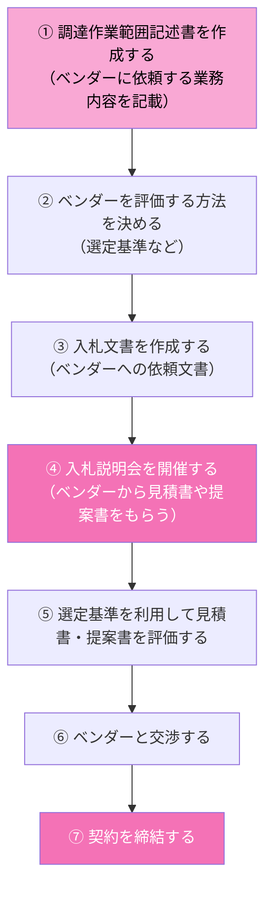

購入者は、入札文書が配布されると、通常は入札説明会を開催し、入札者の質問に答え、入札者に明確な情報を提供します。ベンダーを選択することを**発注先選定**と呼び、ベンダーが提出した見積書や提案書などのプロポーザルを評価します。そのあと、購入者はベンダーと交渉することになります。交渉の対象になるのは、コストをはじめ、納期、支払い期日、作業場所、知的財産権など、調達に関するほぼすべての項目です。

### 入札文書の種類

| 文書 | 内容 |
|---|---|
| **情報提供依頼書（RFI）** | 購入者がベンダーから、入札事業への参画能力についての情報を収集するための文書。納入候補者リストを絞り込むために使用されたり、正式な依頼を開始する前にさらなる情報を求めたりするときに使用する |
| **提案依頼書（RFP）** | 購入者が発行する、必要な作業範囲を記述した文書 |
| **見積依頼書（RFQ）** | 価格が主な決定要因であるときに作成する |
| **入札招請書（IFB）** | 調達プロセスの次のステップに進むために、幅広い納入候補者に送られ、公表され、ベンダーに調達へ入札するよう求める文書（※入札招請書はPMBOK Guideには明示的に記載されていない用語） |

#### まとめ
- 調達プロセスとは、外部のベンダーから設備・物品・サービスなどを獲得するための一連の手順のこと
- 調達作業範囲記述書の作成から契約締結まで、複数のステップを踏んで進める
- 入札文書には、情報提供依頼書（RFI）、提案依頼書（RFP）、見積依頼書（RFQ）などの種類があり、目的に応じて使い分ける

---

## 7. デリバリー・パフォーマンス領域

### 要求事項を引き出す技法

成果物を開発するためには、要求事項の特定が必要です。要求事項とは、プロダクト、サービス、所産が備えるべき特性や能力のことです。要求事項には、明確さ・完全性、要求事項が満たされていることを検証できること、追跡可能性が担保されていることが必要です。

| 技法 | 内容 |
|---|---|
| **資料分析** | 営業部門から提供される顧客資料やマーケティング資料などから、要求事項を特定する |
| **インタビュー / フォーカスグループ** | 特定分野の専門家へのインタビューのこと。専門家との会議を通じて要求事項を特定する |
| **ファシリテーション技法** | 会議において意見を拡散し、得られた意見をまとめて合意形成する |
| **プロトタイプ** | プロトタイプ（試作品）を見せて、会議を通じて要求事項を特定する |

要求事項をこれらの技法で引き出しても、プロジェクトの進行に伴い要求事項が変化することはあるため、プロジェクト期間を通したマネジメントが必要です。

#### まとめ
- 要求事項とは、プロダクト、サービス、所産が備えるべき特性や能力のこと
- 要求事項には、明確さ、完全性、検証可能性、追跡可能性が担保されている必要がある
- 要求事項は変化することがあるため、プロジェクト期間を通してマネジメントすること

---

### プロジェクトスコープ記述書の作成

ステークホルダーから要求事項を引き出したら、それをもとに詳細なプロジェクトスコープ記述書やWBSを作成します。

- **プロジェクトスコープ**：「プロジェクトで実施すること」
- **プロダクトスコープ**：「開発するもの」

基本的にはプロジェクトスコープを実現することで、プロダクトスコープが完成します。プロジェクトの納期や開発費などの制約条件を考えると、プロジェクトのすべての要求事項を実現するのは困難な場合があります。その場合は、制約条件をもとに妥協案を考えることも必要です。

このように、プロジェクトで実現することを定義して作られる文書を**プロジェクトスコープ記述書（Project Scope Statement）**といいます。原則として、プロジェクトスコープには以下の内容が含まれます。

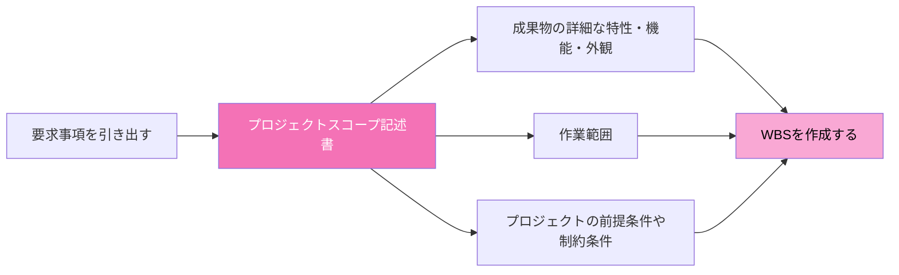

一般的には、プロジェクトスコープ記述書を作成したあとで、WBS（次項参照）を作成します。

#### まとめ
- プロジェクトスコープ記述書とは、プロジェクトで実現することを定義した文書のこと
- プロジェクトスコープ（実施すること）とプロダクトスコープ（開発するもの）は区別して考える
- プロジェクトスコープ記述書には、成果物の特性・作業範囲・前提条件や制約条件を明確に記載する

---

### WBS（作業分解構成図）

**WBS（Work Breakdown Structure：作業分解構成図）**とは、成果物をもとに作業を階層的に分解し、管理可能なレベルまで細分化したものです。WBSの最小の構成要素は**ワークパッケージ**と呼ばれ、一般的に1〜2週間程度で完了するアクティビティ（作業項目）とされています。「アクティビティ」と「タスク」は、ほぼ同義語として扱われます。

**WBSのイメージ**

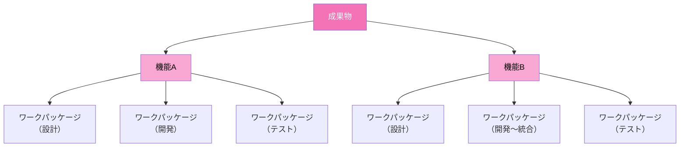

WBSの各作業項目（ワークパッケージ）について詳細情報を記述したものを**WBS辞書**と呼びます。WBS辞書には、作業内容、担当、期間、必要な資源などが記載されます。つまり、「WBSとは、樹形図のような形で作成された作業項目の一覧である」と考えるとよいでしょう。

#### まとめ
- WBSとは、プロジェクトスコープ記述書で定義した作業範囲を、成果物をもとにワークパッケージまで分解した構成図のこと
- WBSの最小単位はワークパッケージであり、一般的に1〜2週間程度で完了するアクティビティ（タスク）とされる
- WBS辞書には、各作業項目の内容・担当・期間・資源などの詳細情報を記載する

---
### 成果物の完了とは

成果物を完成させ、ステークホルダーへデリバリーする際は、プロジェクトの完了方法を決める必要があります。その方法は、採用する開発アプローチによって異なります。

| | 予測型アプローチ | アジャイル型アプローチ |
|---|---|---|
| **完了の判断基準** | プロジェクト開始時に設定された**プロジェクトスコープ記述書の受入基準**にもとづいて成果物を評価し、受け入れる | イテレーションの終了時に、チームとステークホルダーが合意した**「完了の定義」**というチェックリストにもとづいて成果物を評価する |
| **特徴** | 受入基準はプロジェクト途中で変更されることもあるが、すべての要求事項が完了したことを確認・承認する | 「完了の定義」は、プロジェクトの完了条件を表したチェックリストのこと |

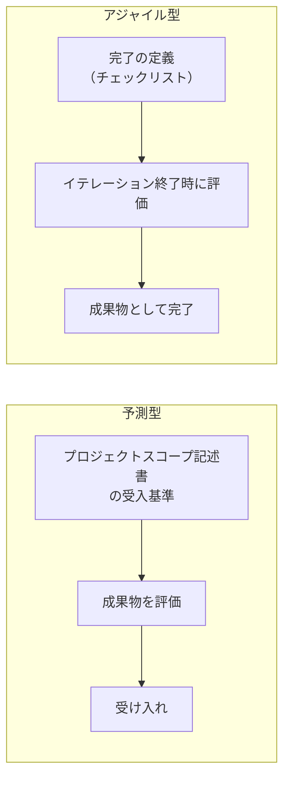

### 完了の定義の変化（Doneドリフト）

PMBOK Guideでは「成果物が顧客に使用されるための基準を備えた状態」を完了としています。つまり、アジャイル型アプローチでは、この「完了の定義」のチェックリストが完了の基準となります。

適応型アプローチは変化に柔軟に対応できますが、不確実性が高い開発アプローチです。したがって、急速に変化する環境でのプロジェクトでは、完了の定義が変わる可能性があります。たとえば、競合他社が新プロダクトをリリースした場合、プロジェクトで開発しているフィーチャー（機能）に追加作業が求められる場合があります。

このように、プロジェクトが進行するにつれて完了の定義が変わってしまう事象を**「Doneドリフト」**といいます。Doneドリフトでは作業期間が変わり、チームの生産性に影響を与える可能性もあるため、適切なチームマネジメントが必要です。

```mermaid
gantt
    dateFormat  X
    axisFormat %s
    title Doneドリフトのイメージ（当初12ヶ月→14ヶ月に延長）
    section 当初計画
    12カ月のプロジェクト :done, a1, 0, 12
    section 変化後
    競合の新機能対応で期間延長 :active, a2, 0, 14
```

#### まとめ
- 予測型アプローチでは、プロジェクトスコープ記述書の受入基準にもとづいて成果物を評価する
- アジャイル型アプローチでは、チームとステークホルダーが合意した「完了の定義」にもとづいて成果物を評価する
- 完了の定義は、成果物が満たすべきすべての基準を備えたチェックリストである
- 環境の変化により完了の定義が変わってしまう現象を「Doneドリフト」という

---

### 品質コスト

品質を確保するためのコストを効率的に利用することが重要です。この品質に関わるコストを**「品質コスト」**といい、「適合コスト」と「不適合コスト」の2つに分類できます。

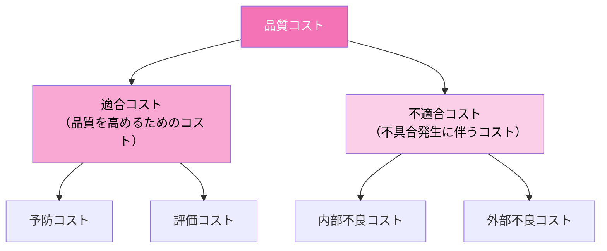

### 適合コストの分類

| 名称 | 内容 | 例（一部） |
|---|---|---|
| **予防コスト** | 不具合の発生を未然に防止するためのコスト | 生産・検査などの計画策定、プログラムの開発・準備など |
| **評価コスト** | 品質要求事項の適合度合いを判断するために、プロダクトの評価・テストに関連するコスト。適合していることを確実にするためのコスト | 評価、テストなどの検証作業、プロダクトやサービスのサプライヤーの評価、購入資材とサービスの評価にも関連する |

### 不適合コストの分類

| 名称 | 内容 | 例（一部） |
|---|---|---|
| **内部不良コスト** | 顧客に届く前に、プロジェクトチーム内で発生した不具合に対処するためのコスト | 手直し、再作業、廃棄、追加テストなど |
| **外部不良コスト** | 顧客に届いたあとに発覚した不具合に対処するためのコスト | 保証対応、返品、リコール、顧客対応窓口の費用など |

多くのプロジェクトでは、適合コストと不適合コストのバランスを考慮しながらプロダクトの品質を管理します。予防コストや評価コストへの投資を適切に行うことで、内部・外部不良コストの発生を抑えることができます。

#### まとめ
- 品質コストは、「適合コスト」（予防コスト・評価コスト）と「不適合コスト」（内部不良コスト・外部不良コスト）に分類される
- 予防・評価に投資することで、不良コストの発生を抑えることができる
- プロジェクトでは、これらのコストのバランスを考慮しながら品質を管理する

---

## 8. 測定・パフォーマンス領域

### 測定パフォーマンス領域とは

測定パフォーマンス領域とは、プロジェクトが計画どおりに進んでいるかを評価する領域です。デリバリー・パフォーマンス領域で実施された作業が、計画・パフォーマンス領域で設定した尺度（メトリックス）をどの程度満たすのかという点を評価します。

尺度を利用する理由には、パフォーマンスと計画を比較することのほか、説明責任を示すことや、ステークホルダーに報告できることなどが挙げられます。

### KPI（重要業績評価指標）とは

効果的な尺度として**KPI（Key Performance Indicator：重要業績評価指標）**があります。KPIには「先行指標」と「遅行指標」の2種類があり、測定ではこの2つの指標のバランスを取ることが重要です。

| KPIの種類 | 内容 | 例 |
|---|---|---|
| **先行指標**（何が起こりそうか＝予測） | プロジェクトの成果を予測するために使用される。成果が現れる前に妥当な傾向でない場合、チームは事前に対策を講じることができる | プロジェクトの成功率 |
| **遅行指標**（何が起こったか＝結果） | プロジェクトの成果を測定するために使用される。プロジェクトのパフォーマンスがどの程度効果的であったのかを評価する | 完成した成果物の数、消費された資源量 |

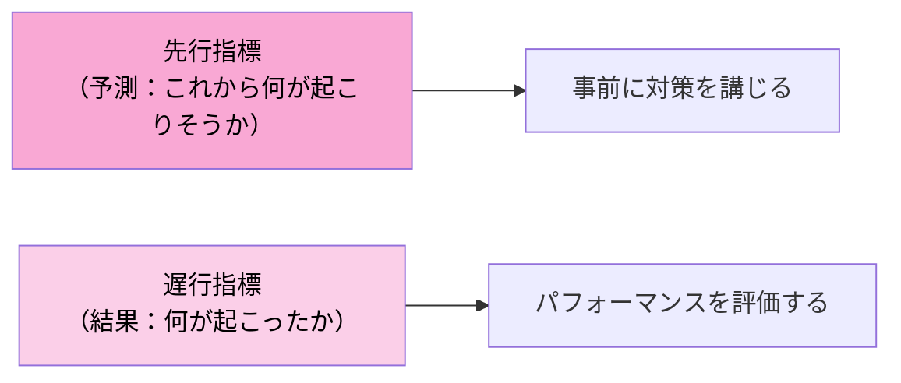

#### まとめ
- 測定パフォーマンス領域とは、プロジェクトが計画どおりに進んでいるかを評価する領域
- KPIには先行指標（予測）と遅行指標（結果）の2種類があり、両方のバランスを取ることが重要
- 尺度を利用する理由には、パフォーマンス比較・説明責任・ステークホルダーへの報告がある

---

### SMART基準

効果的な尺度を設定するには工数がかかります。そのため、プロジェクトチームは尺度がステークホルダーにとって意味のあるものであることを要求されます。その特性は**「SMART基準」**で示すことができます。

SMARTは、フレームワーク（何かを決定したり計画したりする際に利用される、考え方や仕組み）の1つです。

| SMART基準の項目 | 内容 |
|---|---|
| **Specific（具体的である）** | 測定は、何を測定対象とするのか明確に示されている必要がある |
| **Meaningful（有意義である）** | 測定の尺度は、ビジネスケース、要求事項に結びついているべきである |
| **Achievable（達成可能である）** | 測定の尺度は妥当で現実的であり、人員、技術、環境に照らして達成可能であること |
| **Relevant（関連性がある）** | 測定の尺度は、目標との関連性が必要である。測定によって入手できる情報は、ステークホルダーの行動を促す程度の内容であることが望ましい |
| **Timely（期限が明確である）** | 測定はいつまでに達成するのか、期限が明確であるべきである |

#### まとめ
- KPIには先行指標と遅行指標の2種類がある
- 先行指標は予測の要素があり、遅行指標は結果にもとづく
- KPIなどの効果的な尺度の特性は、SMART基準で明確にできる

---

### 事業価値の尺度

プロジェクトが長期にわたる場合、大きなプロジェクトでは事業価値を測定することがあります。「事業価値」とは、プロジェクトへの投資から得られる利益と、投資額との関係を評価する考え方です。プロジェクトを継続するかどうかの判断が求められる際に、以下のような尺度を利用します。

| 尺度項目 | 内容 |
|---|---|
| **BCR（Benefit-Cost Ratio：費用便益率）** | 得られるベネフィットがプロジェクトのコストを上回るか判断するために利用する（ベネフィット ÷ コスト）。1以上であれば、プロジェクトのベネフィットがコストを上回る |
| **ROI（Return On Investment：投資対効果）** | 投資効率に焦点を当てる。計算方法は「（ベネフィット − コスト）÷ コスト」で、パーセンテージで示される。割合が大きいほど、投資効率がよい |

BCRは費用対効果に焦点を当て、その比率が1以上かどうかが判断基準です。一方のROIは投資効率に焦点を当て、その割合が大きいかどうかが判断基準です。

#### まとめ
- 事業価値の尺度を利用し、プロジェクトの継続判断が必要になる場合がある
- BCRは費用対効果に焦点を当て、ROIは投資効率に焦点を当てている

---

### NPV（正味現在価値）

**NPV（Net Present Value：正味現在価値）**とは、将来得られる利益を現在の価値に割り戻して評価するための指標です。

たとえば、期間が10年のプロジェクトがあるとします。10年後のプロジェクト完了時に顧客から売上1億円を得る場合、その売上を「現在価値」に換算して考えます。その理由は、利率が加わることで、同じ金額でも現在と将来では価値が違うためです。仮に現在の金利が年1%なら、10年後の1億円の売上を現在価値で考えると、

$$
\frac{1億円}{(1+0.01)^{10}} ≒ 9,052万円
$$

となります。つまり、金利が1%なら、10年後の1億円は現在の価値では約9,052万円なのです。

また、NPVは現在価値から開発費を差し引いて算出します。上記の例で開発費が1,000万円だとすると、

$$
NPV = 9,052万円 − 1,000万円 = 8,052万円
$$

となります。なお、金利を考える場合は、銀行からの借り入れの利率のほか、企業が利益を得た場合の株主への還元率を含めて考えるのが一般的です。

#### まとめ
- 事業価値の尺度としてBCR・ROI・NPVなどを利用し、プロジェクトの継続判断に役立てる
- BCRは費用対効果、ROIは投資効率に焦点を当てる
- NPVとは、将来得られる利益を現在価値に割り戻して評価する指標である

---

## 9. 不確かさ・パフォーマンス領域

プロジェクトチームは、プロジェクト期間中の不確かさを積極的に管理する必要があります。ここでの不確かさには、「不確かさ」「曖昧さ」「複雑さ」「リスク」が含まれます。

### 不確かさへの対応

**不確かさ**とは、課題と出来事などの理解と認識が欠如しており、不明または予測不可能な状態のことです（Sec.09参照）。プロジェクトチームは、不確かさについて調査し、査定して、どのように対処するのかを決定する必要があります。

| 対応方法 | 内容 |
|---|---|
| **情報の収集** | 調査を行う、専門家に関わってもらう、市場分析を行うなどして、より多くの情報を収集する。情報を収集することで不確かさを低減できる |
| **複数の結果に備える** | 意思決定を検証する以外に、予測どおりの結果にならなかった場合などに備える代替的な解決策として、バックアッププランやセーフティマージンを設計する。または代替案を調査し、用意する |
| **回復力を養う** | 影響を緩和する能力と、挫折や失敗から迅速に回復する能力。回復力を養うことで、学び得た知識を利用して迅速に適応することが可能になる |

#### まとめ
- 不確かさとは、課題と出来事などの理解と認識が欠如しており、不明または予測不可能な状態のこと
- 不確かさについては調査し、査定して、どのように対処するのかを決定する必要がある
- 不確かさへの対応として、情報の収集、複数の結果への備え、コンティンジェンシー計画の用意などがある

---

### 曖昧さへの対応

曖昧さは、「**概念的な曖昧さ**」と「**状況的な曖昧さ**」の2つに分けられます。

| 種類 | 内容 |
|---|---|
| **概念的な曖昧さ** | 主にコミュニケーションに起因する。複数の類似した用語を利用することで生じてしまう。そのため、利用する用語についてのルールや用語の定義を確立することで解消が可能 |
| **状況的な曖昧さ** | 課題を解決するために複数の選択肢が存在している状態。PMBOK Guideでは、状況的な曖昧さは以下の方法で解消できると示している |

**状況的な曖昧さの対応方法**

| 解消方法 | 内容 |
|---|---|
| **段階的詳細化** | プロジェクトが進むにつれ、プロジェクトの開始時は大まかな計画を立案し、得られる情報が増えるにつれて計画をより詳細にする。段階を経ることで曖昧さを解消できる |
| **実験** | 新しいアイデアを試すことで、曖昧さを解消できる |
| **プロトタイプ** | プロトタイプ（試作品）を見せることで、課題などを見分けることにつながり、曖昧さを解消できる |

とくにプロジェクトの開始時は、顧客の要求なども曖昧になりがちです。このため、状況的な曖昧さへの対応方法は、あらゆるプロジェクトで利用されているのではないでしょうか。

#### まとめ
- 曖昧さには「概念的な曖昧さ」（用語の定義で解消）と「状況的な曖昧さ」（段階的詳細化・実験・プロトタイプで解消）がある
- 状況的な曖昧さは、段階的詳細化、実験、プロトタイプを利用することで解消できる

---

### 複雑さへの対応

複雑さ（Sec.09参照）は、プロジェクトのどのタイミングでも発生する可能性があります。PMBOK Guideでは、複雑さへの対応として、**システムの分割**、**多様性**、**シミュレーション（プロセスベース）**の3つを示しています。

| 対応方法 | 内容 |
|---|---|
| **システムの分割** | システムの一部を切り離して、システムを簡素化する。類似しているが関連性のないシナリオを利用する（各ワークストリームを含む複数プロジェクトなど） |
| **多様性** | 複雑なシステムは、多様な視点からシステムを見る必要がある。異なるデータの相違とのバランスを取ることで、より広い視点を得ることになる |
| **シミュレーション（プロセスベース）** | 実際に人々を観察して消費者の購買行動を確認するなど、あるいは反復・漸進的に計画し、イテレーションという限られた期間でフィーチャーを開発する。頻繁にステークホルダーの声を確認しながら、失敗を想定して計画する |

#### まとめ
- 複雑さへの対応方法には、システムの分割、多様性、シミュレーション（プロセスベース）がある
- 状況に応じてこれらの対応方法を使い分けて検討する

---

### リスクと課題

**リスク**とは、プロジェクトに影響を与えうる、発生が不確実な事象のことです（Sec.24参照）。リスクはプロジェクト期間を通してマネジメントする必要があります。

たとえば、顧客から突然の追加要求が発生して、急遽それに対処する必要が生じたとします。この場合、時制は将来ではなく現在なので、「リスクに対処する」ではなく「課題に対処する」と表現します。また、リスクと課題のポイントは、リスクに対処しつつ、各リスクが課題にならないように、各リスクに対して事前に「トリガー（予兆）」を設定することです。リスクが発生間近であることを示すトリガーを設定することで、課題化した際の悪影響を多少は軽減できる可能性があります。

### リスクと課題の違い

| | リスク | 課題 |
|---|---|---|
| **前提** | まだ発生していない出来事 | すでに発生した出来事 |
| **内容** | 好影響（好機）と悪影響（脅威）の両方がある | 悪影響しかない |
| **時制** | 将来 | 現在 |
| **想定発生するとき** | プロジェクトの計画を立てるときに想定する | 計画にもとづき作業を進めているときに発生する |
| **対処** | 「リスクに対処する」とは、これから発生する事象の影響度や発生確率を下げるために、未然に対応することを指す | 「課題に対処する」とは、すでに発生してしまった事象に対応することを指す |

#### まとめ
- リスクとは、プロジェクトに影響を与えうる、発生が不確実な事象のこと
- リスクは「まだ発生していない・将来・好影響悪影響の両方」、課題は「すでに発生・現在・悪影響のみ」という違いがある
- リスクに事前にトリガー（予兆）を設定することで、課題化した際の悪影響を軽減できる

---

### 個別リスクの対応方法（脅威）

個別のリスクを分析したら、各リスクについての対応方法を決定します。脅威（悪影響のあるリスク）への対応には、以下の5つがあります。

| 名称 | 内容 |
|---|---|
| **エスカレーション（Escalate）** | リスクの影響がプロジェクトマネジャーの権限を越える場合に、上位者やスポンサーに対応を求める |
| **回避（Avoid）** | リスクの発生確率をゼロにする対応（例：スケジュールやスコープ、プロジェクトマネジメント計画書の一部を変更する など） |
| **転嫁（Transfer）** | プロジェクトからリスクをなくすのではなく、リスクの管理責任を第三者に移転する方法。移転にともないコストが発生する（例：保険に加入する、ベンダーと契約して一部の作業を依頼する など） |
| **軽減（Mitigate）** | リスクの発生確率や影響度を低下させる対応（例：通常よりもテストの回数を多くする など） |
| **受容**（能動的受容・受動的受容） | リスクに対して能動的または受動的に対応する。個別リスクの対応方法では、もっとも一般的なものは**能動的受容**であるといわれる（例：部門などからの依頼で見積りを提供する際に、コンティンジェンシー予備を組み込んでおく）。受動的受容は、定期的なレビュー以外は何もしない方法で、あまり採用されない |

#### まとめ
- 脅威（悪影響のあるリスク）の対応方法は、エスカレーション、回避、転嫁、軽減、受容（能動的・受動的）の5つである
- 個別リスクの対応方法の中で、もっとも一般的なものは能動的受容といわれている

---

### 個別リスクの対応方法（好機）

好機（好影響のあるリスク）への対応方法は、脅威の戦略とほぼ同じ構成ですが、内容はよい方向へ発生確率や影響度を高める対応になります。

| 名称 | 内容 |
|---|---|
| **エスカレーション（Escalate）** | 好機の影響がプロジェクトマネジャーの権限を越える場合に、上位者やスポンサーに対応を求める |
| **活用（Exploit）** | 特定した好機を確実に発生させる方法（例：スケジュールやスコープの一部を変える など） |
| **共有（Share）** | 好機のオーナーシップの全部、もしくはその一部を第三者と共有する方法。合弁事業やパートナーシップなどを指す |
| **強化（Enhance）** | 特定した好機の発生確率や影響度を高める。スキルが高いメンバーにこの案件を任せる など |
| **受容**（能動的受容・受動的受容） | 能動的受容はコンティンジェンシー予備を設ける対応。受動的受容は定期的なレビュー以外は何もしない対応 |

好機の戦略のポイントは、**活用策**と**強化策**の位置づけです。活用策はリスクが確実に発生するようにします。つまり、脅威の戦略における「回避」とは逆の対応法です。一方、強化策はリスクの発生確率や影響度を高めます。こちらも、脅威の戦略における「軽減」とは逆の対応法です。

また活用策では、特定した好機を確実に発生させるため、計画・方針などの変更が必要です。たとえば、海外から資材を購入しているプロジェクトであれば、継続的に資材を購入する計画ではなく、円高になった段階で一気に海外から資材を購入する計画に変更する、などの方法です。つまり、活用策はリスク要因がプロジェクトの外に存在していることが多いといえます。

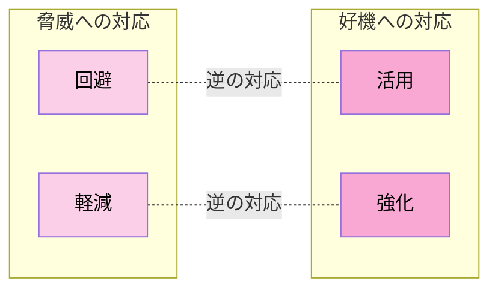

#### まとめ
- 好機（好影響のあるリスク）の対応方法は、エスカレーション、活用、共有、強化、受容（能動的・受動的）の5つである
- 活用策は脅威の「回避」と、強化策は脅威の「軽減」と、それぞれ逆の対応にあたる

---

### リスクレビュー

ステークホルダーから積極的にフィードバックを得ることは、リスクに対処するうえで必要なアクションです。その1つに、**デイリースタンドアップ会議**があります。これは毎回同じ時間・同じ場所で、立ったまま行う15分間程度の会議です。アジャイル型アプローチでよく利用されますが、開発アプローチの種類を問わず、新しいリスクや好機を特定するために活用できます。

予測型アプローチのプロジェクトであれば、イテレーション内で実施するレビューやレトロスペクティブの代わりに、**状況会議**を開催して、新しいリスクや課題を洗い出します。予測不能な変化が発生するプロジェクトであれば、このような会議で作業の順番を組み替えるなどの代替案を検討します。

#### まとめ
- リスクレビューは、デイリースタンドアップ会議、レビュー、レトロスペクティブ、状況会議などを利用して、定期的に新しいリスクを特定し、既存のリスクの状況を明確化する
- 予測不能な変化が発生するプロジェクトでは、作業の順番を組み替えるなどの対応方法も検討する

---

## 10. 4章 全体まとめ（クイックリファレンス）

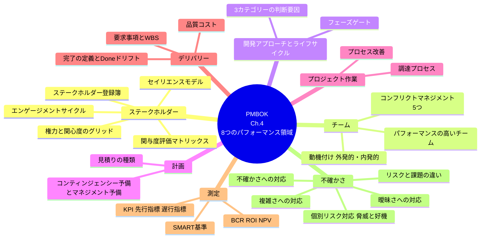

---

*これで4章（8つのパフォーマンス領域）のナレッジノートは完結です。*
