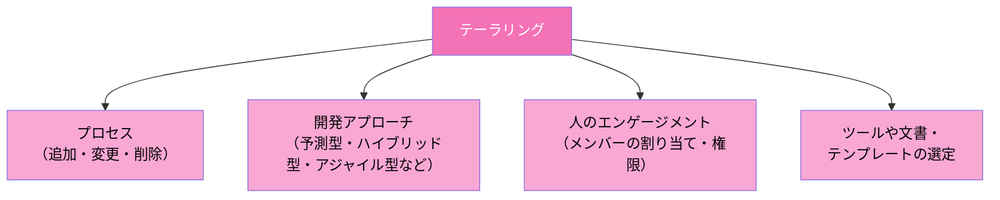
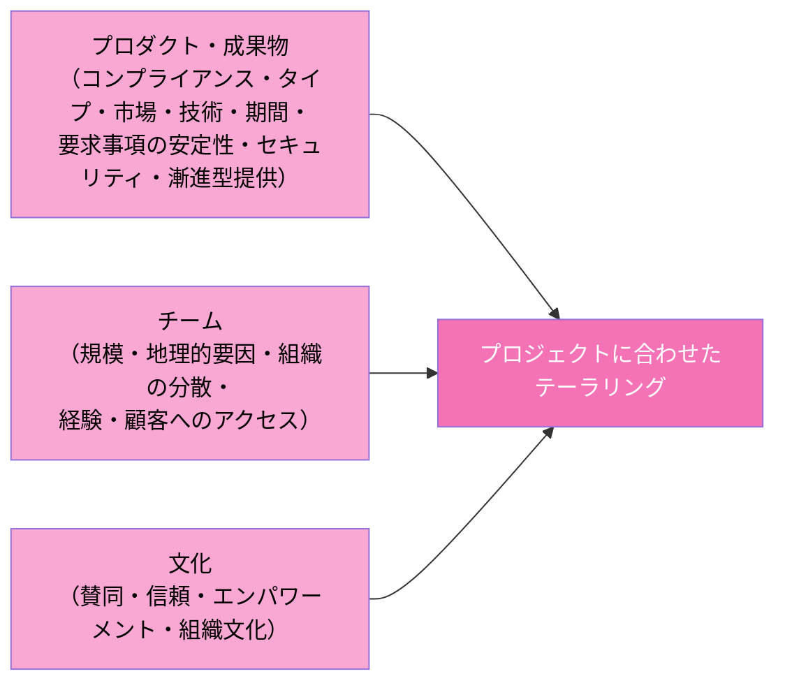
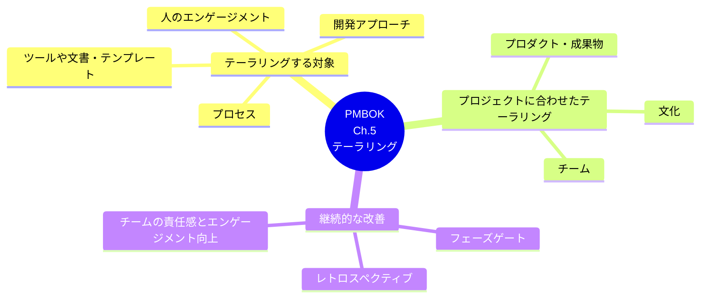

# PMBOK ナレッジノート（Chapter 5：PMBOK第7版 - テーラリング）

---

## 1. テーラリングする対象

どのようなプロジェクトでも利用できる単一の開発アプローチは存在しないため、プロジェクトの状況、ゴール、作業環境の理解を考慮し、**テーラリング**を利用して、作業プロセスなどプロジェクトの進め方を検討します。たとえば、安全が最優先のプロジェクトでは、独自の検査を追加するなどのアクションが必要です。つまり、状況に応じて**プロセス**の追加、変更、削除などを行います。

**開発アプローチ**もテーラリングの対象です。プロジェクトの特性により予測型、ハイブリッド型、アジャイル型などを選択しますが、この選択と決定もテーラリングの1つです。

また、プロジェクトに関わる**人のエンゲージメント**もテーラリングの1つです。納期が厳しいプロジェクトであれば、経験豊富なメンバーを割り当てることが妥当であり、そのようなメンバーに与える権限について検討することもテーラリングです。さらに、**ソフトウェアや機器などのツール、プロジェクトで利用する文書・テンプレートの選定**もテーラリングです。

### テーラリングする対象（4つ）

### まとめ
- どのようなプロジェクトでも利用できる単一のアプローチは存在しないため、テーラリングが必要である
- テーラリングを実施するには、プロジェクトの状況、ゴール、作業環境の理解が必要である
- テーラリングにはプロセスのほか、開発アプローチ、人のエンゲージメント、ツール、方法や作成物も含む

---

## 2. プロジェクトに合わせてテーラリングする

プロジェクトに合わせたテーラリングは、多くの属性が影響を与えます。PMBOK Guideでは、**「プロダクト・成果物」「チーム」「文化」**という3つの領域に含まれる属性について説明しています。

### プロジェクトに合わせたテーラリングに関する属性

| 領域 | 属性 | 内容 |
|---|---|---|
| **プロダクト・成果物** | コンプライアンス・重大性 | どの程度のプロセスの厳格さと品質保証が適切か |
| | プロダクトのタイプ | ビルなど認識しやすい有形のものか、ソフトウェア設計のように無形のものか |
| | 業界市場 | 開発した成果物はどの市場に提供されるか、競合の存在、市場の変化や規制はどうか |
| | 技術 | 技術は安定しているのか、進化するのか |
| | 期間 | プロジェクト期間の長さ |
| | 要求事項の安定性 | 要求事項の変化の可能性 |
| | セキュリティ | プロダクトの要素は営業秘密か、極秘扱いか |
| | 漸進型提供 | ステークホルダーから漸進的にフィードバックを得られるのか、ほぼ完了したあとでの評価なのか |
| **チーム** | チームの規模 | メンバーの人数 |
| | チームの地理的要因 | メンバーの主な所在地はどこか。リモートか、同一の作業場所か |
| | 組織の分散 | チームを支えるステークホルダーはどこにいるのか |
| | チームの経験 | 当該業界や当該組織における経験 |
| | 顧客へのアクセス | 顧客からのフィードバックはタイムリーで頻繁に得ることができるのか |
| **文化** | 賛同 | 提案された実施アプローチは受け入れられ、支持されているか |
| | 信頼 | チームは高い信頼を得ているか |
| | エンパワーメント | 作業環境、決定事項などに責任を持ち、信頼され、サポートを受け、奨励されているか |
| | 組織文化 | 会社の文化として任せるのか、細かい指示を出しているのか |

### まとめ
- プロジェクトに合わせたテーラリングには、多くの属性が影響を与える
- PMBOK Guideでは「プロダクト・成果物」「チーム」「文化」の3領域に含まれる属性を示している
- それぞれの属性を確認しながら、プロジェクトに最適なテーラリングを検討する

---

## 3. 継続的な改善を実施する

プロジェクトにおいて実施される**フェーズゲート**や**レトロスペクティブ**などを利用することで、テーラリングにおいて改善すべき箇所を特定できます。レトロスペクティブとは、アジャイル型アプローチにおいてイテレーション内で実施される、イテレーションを振り返るための会議です。

プロジェクトチームが自ら、プロセスの改善に積極的に取り組むことで、責任感が醸成されます。これによって、現状に甘んじることなく改善の意識が高まり、チームのエンゲージメントを高めることにつながります。

### まとめ
- テーラリングプロセスとは、テーラリングの手順のこと
- テーラリングプロセスは、「開発アプローチ→組織→プロジェクト→改善」の順序で進む
- プロジェクトに合わせてテーラリングする場合、多くの属性を考慮する必要がある

---

## 5章 全体まとめ（クイックリファレンス）

---

*本ファイルはアップロードされたスキャン範囲（テーラリングする対象／プロジェクトに合わせたテーラリング／継続的な改善）にもとづいています。5章の続きのページがあれば、追加でアップロードしてください。*
