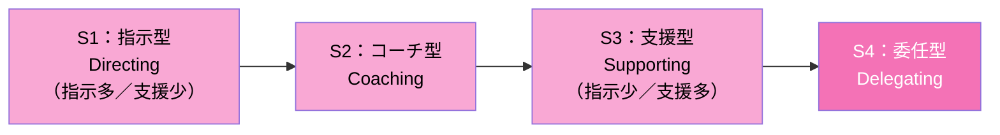
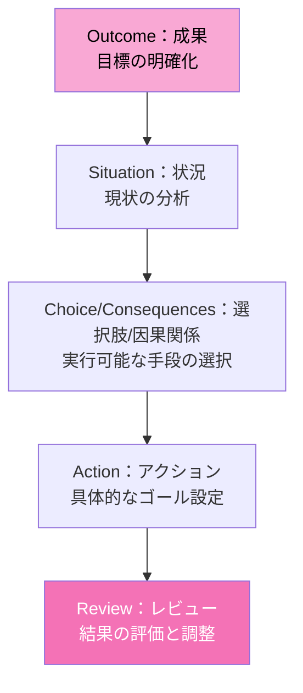
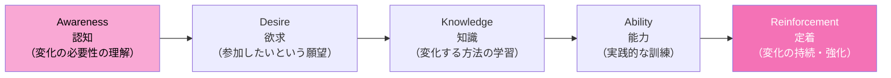
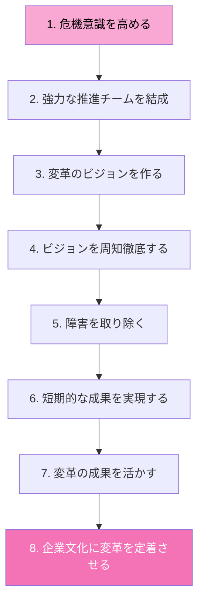
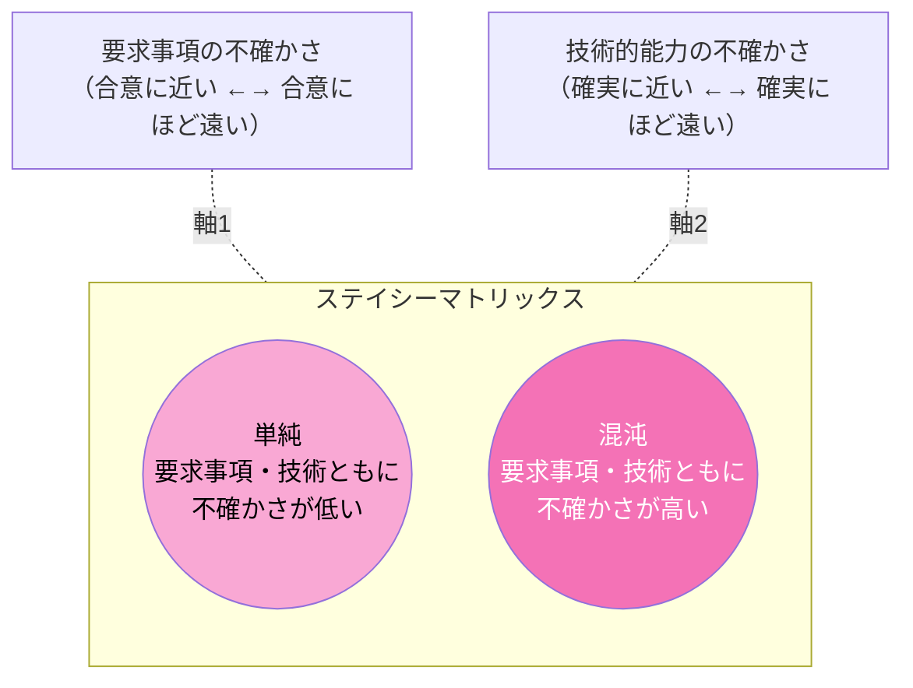
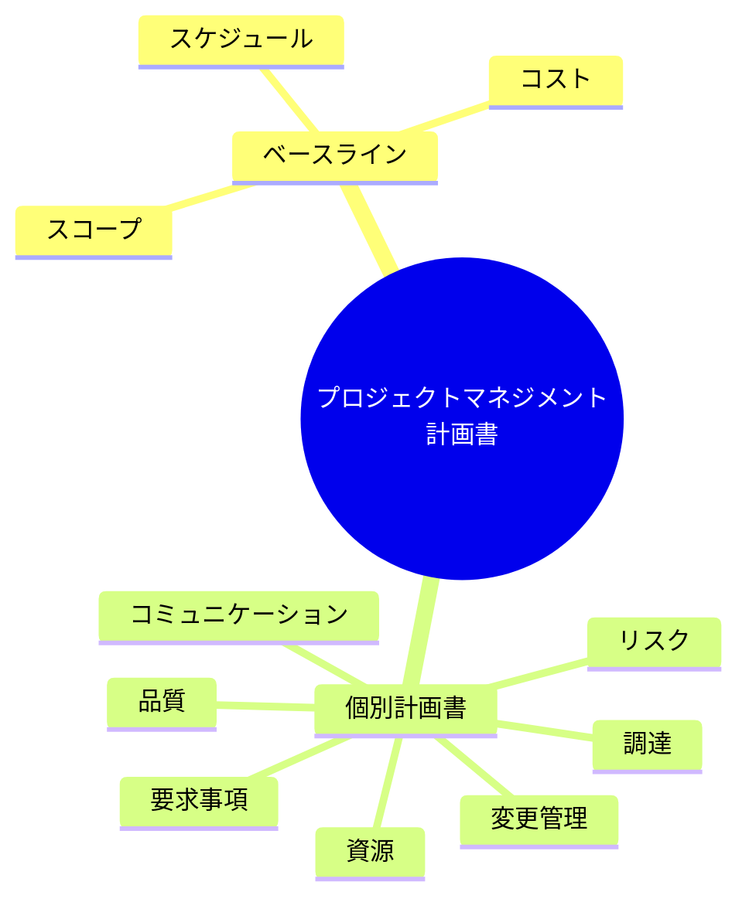
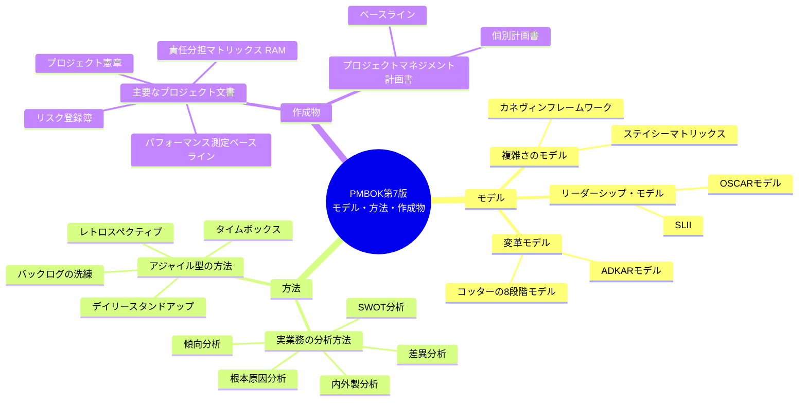

# PMBOK ナレッジノート（PMBOK第7版：モデル・方法・作成物）

> PMBOK Guide 第7版では、8つのパフォーマンス領域やテーラリングを実践するうえで役立つ「モデル」「方法」「作成物」がツールキットとして紹介されています。本ファイルはその整理ノートです。

---

## 1. よく使用されるモデル

モデルは、プロジェクトマネジメントの状況を理解し、適切な対応を導くためのフレームワークです。

### 1.1 リーダーシップ・モデル

ステークホルダーの成熟度や、個人の能力開発に焦点を当てたモデルです。

#### SLII（Situational Leadership 理論Ⅱ）

各ステークホルダーの習熟度が高まるにつれて、リーダーシップのスタイルを4段階に変化させます。

#### OSCARモデル

コーチングや個人の能力開発のための行動計画をサポートする5つの手順です。

---

### 1.2 変革モデル

組織や個人の変化を促し、定着させるためのモデルです。

#### ADKARモデル

組織変革を成功させるために、個人の行動変化を5段階で支援します。

#### コッターの8段階モデル

組織に対して変革を浸透させるためのプロセスです。

---

### 1.3 複雑さのモデル

プロジェクトの相対的な不確かさや状況を判断するためのフレームワークです。

#### カネヴィンフレームワーク

状況を5つのドメインに分類し、適切な意思決定（ベストプラクティスの適用や試行錯誤など）を支援します。

#### ステイシーマトリックス

「要求事項」と「技術的能力」の不確かさの2軸で複雑さを判断します。

※ 要求事項・技術的能力ともに不確かさが低いほど「単純」な状況、両方の不確かさが高いほど「混沌」とした状況に近づきます。

---

## 2. よく使用される方法

実業務や試験において重要となる分析手法やアプローチです。

### 2.1 実業務で利用される分析方法

| 分析方法 | 内容 |
|---|---|
| **内外製分析** | 自社で生成するか、ベンダーに依頼するかを分析する |
| **根本原因分析** | 「なぜ」を繰り返し、問題の根本的な原因を探る |
| **SWOT分析** | 強み（Strengths）、弱み（Weaknesses）、機会（Opportunities）、脅威（Threats）の4観点でリスクを特定する |
| **傾向分析** | 過去の結果にもとづき、将来の成果を予測する |
| **差異分析** | 計画と実績の差を特定し、原因を分析する |

### 2.2 アジャイル型アプローチに関する方法

| アジャイルの方法 | 内容 |
|---|---|
| **バックログの洗練** | プロダクトバックログの優先順位付けを行う会議 |
| **デイリースタンドアップ** | 昨日・今日のことや課題を共有する、イテレーション内の会議 |
| **レトロスペクティブ** | イテレーションを振り返り、改善案を検討する会議 |
| **タイムボックス** | 会議などの時間枠をあらかじめ決めておくこと |

---

## 3. よく使用される作成物

プロジェクトを管理するために利用されるテンプレートや文書です。主に規模の大きい予測型アプローチで多く利用されます。

### 3.1 主要なプロジェクト文書

| 作成物 | 内容 |
|---|---|
| **プロジェクト憲章** | プロジェクトを正式に認可し、プロジェクトマネジャーの権限を定義する |
| **リスク登録簿** | 特定したリスクの分析結果や対応方法を記述する |
| **パフォーマンス測定ベースライン** | 承認されたスコープ、スケジュール、コストを統合した基準 |
| **責任分担マトリックス（RAM）** | 各人の役割（実行責任、説明責任など）を定義する |

### 3.2 プロジェクトマネジメント計画書の構造

プロジェクトマネジメント計画書は、以下のあらゆる個別計画書とベースラインを統合した最上位の文書です。

**個別計画書の例**：変更管理計画書、コミュニケーション・マネジメント計画書、コスト・マネジメント計画書、リスクマネジメント計画書 など

---

## 全体まとめ（クイックリファレンス）

