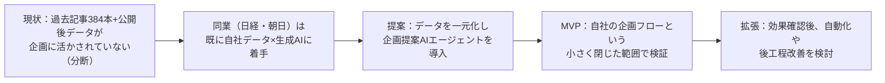
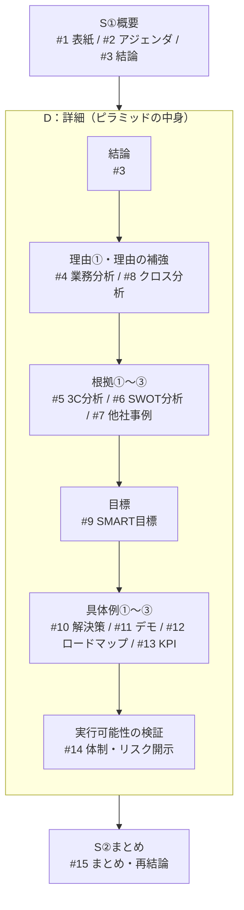
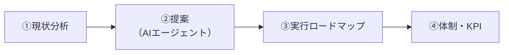
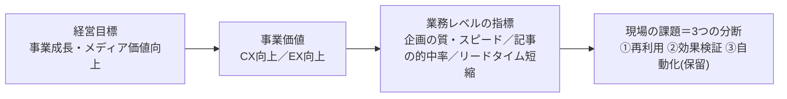
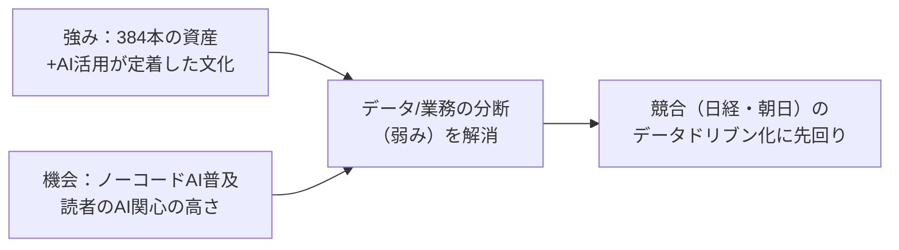
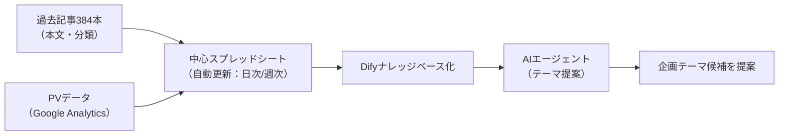
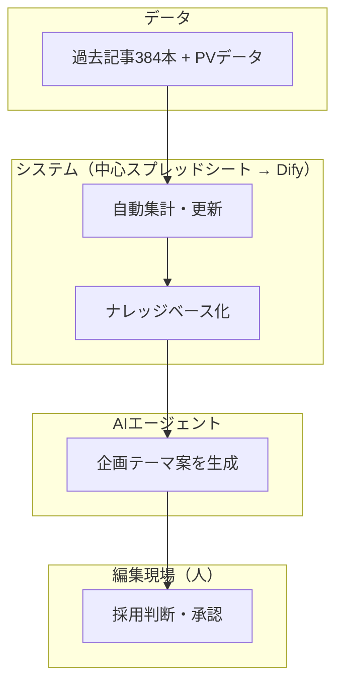
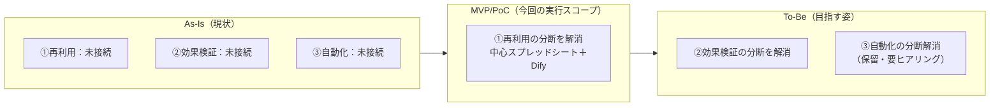
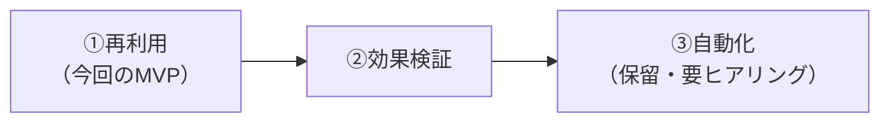

https://claude.ai/artifact/XRZARiLBwUrqWdy4Vj6VzH

# あなた
社内DXを提案/推進するITコンサルタント/エンジニアです。

# 伝えたいこと

## 聞き手(誰に)
業務担当者、業務責任者(部長相当)、社内ITシステム部

## メインメッセージ(何を伝えるか)
システム/データ分断の解消→AI活用の加速→業務付加価値の向上

## 起こしたい変化(どうなって欲しいこと/状態)
データを一箇所にまとめ、そのデータを中心とした業務フロー設計/運用に変えてほしい

# 前提/背景パート

- 聞き手が求めていること
MISSION（やるべきこと）

提供データ（記事・制作フロー）を読み解き、組み合わせて整理する
まだ気づかれていない新しい課題やインサイトを見つける
その課題を解決する成果物を、Difyや各種AIで作る
作った成果物と、その効果を発表する

GOAL（達成すべきこと）

すでに進めているDXの"その先"にある、新しい視点の課題を発見する
その課題をAIで実際に解決する動く成果物を完成させ、現場が「使ってみたい」と思える提案にする

# 想定QA (聞き手の疑問)

スライド化する前に、聞き手（経営層・編集現場・関係部署）が抱きそうな疑問と、現時点で答えられる内容／まだ答えられない内容を整理する。答えられない項目は無理に取り繕わず、「現時点では未定・要検討」と正直に扱うことで、かえって提案の信頼性を高める。

## A. 精度・品質
- **Q1. AIが提案するテーマの精度はどう担保するのか？誤った提案をしたらどうなるのか？**
  A：AIエージェントは「提案」までを担い、最終的な採用判断は編集者・企画会議が行う（人間が最終承認するフロー）。KPIに「承認率」を置いているのも、AIの提案がそのまま自動的に記事化されるわけではないことが前提。
- **Q2. 過去記事384本だけで十分な精度が出るのか？データが古くなったらどう更新するのか？**
  A：そのための検証であり、また業務フローはスプレッドシート中心に添えるので、自動更新される業務フローである。つまり、常に最新の状態である。余談だが、Google analyticsの更新は、同スプレッドシート上で、任意のタイミング(日次or週次)でまずは十分と考える。

## B. コスト・投資対効果
- **Q3. 導入・運用にどれくらいのコストがかかるのか？**
  A：chatgptが現在、利用可能とのことなので、特にはない。difyの無料プランでMVPは検証可能。
- **Q4. 情報整理時間が5〜10分に短縮されても、経営インパクト（金額換算）はどれくらいか？**
  A：現時点では時間削減効果の把握にとどまり、金額換算のROI試算は未実施。スライド12のPV数KPIが、今後の収益インパクトを示す指標になる想定。業務時間を削減できたとしても、残りの時間で成果にかかる仕事をしない場合、おっしゃる通り、経営インパクトには影響しないので、「誰が、どれくらい投稿して、採択率はどれくらいで、記事のPVがどうだったか」こちらをモニタリング指標として提案する。

## C. リスク・失敗の可能性
- **Q5. Klarna（スライド7）のように、後から「AIに任せすぎた」と方針転換するリスクはないか？**
  A：そのリスクを見込んで、①再利用→②効果検証→③自動化と段階的に進めるロードマップ（スライド11）を採用している。各フェーズを検証してから次に進む設計そのものが、Klarna事例の教訓への回答になっている。
- **Q6. 後工程（識者選定・外部チェック・入稿）の自動化が「保留」とあるが、いつ判断するのか？**
  A：ビジネスメディア運用という事業上、「良い記事/テーマをたくさん出すこと」を業務改善した方がより事業インパクトがあると考えた。そのため、MVP検証後に改めて判断。

## D. 体制・組織
- **Q7. 経営層の承認や関与はどうなっているのか？**
  A：現状は編集現場発の個別施策として検討中。CDO設置や経営陣の関与など体制面は「未着手・要確認」（スライド13で正直に開示している論点そのもの）。
- **Q8. 現場の記者・編集者はAI導入に抵抗を感じないか？**
  A：執筆工程で既に生成AIが日常的に使われているため抵抗感は比較的低い。提案するシステム構成も、スプレッドシートとありふれたツール構成としているので、問題ないと考える。

## E. 差別化・競合
- **Q9. 日経・朝日と同じことをしているだけでは？自社の強みは何か？**
  A：384本の記事アーカイブがテーマ21分類・業界20分類まで既に構造化済みである点、執筆工程で生成AI活用がすでに定着した組織文化がある点が自社固有の強み（SWOT）。この土台があるからこそ、日経・朝日とは異なるスピード感で着手できる。

## F. スケジュール・展開
- **Q10. MVPはいつまでに完成させるのか？**
  A：研修期間内の完成を目標としているが、具体的な期日は現時点で未確定。
- **Q11. MVPが成功したら、他部署・他媒体への展開は考えているのか？**
  A：他部署での展開はにより、スケールメリットがあると考えるが、MVP後はまず、システム構成をより本運用/他部署展開に耐えうるアセットに強化/検討する必要があると考える。

## G. データ・セキュリティ
- **Q12. 記事データや識者取材の内容をAIに読み込ませることに、セキュリティ・権利上の問題はないか？**
  A：すでにchatgptでの社内利用実績があるため、問題なしと考える。また、個人情報の記載はなく、記事内容についても公に公開されている情報である。

## 使い方の提案
- でも動画を流すスライドを用意

# ルール
## デザイン
- 基本、白黒グレーで、見てほしい部分だけ、色をつける
- 必要であれば、分かりやすさ重視のために、中扉を挿入する構成でも可
- 補足事項や検討事項があれば、appendixを用意しても良い

## 作成時のチェックポイント（6章のポイントより） 
- フレームワークで情報を整理

**SDS法・ピラミッドストラクチャーとも、以下のように「入れ子構造」で組み込んでいます。**

| フレームワーク | 特徴（6章より） | 本構成での使い方 |
|---|---|---|
| SDS法 | 概要→詳細→まとめ、全体像を伝えつつ理解を深める | **外枠（マクロ構造）**：資料全体をS（概要）→D（詳細）→S（まとめ）の3層に分割 |
| ピラミッドストラクチャー | 結論→理由→根拠→具体例、論理的に整理して伝える | **中身（ミクロ構造）**：SDSの「D（詳細）」部分の展開ロジックそのものに採用 |
| PREP法 | 結論→理由→具体例→再結論、短時間で説得力を持たせる | **個々のスライドの型**：1枚の中で「言い切り→根拠→再言い切り」を作る単位として使用 |

「SDSの器の中にピラミッドが入っており、ピラミッドの各段（理由・根拠・具体例）を構成するスライド1枚1枚がPREPの型になっている」という三層構造です。

- <絶対遵守>1スライド1メッセージになっているか
- 1スライド内の【総文字数は80文字以内】としてください（＝メインメッセージ／見出し文の文字数を指す。表・図解内の詳細情報は別途appendix等で補足可）
- 聞き手に合わせた用語/表現を使う (例えば、非エンジニアには、エンジニア用語が通じないので)
- 聞き手(基本的に初見に近い人)の理解Lvに合わせた説明=情報を適切に載せる
- 専門用語を使っても良いが、補足説明(解説)を挿入する
- 各スライドには「スライドタイトル」「要点（箇条書きは、基本2点以下、最大3点以内）」を含める
- 文字を詰め込みすぎず、図・表・アイコンで直感的に見せる = 図解/表形式といった、分かりやすさを考慮する
- メインメッセージだけを全読み通しても、ストーリーが破綻しないか（＝SDSの骨格が保たれているかの確認）
- ITシステムが題材の場合、システム構成図/スイムレーン表現で、分かりやすさを意識して
- 対象スコープについて、明確にわかるように表現する
- 対象スコープが明確ではない場合、スライド作成に入る前にユーザーに確認して
- 長い文章は禁止。表形式などを活用し、読み手がパッとわかる工夫をする

# 個別ルール欄
- 【トーン＆マナー】プロフェッショナル、論理的、説得力重視
- value time treeは聞き手に馴染みがないので、バリューチェーン等、より分かりやすい表現に変えても良い
- 「あるべき/目指したい姿」からのギャップ(課題)、打ち手の候補と選定、といった内容が含まれていること
- Difyは先方は知らないので、簡単な説明が必要

## 1. 全体ストーリーライン（要約）

> 編集現場は執筆工程こそAI活用が進んでいるが、過去記事384本という資産と公開後のデータが、次の企画に構造的に活かされていない。同業の新聞社2社（日経・朝日）は既に自社データ×生成AIの企画・情報活用に着手しており、他業界でもAIエージェント活用の具体的な成果が実証されている。この「点在的な効率化」を解消するため、データの一元化と企画提案AIエージェントの導入を提案する。まずは自社の企画フローという小さく閉じた範囲でMVPを構築し、情報整理をQuicty/Cost(時間)の面からサポートする。効果が確認でき次第、完全自動化や後工程（取材調整・入稿）の改善を検討する。

*（この要約は、冒頭で定義した「メインメッセージ＝システム/データ分断の解消→AI活用の加速→業務付加価値の向上」という3段の因果関係を具体化したものになっている）*

---

# 全体ストーリーとフレームワークの対応表（全15枚）

| # | スライド | SDS上の位置 | ピラミッド上の位置 |
|---|---|---|---|
| 1 | 表紙 | — | — |
| 2 | アジェンダ | **S①：概要** | （ピラミッド全体の予告） |
| 3 | 結論：システム/データの分断をなくす | **S①：概要**（＝ピラミッドの結論を先出し） | **頂点：結論** |
| 4 | 業務分析 - データ/業務の分断 | D：詳細 | **理由①** |
| 5 | 3C分析 | D：詳細 | **根拠①** |
| 6 | SWOT分析 | D：詳細 | **根拠②** |
| 7 | 他社事例に見る市場動向 | D：詳細 | **根拠③（3C・SWOTの裏付け）** |
| 8 | クロス分析（なぜ今か） | D：詳細 | **理由の補強** |
| 9 | 目指す姿・SMART目標 | D：詳細 | 結論に紐づく到達点（目標） |
| 10 | 解決策：再利用フェーズ（AIエージェント） | D：詳細 | **具体例①** |
| 11 | 【NEW】デモ：動く成果物（Dify実演） | D：詳細 | **具体例①の証拠（実演）** |
| 12 | 実行ロードマップ（As-Is→MVP/PoC→To-Be） | D：詳細 | **具体例②** |
| 13 | KPI・モニタリング指標（起案数／承認率／PV数） | D：詳細 | **具体例③（裏付け数値）** |
| 14 | 体制・文化・人材・セキュリティの論点 | D：詳細 | 実行可能性の検証（リスク開示） |
| 15 | まとめ・再結論 | **S②：まとめ**（＝結論の再掲） | 頂点の再提示 |

## フレームワークの入れ子構造（図解）

「SDSという器の中にピラミッドが入っており、ピラミッドの各段（理由・根拠・具体例）を構成するスライド1枚1枚がPREPの型になっている」という三層構造を、スライド番号付きで図解したもの。

## トピック構成マップ（アジェンダ4部構成 × スライド）

スライド2のアジェンダで示す「①現状分析→②提案→③実行ロードマップ→④体制・KPI」という4つのトピックに、全15枚がどう属するかを図解したもの。

```mermaid
flowchart LR
    subgraph T1["①現状分析"]
        direction TB
        s1["#1 表紙"]
        s2["#2 アジェンダ"]
        s3["#3 結論"]
        s4["#4 業務分析（分断）"]
        s5["#5 3C分析"]
        s6["#6 SWOT分析"]
        s7["#7 他社事例"]
        s8["#8 クロス分析"]
    end
    subgraph T2["②提案（AIエージェント）"]
        direction TB
        s9["#9 目指す姿・SMART"]
        s10["#10 解決策：MVP"]
        s11["#11 デモ"]
    end
    subgraph T3["③実行ロードマップ"]
        direction TB
        s12["#12 As-Is→MVP/PoC→To-Be"]
    end
    subgraph T4["④体制・KPI"]
        direction TB
        s13["#13 KPI・モニタリング"]
        s14["#14 体制・文化・リスク"]
    end
    subgraph T5["まとめ"]
        s15["#15 まとめ・Next Action"]
    end
    T1 --> T2 --> T3 --> T4 --> T5
```

---

## 2. スライド別｜メインメッセージ／サブメッセージ（根拠・ボディ部）

### スライド1｜表紙
- **内容**：タイトル「データ・業務の分断をなくす ― 再利用・効果検証・自動化をつなぐAIエージェント基盤の提案」／サブタイトル「まずは過去記事384本の資産化から」、対象組織名・作成者・作成日
- **ビジュアル**：シンプルな配色。分断した歯車がつながっていくようなイメージの薄いグラフィック

### スライド2｜アジェンダ（SDS：概要①）
- **メインメッセージ**：本日は「現状の課題」→「提案」→「実行計画」→「体制・効果測定」の順でお話しします
- **サブメッセージ（ボディ）**：①現状分析　②提案（AIエージェント）　③ロードマップ　④体制・KPI、の4パートをアイコンで並べる

- **ビジュアル**：横並び4ステップの矢印図

### スライド3｜結論（ピラミッド頂点／SDS：概要②）
- **メインメッセージ**：データ／システムの分断をなくし、価値が循環する環境を作る
- **サブメッセージ（根拠）**：データ／システムが分断しているため、業務が分断し、作業が複雑化／属人化が発生している
- **ビジュアル**：結論を大きな文字で中央配置。図解なしで「言い切り」を見せる

### スライド4｜業務分析 - データ/業務の分断（ピラミッド：理由①）※バリューチェーン形式で「事業価値×業務手順」を整理
- **メインメッセージ**：データが分断しているため、企画・分析・後工程がそれぞれ孤立し、事業価値（CX＝顧客体験／EX＝従業員体験）の毀損として現れている
- **サブメッセージ（根拠・ボディ）**：経営目標から現場の課題までのつながり（バリューチェーン）を、実際の業務手順（①〜⑥の工程）に重ね合わせて整理する。※添付の「Value Driver Tree」「SIPOC」シートの階層を、聞き手に馴染みのあるバリューチェーンの言葉に置き換えたもの（個別ルール欄より）

  **あるべき姿とのギャップ**（個別ルール欄「あるべき/目指したい姿からのギャップ」に対応）：バリューチェーン図の直下に、あるべき姿と現状のギャップを一文で明示するコールアウトを配置する。
  > **あるべき姿**：過去の資産・実績データが常に次の企画・分析・改善に活かされている状態　→　**現状**は「3つの分断」によりそれが実現できていない（下記の表で詳細を提示）

  **バリューチェーンの流れ**

  - 経営目標：事業成長・メディア価値向上
  - 事業価値：CX向上（差別化・事業成長）／EX向上
  - 業務レベルの指標：企画の質・スピード向上／記事の的中率向上（当たりテーマ選定）／編集現場のリードタイム短縮
  - 現場の課題（＝3つの分断）：下表のとおり、それぞれ特定の業務手順ステップで発生している

  **「事業価値×業務手順」マトリクス**

  | 事業価値 | 該当する業務手順（①〜⑥） | 現場の課題 | 分断の種類 |
  |---|---|---|---|
  | CX向上：企画の質・スピード向上 | ①企画テーマ選定 | 過去記事384本（テーマ21分類／業界20分類）の傾向が企画時に参照されていない | **①再利用の分断** |
  | CX向上：記事の的中率向上（事業成長） | ⑥分析・振り返り → ①へ還流するはずが未接続 | 公開後のPV等（Google Analytics）が企画テーマ選定にフィードバックされていない | **②効果検証の分断** |
  | EX向上：編集現場のリードタイム短縮 | ②取材実施／③執筆・リライト（※ここはAI活用が定着）／④外部チェック／⑤入稿 | 識者選定・外部チェック・入稿等の後工程が人手のまま未自動化（実在性は要ヒアリング） | **③自動化の分断（保留）** |

  - ①②は添付資料で「候補7＝自動化・再利用・効果検証を繋ぐ仕組み」として統合採用済み。③は（a）実在性未確認であることに加え、（b）ビジネスメディア運営としては「良い記事・テーマを数多く生み出すこと」（①②）の方が事業インパクトが大きいと判断したため、優先度を下げて保留とし、MVP検証後に改めて判断する——という2つの理由を正直に示す
- **ビジュアル**：上段にバリューチェーンの流れ図（経営目標→事業価値(CX/EX)→業務レベルの指標→現場の課題へつながる4ステップ）、下段に上記の「事業価値×業務手順」マトリクス表を配置。③（自動化）の行は保留のためグレー・点線で表現し、他の分断と視覚的に区別する

### スライド5｜3C分析（ピラミッド：根拠①）※他社事例で強化
- **メインメッセージ**：読者のAI関連テーマへの関心は高く、同業他社は既にデータ×生成AIの活用に着手している
- **サブメッセージ（根拠・ボディ）**：

  | 観点 | 内容 |
  |---|---|
  | Customer（市場・顧客） | 384本中92本＝約24%がAI・生成AI関連。情報消費のスピードが加速し、鮮度・独自性への要求が高い |
  | Company（自社） | 執筆はAI活用が定着している一方、企画・分析へのデータ活用は未着手（＝データ/業務の分断による「点在的な効率化」） |
  | Competitor（競合） | **日本経済新聞社**：自社記事・経済データ約2000万件をRAG化（AIが自社データを検索・参照しながら回答を生成できるようにする技術）し、企画書生成までを自動化する法人向けサービス「NIKKEI KAI」を2025年3月に開始（NTTデータと販売協力）。**朝日新聞社**：Microsoft 365 Copilotを全社導入し、過去資料から情報を抽出するAIエージェントをCopilot Studioで検証中（2024年8月から4か月間の検証で平均週2時間・最大週20時間の工数削減、2025年5月に本格導入）。ただし朝日新聞社も編集部門への展開は「今後」の段階であり、当社の現在地（候補出し段階）に近い |

  - 詳細出典はスライド7参照
- **ビジュアル**：3列の比較表または3つの円。Competitor欄に日経・朝日のロゴ的アイコンを添える

### スライド6｜SWOT分析（ピラミッド：根拠②）※他社事例で強化
- **メインメッセージ**：384本の資産と組織文化という強みを、機会につなげられていないことが弱みであり、同業の先行動向が脅威を具体化している
- **サブメッセージ（根拠・ボディ）**：

  | | 内部要因 | 外部要因 |
  |---|---|---|
  | **プラス** | **強み**：384本の資産（テーマ21分類／業界20分類で構造化済み）／執筆工程で既にAI活用が定着した組織文化 | **機会**：ノーコードAI（Dify等）の普及／読者のAI関心の高さ／他業界でのAIエージェント活用の実証成果（シーメンス：保守対応時間25%削減、Samsung SDS：経費精算処理時間80%以上削減、Walmart：交渉合意率68%） |
  | **マイナス** | **弱み**：データ/業務が分断しているため、企画への構造的フィードバックが欠如（点在的効率化）／識者選定・外部チェック・入稿等の後工程が人手依存 | **脅威**：日本経済新聞社が「NIKKEI KAI」を外販段階まで進め、朝日新聞社も全社的にCopilotを導入するなど、同業大手のデータドリブン化が具体的な業界動向として顕在化 |

  - 機会欄の実証成果（シーメンス・Samsung SDS・Walmart）は、自社が今から着手しても十分に勝算があることを裏付ける
  - 脅威欄の動向は「一般的な想定」ではなく具体的な業界動向であり、自社が動かなければ企画立案の質・スピードで先行される可能性を示す
- **ビジュアル**：定番の2×2マトリクス図。機会・脅威の欄に事例名を小さく添える

### スライド7｜他社事例に見る市場動向（3C/SWOTの根拠）
- **メインメッセージ**：AIエージェント活用は業界を問わず具体的な成果を出しており、同業の新聞社2社は既に自社データの活用に着手している
- **サブメッセージ（根拠・ボディ）**：

  | 企業・事例 | 業界 | Before→After（成果） | 自社への示唆 |
  |---|---|---|---|
  | 日本経済新聞社「NIKKEI KAI」 | 新聞・メディア（外部法人向け） | 自社記事・経済データ約2000万件をRAG化し企画書生成を自動化。2025年3月に事業化、NTTデータと販売協力 | 「自社アーカイブ×生成AIで企画書生成」は本提案とほぼ同じ発想の**先行事例**。外部展開の参考にもなる |
  | 朝日新聞社 | 新聞・メディア（コーポレート中心） | Microsoft 365 Copilot全社導入。過去資料から情報抽出するAIエージェントをCopilot Studioで検証（4か月で週2〜20時間の工数削減）、2025年5月本格導入 | データ保管ルールの見直しが必要だった点が示唆的。編集部門展開は「今後」で、**当社の現在地に近い** |
  | シーメンス（独） | 製造業（設備保全） | 熟練工不足による対応遅延→AIチャットボット導入でリアクティブメンテナンス時間を平均25%削減 | 「人を探す」から「その場でAIが人を適切な対応へ導く」への発想転換が参考になる |
  | Samsung SDS（韓） | コーポレート業務（経費精算） | RPAで自動化しきれなかった例外処理に生成AIを組み合わせ、紙レシート処理時間を80%以上削減 | ルールベース＋生成AIのハイブリッド構成は、本提案の「自動化パートへの段階的拡張」の設計参考になる |
  | Walmart（米） | 小売・調達 | AIエージェントによるサプライヤー交渉で合意率68%、支払い条件を平均35日延長 | 定型化しにくい対話業務でもAIが機能する実例。将来の識者選定・調整業務への応用余地を示唆 |
  | Klarna（スウェーデン）※留意点 | フィンテック・カスタマーサポート | 導入1か月で230万件対応（人間約700人相当）を達成する一方、2025年に品質低下が判明し人間サポートを再導入するハイブリッド体制へ方針転換 | **過度な自動化は禁物**という教訓。本提案が「再利用→効果検証→自動化」の順に段階的に拡張するロードマップ（スライド12）を取る根拠の一つ |

- **出典**：各社公式発表・プレスリリース等の一次情報（Siemens公式、arXiv論文、Pactum公式ブログ、OpenAI公式／Forbes、Microsoft Customer Stories、日本経済新聞社プレスリリース）を確認済み。詳細URLは添付の「他社事例(参考リンク付き)」シート参照
- **ビジュアル**：6事例を表形式で並べ、日経・朝日の2件のみ枠を強調（同業のため）。Klarnaの行は色を変えて「留意点」として視覚的に区別
- **注記**：数値はいずれも各社の公式発表・一次情報に基づくものであり、自社への適用効果を保証するものではない旨を口頭で補足する

### スライド8｜クロス分析（ピラミッド：理由の補強）
- **メインメッセージ**：強みを機会につなぎ弱みを解消することが、脅威への先回りになる
- **サブメッセージ（根拠・ボディ）**：384本の資産×ノーコードAI普及の機会を接続→データ/業務の分断（弱み）を解消→**日経・朝日に代表される**競合のデータドリブン化に先回りする、という一連の論理

- **ビジュアル**：SWOT4象限から中央に矢印が集まる図

### スライド9｜目指す姿・DXビジョン（SMART目標）
- **メインメッセージ**：再利用・効果検証・自動化をつなぐ一気通貫の仕組みで、"書く"側から"活かす"側までAIが支援する体制を目指す（第一弾は再利用＝テーマ提案AIエージェント）
- **サブメッセージ（根拠・ボディ）**：
  - S＝次期企画テーマ候補を自動提案するAIエージェントを構築（分断解消の第一弾＝再利用）／M＝情報整理時間・採用率で測定／**A＝既存のノーコード実装例の延長で対応可能。ChatGPTは既に利用可能、Difyも無料プランでMVP検証が可能なため、追加コストはほぼ発生しない（想定QA Q3より）**／R＝自社の企画フローという小さく閉じた範囲から開始／T＝研修期間内にMVP完成
  - **検討した複数の候補と、今回このアプローチをとる理由（優先度・影響度による判断）**：
    - ※「候補」とは、事前の課題整理で洗い出した7つの解決アプローチ案（候補1〜7）のこと。番号は検討順であり優先順位ではない

    | 候補 | 内容 | 実現容易性 | 想定インパクト | 今回のスコープ | 理由 |
    |---|---|---|---|---|---|
    | 候補7：全体指針 | 再利用×効果検証×自動化をつなぐ全体構想 | 高 | 大 | ○ 全体方針（採用） | ①②を包含し、7候補の中で業務インパクトが最大 |
    | 候補2：再利用 | 過去記事384本からテーマ候補を自動提案するAI | 高 | 大 | ○ MVP採用 | データが既にあり検証可能。CXへのインパクトも大 |
    | 候補1：効果検証 | PV等の実績データを企画テーマ選定に還元する仕組み | 低 | 中 | × 次フェーズ | PVデータが未整備のため、整備後に次フェーズで着手 |
    | 候補3：自動化 | 取材・外部チェック・入稿等の後工程を自動化 | 低 | 中 | △ 保留 | ①②の方がインパクト大と判断（想定QA Q6）。ヒアリング後に再検討 |
    | 候補4：補助機能 | テーマ提案時の重複記事を自動チェック | 中 | 小 | △ 補助的に活用 | 候補2の再利用フローに組み込む補助機能として活用 |
    | 候補5・6：分析系 | 記事のトレンド推移や担当者の工数を分析するレポート | 中 | 小 | × 後回し | 優先度が①〜④より低いため、今回は着手せず後回し |
- **ビジュアル**：ビジョン文を上段に大きく、SMART5要素を中段に並べる（各要素の英単語＋日本語訳を明記し、SMART自体の意味も脚注で補足）。下段は「候補｜内容｜実現容易性｜想定インパクト｜今回のスコープ｜理由」の6列テーブルで、候補7・候補2・候補1・候補3・候補4・候補5＋6を1行ずつ整理。「内容」列で各候補が具体的に何をする案なのかを一言で説明し、初見でも文脈なしに読めるようにする。候補7・候補2の「今回のスコープ」セルのみアクセントカラーで塗って「採用」を強調し、他は淡いグレーで「次フェーズ／保留／補助的に活用／後回し」と明示。文章説明ではなく表形式にすることで、7候補の位置づけを一覧で把握できるようにする

### スライド10｜解決策：再利用フェーズのAIエージェントMVP（ピラミッド：具体例①）
- **メインメッセージ**：まず「再利用」の分断から着手し、過去記事をDifyのナレッジベース化してテーマ提案AIエージェントを構築する
- **サブメッセージ（根拠・ボディ）**：
  - 課題（過去記事が企画に活かされていない＝再利用の分断）→解決策（本文・分類をDifyのナレッジベースに登録しMVPを構築）→期待効果（情報整理時間を30〜60分→5〜10分に短縮）
  - **データを一箇所にまとめる仕組み**：過去記事384本の本文・分類に加え、公開後のPV等（Google Analytics）データも同じ「中心スプレッドシート」に集約し、日次または週次で更新する（想定QA Q2より）。このスプレッドシートを常に最新のナレッジベースとしてDifyが参照するため、AIエージェントの提案も自動的に最新状態を反映する＝「起こしたい変化（データを一箇所にまとめ、そのデータを中心とした業務フロー設計/運用に変える）」をそのまま体現する構成
  - ツール構成もスプレッドシート＋Difyという馴染みのある組み合わせのため、現場にも社内ITシステム部門にも導入のハードルが低い（想定QA Q8より）
  - ※用語補足：Dify＝プログラミング知識がなくてもAIエージェントを作れるツール／ナレッジベース化＝AIが参照できる形にデータを整理すること

  **データフロー**

  **誰が／何をするか（スイムレーン表現）**

  - 「AIは提案までを担い、最終承認は編集現場が行う」という人間の承認チェックポイント（想定QA Q1への回答）を、レーンの最終段として明示する
- **ビジュアル**：上記フロー図＋スイムレーン図を配置。「3つの分断のうち①再利用を解消する第一段階」という位置づけを図の上部に一言添える

### スライド11｜デモ：動く成果物（Dify実演）【新規追加】
- **メインメッセージ**：実際に動くAIエージェントを見ていただく
- **サブメッセージ（根拠・ボディ）**：Difyで構築したテーマ提案AIエージェントのデモ動画を再生する。中心スプレッドシート（過去記事384本＋PVデータ）から、実際に企画テーマ案が生成される一連の流れを実演する
- **ビジュアル**：動画の埋め込み枠（またはリンク）をスライド中央に大きく配置。動画が用意できない場合は、操作画面のスクリーンショットを連続で並べる形でも代替可能
- **注記**：マナビDXクエストのGOAL「その課題をAIで実際に解決する動く成果物を完成させ、現場が『使ってみたい』と思える提案にする」に直接応えるパートであり、想定QAの「使い方の提案」で挙げた「デモ動画を流すスライド」がこれにあたる。ここが提案全体の説得力の核になる

### スライド12｜実行ロードマップ（As-Is → MVP/PoC → To-Be）（ピラミッド：具体例②）
- **メインメッセージ**：現状（As-Is）の分断を、MVP/PoCで実証し、To-Be（分断がつながった状態）へと段階的に引き上げる
- **サブメッセージ（根拠・ボディ）**：
  - **As-Is（現状）**：データ/業務が3つの点で分断（①再利用／②効果検証／③自動化。スライド4より）。企画は都度ゼロから検討し、分析結果も活かされず、後工程は人手のまま
  - **MVP/PoC（研修期間内・今回の実行スコープ）**：過去記事384本とPVデータを中心スプレッドシートに集約し、Difyのナレッジベース化・テーマ提案AIエージェントを構築（＝**①再利用**の分断を解消）。情報整理時間を30〜60分→5〜10分に短縮できるかを検証する
  - **To-Be（目指す姿・MVP成功後）**：同じ中心スプレッドシート上でPV等の実績データ連携を深め**②効果検証**の分断を解消し、提案精度を高める。取材調整・入稿などの後工程にも段階的にAI活用を広げ**③自動化**の分断解消を目指す（要現場ヒアリング・現時点は保留）。"書く"側から"活かす"側までAIがつながる、スライド9のビジョンと同じ状態

- **ビジュアル**：横軸に「As-Is → MVP/PoC → To-Be」の3ステージを並べたロードマップ図。As-Isはスライド4と同じ「離れた歯車」のイメージ、To-Beは歯車がつながったイメージ（スライド3の結論と呼応）。MVP/PoC欄には「① 実証中」のバッジを付ける。To-Be内の③（自動化）部分は点線で「保留」を明示
- **注記**：※用語補足：MVP＝実用最小限の試作品として小さく検証すること／PoC＝概念実証（効果を小さく試すこと）／To-Be＝目指す姿

### スライド13｜KPI・モニタリング指標（起案数／承認率／PV数）（ピラミッド：具体例③）
- **メインメッセージ**：起案数・承認率・PV数で、MVP前後の「有意な向上」を測定する
- **サブメッセージ（根拠・ボディ）**：フェーズごとに指標を分けて整理する（スライド12のAs-Is→MVP/PoC→To-Beと連動）。

  | フェーズ | 観点 | KPI項目 | 現状値 | 測定・目標の考え方 |
  |---|---|---|---|---|
  | MVP/PoC（先行指標・業務効率） | EX | 企画テーマ選定の情報整理時間 | 30〜60分 | 5〜10分へ短縮（月次） |
  | MVP/PoC（先行指標・事業価値） | CX | **起案数**（AIエージェントが提案するテーマ数） | 未計測（人手ブレストの案出数は記録されていない） | MVP開始前に一定期間ベースラインを計測し、導入後と比較 |
  | MVP/PoC（先行指標・事業価値） | CX | **承認率**（企画会議での採用率） | 未計測（0%） | ベースライン計測後、導入後の採用率と比較（企画会議ごと） |
  | 習慣化指標（土台） | CX/EX | 分析・振り返りの実施率 | 未実施・任意 | 100%・毎号実施（月次）。PV評価の前提となる基本動作 |
  | To-Be（成果指標・事業価値） | CX | **PV数**（採用テーマ記事の平均PV） | 現状データはあるが企画へは未活用（候補1＝効果検証は次フェーズ） | MVP採用記事のPVと、同時期の比較対象記事のPVを比較 |

  **「有意な向上」の判定方法（例）**：PVなど指標の自然な変動幅（標準偏差）を先に把握し、その変動幅を明確に超えて改善した場合に「成功」とみなす（例：PVの標準偏差が±3%程度であれば、+4%以上の向上を成功の目安とする）。ただし以下2点に留意する。
  - PVは一部の記事が突出する裾の長い分布になりやすいため、十分なサンプル数（記事本数）を確保できるかを事前に確認する
  - サンプルが少ない場合は、平均値ではなく中央値や対数変換した値での比較も検討する
- **ビジュアル**：上表をフェーズ（MVP/PoC→To-Be）で色分けしたビフォー／アフター対比表。PV数の行には「変動幅（標準偏差）」と「目標改善幅」を示す簡易グラフ（誤差バー付き棒グラフ等）を添える
- **注記**：起案数・承認率は「未計測」、PVの効果検証連携は「次フェーズ」であることをそのまま正直に示す（誇張しない）。起案数・承認率・PVはいずれも中心スプレッドシート上に記録できるため、追加ツールなしでモニタリングを一元管理できる（想定QA Q2・Q4より）

### スライド14｜体制・企業文化・人材・セキュリティの論点
- **メインメッセージ**：現場発の施策として動きやすく、セキュリティ面の懸念も小さい一方、経営層の関与や体制面は今後の確認事項である
- **サブメッセージ（根拠・ボディ）**：

  | 観点 | わかっていること | 要確認・未着手のこと |
  |---|---|---|
  | 推進体制 | ― | CDO設置等5項目がいずれも「未着手／要確認」。編集現場発の個別施策として検討中 |
  | 企業文化 | 提案するシステム構成がスプレッドシート＋Difyという馴染みのある組み合わせのため、抵抗感は小さいと推測（想定QA Q8より） | 生成AIへの実際の抵抗感は現場確認が必要 |
  | 人材 | 「変化への適応」「反復的アプローチ」は把握済み | 「コラボレーション」「事実に基づく判断」等は情報不足 |
  | **データ・セキュリティ**（新規項目） | **ChatGPTの社内利用実績が既にあり、記事内容は個人情報を含まない公開情報のため、懸念は小さいと判断（想定QA Q12より）** | ― |

  - データ・セキュリティ列だけ「わかっていること」側が厚く、他の3項目と対照的である点が、数少ない解消済みの論点であることを示す
- **ビジュアル**：上表を4列（体制／文化／人材／データ・セキュリティ）で対比表示。データ・セキュリティ列は「わかっていること」側が厚く、他の3列と対照的であることが視覚的に伝わるようにする
- **注記**：できているように見せず、未確認・未着手を正直に可視化する（信頼性を優先）。一方で、解消済みの懸念（セキュリティ）まで曖昧にせず、はっきり「問題なし」と言い切ることも同じくらい重要

### スライド15｜まとめ（SDS：まとめ／ピラミッド頂点の再提示）
- **メインメッセージ**：データ／システムの分断をなくし、価値が循環する環境を、まず小さく始めて作る（結論の再掲、スライド3と統一）
- **サブメッセージ（根拠・ボディ）**：結論の再提示（①再利用→②効果検証→③自動化の順に分断を解消していく）＋Next Actionを3点以内で明示：

  1. データを一箇所（中心スプレッドシート）にまとめ、そのデータを中心とした業務フロー設計・運用へ移行することへの合意（＝「起こしたい変化」そのもの）
  2. MVP構築（スライド11でデモした仕組みの本格運用化）の承認
  3. 現場ヒアリングの実施時期（後工程③自動化の実在性確認）の決定
  - **承認にあたって：コスト・期間・リスク／撤退ライン**（Next Actionの2で「承認」を求める以上、判断材料としてコスト・期間に加え、うまくいかなかった場合の判断基準もこの場で明示する）：

    | 項目 | 内容 |
    |---|---|
    | コスト | 追加コストはほぼ発生しない（ChatGPTは契約範囲内、Difyは無料プランでMVP検証可能／想定QA Q3） |
    | 期間 | 研修期間内でのMVP完成が目標。具体的な期日は今後確定（現時点は未定・要調整） |
    | リスク／撤退ライン | KPI（起案数・承認率）が一定期間で有意に向上しなければ、MVPを一旦停止し他候補（候補1・3等）を再検討。順調に向上すれば次フェーズ（②効果検証）へ拡大する。Klarnaの教訓（想定QA Q5）を踏まえ、段階的に判断する設計そのものが撤退ラインの機能を果たす |

  - 聞き手が業務責任者・社内ITシステム部門であることを踏まえ、「経営層への共有」は必須のNext Actionとしてではなく、必要と判断された場合の任意の追加ステップとして扱う
- **ビジュアル**：結論文を再掲し、Next Actionの箇条書きの下に「コスト・期間・リスク／撤退ライン」を3カラムのハイライト表示で追加
