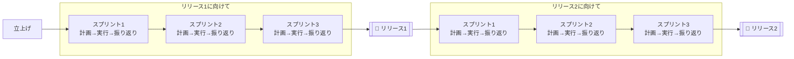
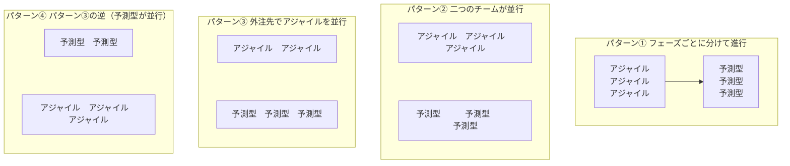
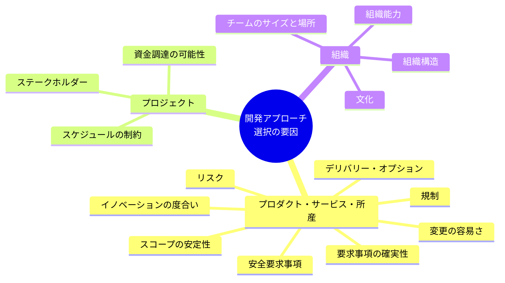
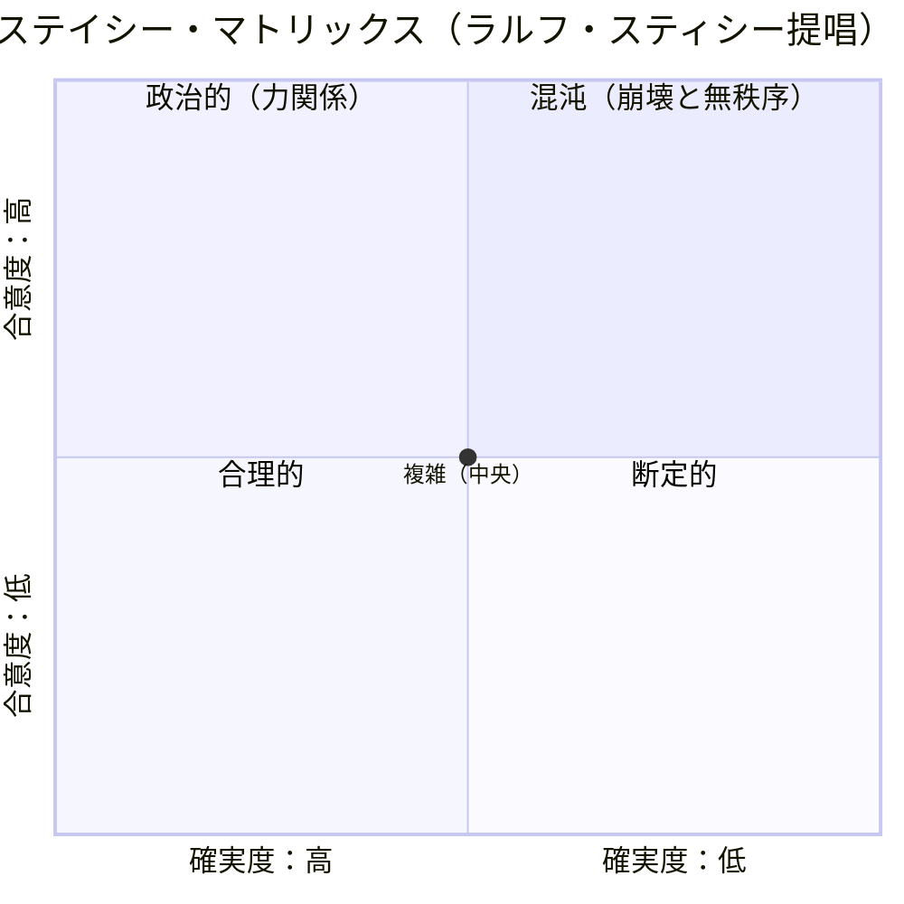
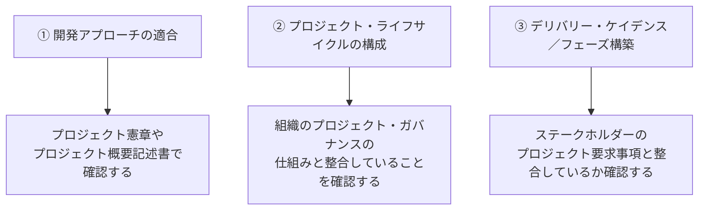
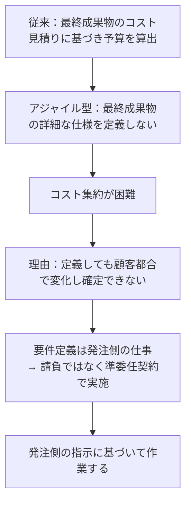

# 第4章 開発アプローチとライフサイクル・パフォーマンス領域

> PMBOK®ガイド 第7版「8つの活動領域の勘どころ① 開発アプローチ・パフォーマンス領域」のまとめ

---

## 4-1 領域の概要と活動の目的

この節では、**開発アプローチ**と**ライフサイクル・パフォーマンス領域**の概要と、その活動の目的を説明します。

この領域では、プロジェクトの成果を最適化するために必要な、**開発アプローチ**、**デリバリーのケイデンス**、**プロジェクト・ライフサイクル**を確立します。要するに「プロジェクトの進め方を決める」ことです。

### 📌 期待される成果

| # | 期待される成果 | 補足 |
|---|---|---|
| ① | プロジェクト成果物と合致する**開発アプローチ**であること | プロジェクトの特性や組織環境に則した、予測型・適応型・ハイブリッド型を選択する（テーラリング活動の一部） |
| ② | 事業価値とステークホルダーへの価値を実現する複数の**フェーズで構成されるプロジェクト・ライフサイクル**になっていること | 予測型に代表される複数フェーズとガバナンスの仕組み（例：ゲート・レビュー）を構築する |
| ③ | **デリバリー・ケイデンス**と開発アプローチを促進する**プロジェクト・ライフサイクルのフェーズ**が構築されていること | 適応型のライフサイクルもフェーズで表現可能。フェーズを繰り返す際のケイデンス（リズム・テンポ）はステークホルダーが望むデリバリー頻度・速さに見合う必要がある |

> 💡 **ケイデンスとは？**
> リズムやテンポのことで、音楽用語「カデンツ」の英語読み。ここでの「デリバリー」は納品を含む広い意味を持つ。
>
> 適応型では、予測型のように最終成果物を一回納品して終結するのではなく、**小さな機能やフィーチャーに分割して少しずつ創っては納品するフェーズを反復**する。顧客は最終成果物を待たずに分割納品された成果物をすぐビジネスに適用でき、事業価値を早期に獲得できる。

---

### 🔁 開発アプローチの例（図4-1：スクラムのライフサイクル例）

最初にリリース（納品）のケイデンスを決め、ひとつのリリースの中で反復（スプリント）が3回実行される計画。契約によっては、計画したリリース以前にも一部納品され、バックログが減っていく（＝**反復型**といわれる適応型のひとつ）。

バックログ量は顧客要求により変動しつつも、リリースを重ねるたびに全体としては減っていくイメージ。

---

### 🧩 漸進型の例（図4-2）

適応型にはさらに**漸進型**が含まれる。「構築」の部分で機能やフィーチャーを増分として追加していく。

---

### 🔀 ハイブリッド型の例（図4-3）

予測型と適応型を組み合わせて進める方法で、さまざまな組み合わせがある。

- **パターン①**：フェーズごとに分けて（直列で）進める
- **パターン②**：2つのチームが並行して進める
- **パターン③**：外注先でアジャイルを並行させる
- **パターン④**：パターン③の逆の組み合わせ

---

### ⚖️ 検討しなくてはならない主な要因

開発アプローチを選択する際に検討すべき主な要因は、以下の **3カテゴリー** です。

#### 🛠 プロダクト、サービス、または所産

| 要因 | 予測型が向くケース | 適応型が向くケース |
|---|---|---|
| ①イノベーションの度合い | 過去に実績があり仕様が事前決定可能 | － |
| ②要求事項の確実性 | 要求事項が明確 | 変更要求が多く想定される |
| ③スコープの安定性 | 要求事項と同様（安定） | 要求事項と同様（変動） |
| ④変更の容易さ | 変更可能性が低い（例：ハードウエア） | － |
| ⑤デリバリー・オプション | － | 部分的な納品が求められる |
| ⑥リスク | リスクが大きく綿密な計画が必要 | － |
| ⑦安全要求事項 | 厳格な安全要求がある | － |
| ⑧規制 | プロセスや報告書などの詳細が求められる | － |

#### 📁 プロジェクト

| 要因 | 内容 |
|---|---|
| ①ステークホルダー | 適応型では顧客をはじめとするステークホルダーの積極的な関与が必要でワークロードが増える。日本の請負型契約のような「任せる」慣行では適応型は不向き。適応型には**共に働くコラボレーションの文化**が必要 |
| ②スケジュールの制約 | 納期が厳格 → 予測型向き／部分納品可 → 適応型向き（ただしプロジェクト全体の終結日は事前に決められない） |
| ③資金調達の可能性 | まとまった資金調達が事前にできない場合は適応型向き（予算が無くなった時点で終結） |

#### 🏢 組織

| 要因 | 内容 |
|---|---|
| ①組織構造 | 多重階層・厳格な報告が求められる組織 → 予測型向き／適応型にはエンパワーメントされ自己組織化されたチームが必要 |
| ②文化 | 管理・指示に基づく組織 → 予測型向き |
| ③組織能力 | 適応型は組織改革・新しいリーダーシップへの挑戦とも言われ、自律型・自己組織化されたチームが必要 |
| ④チームのサイズと場所 | 適応型は自己組織化を求めて効率よく働くため、**チームあたり7人±2人**が適切とされる（理論値ではなく経験と実験に基づく値）。コロケーションが基本だが、リモートの場合はコミュニケーション手法に注意が必要 |

---

## 4-2 活動のためのツールと技法

この節では、開発アプローチとライフサイクル・パフォーマンス領域における活動でよく使われるツールと技法を紹介します。

### 📊 よく使われるモデル：ステイシー・マトリックス（図4-4）

この領域でよく使われるモデルには、**カネヴィン・フレームワーク**と**ステイシー・マトリックス**があります（カネヴィン・フレームワークは第7版本編の説明で十分なため、ここではステイシー・マトリックスを解説）。

- **縦軸（合意度）**：要求事項の確かさ。下端が最も高い（＝要求事項が確実）
- **横軸（確実度）**：成果物作成に関わる技術的な確実度。左端が最も高い

| 領域 | 特徴 | 向いている開発アプローチ |
|---|---|---|
| 左下（合理的・断定的） | 要求事項も技術も確実性が高い | **予測型** |
| 左上（政治的） | 技術的確実度は高いが合意度が低い（力関係） | 予測型 |
| 中央（複雑） | 適度な不確実性 | **適応型** |
| 右上（混沌：カオス） | 合意も技術も不確実 | プロジェクトを始めるべきではない |

> 💡 要するに「なんでも予測型」でも「なんでも適応型」でもなく、**特性や状況に適した開発アプローチを採用すべき**、というのがこのマトリックスの主張です。

---

### 🧰 他のツールと技法

- **ビジネス・ケース**：プロジェクト立上げ時に参照すべき情報。回収期間や正味現在価値が記述されており、プロジェクト・マネジャーは投資計画を理解した上で計画を立てる必要がある。
- **タイムボックス**：適応型のスケジューリング時に重要な概念。さまざまな活動を一定の時間枠に固定する手法。

#### スクラムにおけるタイムボックスの例

```mermaid
gantt
    dateFormat  X
    axisFormat %s
    title タイムボックスの例（スプリント＝4週間の場合）
    section スプリント
    スプリント（1〜4週間・変更可） :0, 10
    section 会議体
    日々のスタンドアップ会議（15分） :0, 1
    スプリント計画会議（8時間） :1, 2
    スプリント・レビュー会議（4時間） :2, 3
    レトロスペクティブ・スプリント会議（4時間） :3, 4
```

| 会議・活動 | タイムボックス |
|---|---|
| スプリント（反復開発の単位） | 1〜4週間（変更の可能性あり） |
| 日々のスタンドアップ会議 | 15分 |
| スプリント計画会議 | 8時間（スプリント＝4週間の場合） |
| スプリント・レビュー会議 | 4時間（スプリント＝4週間の場合） |
| レトロスペクティブ・スプリント会議 | 4時間（スプリント＝4週間の場合） |

---

## 4-3 活動結果の評価

この節では、開発アプローチとライフサイクル・パフォーマンス領域の活動をどう評価するかについて説明します。

### ✅ 期待される成果の確認

最初に提示したこの領域の成果を再確認します。

1. プロジェクト成果物と合致する開発アプローチであること
2. プロジェクトの最初から最後まで、事業価値とステークホルダーへの価値を実現する複数のフェーズで構成されるプロジェクト・ライフサイクルになっていること
3. プロジェクト成果物の作成に必要な、デリバリー・ケイデンスと開発アプローチを促進するプロジェクト・ライフサイクルのフェーズが構築されていること

### 🔍 成果についてのチェック方法

この領域の活動の結果、上記3項目が達成できたかどうかを確認します。第7版本編のチェック方法の例はかなり概念的なため、実施するプロジェクトに合わせたチェック項目を考案する必要があります。**PMO（Project Management Office）**などの支援部門を含む有識者にチェックを依頼するのも良い方法です。

上記3項目に対応するチェック例：

> 📝 ぜひ読者の担当するプロジェクトやビジネス環境に基づいて、適切なチェック方法を考案してください。

---

## 💬 COLUMN：アジャイルが広まらないのは？

アジャイル手法が日本発の考え方であるにもかかわらず広まらないのには、いくつかの理由があります。その中で最も大きな理由は**「予算化できない」**ことでしょう。

- 見積りとは本来「将来これくらいの費用がかかるだろう」という**推測**にすぎない。
- 契約金額として約束していても、真の値はやってみなければわからない ＝「正確な見積り」というものはあり得ない。
- ならば当初に確定させず、**進めながら決めていけばよい** → これがアジャイルの考え方（＝**段階的詳細化**）。
- 最終的に投資する金額の上限（投資計画）だけは事前に決めておく必要があり、そのためには**しっかりしたビジネス・ケースの作成**が重要になる。
- 逆に言えば、ビジネス・ケースを作成していないことこそが、アジャイル手法が広まらない阻害要因なのかもしれません。

---

*出典：PMBOK®ガイド 第7版 関連書籍「第4章 8つの活動領域の勘どころ① 開発アプローチ・パフォーマンス領域」（p.58〜p.66）よりまとめ*
