# 第7章 計画パフォーマンス領域

> PMBOK®ガイド 第7版 関連書籍「8つの活動領域の勘どころ④ 計画パフォーマンス領域」（p.96〜p.118）のまとめ

---

## 7-1 領域の概要と活動の目的

この節では、**計画パフォーマンス領域**の概要と、その活動の目的を説明します。

> 💡 **計画とは目標への道筋を作ることです。**

### 📌 期待される効果

この領域は、初期・継続中・進化中のプロジェクト組織に関連した活動であり、プロジェクトの成果物や成果を提供するために必要となる**計画と調整**を扱います。

| 期待される効果 | チェックの視点（例） |
|---|---|
| プロジェクトは、組織化され、調整され、計画的に進む | 予測型の特徴のひとつとして、計画通りに進捗している |
| プロジェクトの成果を提供するための総合的なアプローチがある | 知識エリアに基づくマネジメント手法が確立されている |
| プロジェクトの進展に伴い、実施目的である成果物や成果を生み出すために情報は詳細化される | 段階的詳細化が適切に実施されている |
| この状況に見合うだけの時間を計画に費やす | プロジェクトの規模に見合った計画時間である |
| 計画は、ステークホルダーの期待をマネジメントするのに十分である | 適切なステークホルダー・エンゲージメントとコミュニケーション計画がある |
| 新たなニーズ、あるいはニーズや状況の変化に基づいて、プロジェクト期間を通じて計画を適合させるプロセスがある | 予測型では変更マネジメント計画が実行されている／適応型ではバックログについて適切にマネジメントされている |

---

### 🗂 計画の概要

計画の目的は、**プロジェクト成果物を作成するための手法を事前に決めること**であり、**進捗の評価のための基準を事前に決めること**です。

そのために、ビジョン記述書・プロジェクト憲章・ビジネス・ケースなどの初期のプロジェクト文書を**段階的に詳細化**し、成果を達成するための調整された道筋を明らかにし、計画書にまとめます。

- プロジェクトの計画へ費やす時間は、状況によって決まる
- 「大は小を兼ねる」とばかりに大規模プロジェクトのやり方を小規模プロジェクトの計画へ反映させるのは**無駄**
- 規模に関わらず考慮すべきことは、初期の計画において、**財務的な影響**に加え**社会的影響**や**環境への影響**（＝**トリプル・ボトムライン**）を採り入れること
  - 例：プロダクト、プロセス、システムが環境へ及ぼす潜在的な影響を評価する**プロダクト・ライフサイクル・アセスメント**が必要
  - プロダクトやプロセスの設計に情報を提供する際、持続可能性・有害性・環境に関する原材料やプロセスの影響を考慮する

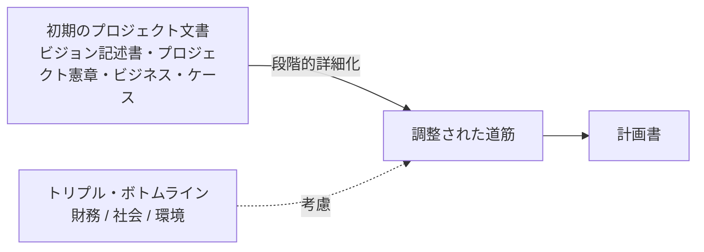

---

### 🎛 計画変数

ひとつとして同じプロジェクトはないので、計画の**量・タイミング・頻度**もそれぞれ異なります。計画を立てるときの主なパラメーターは次のとおりです。

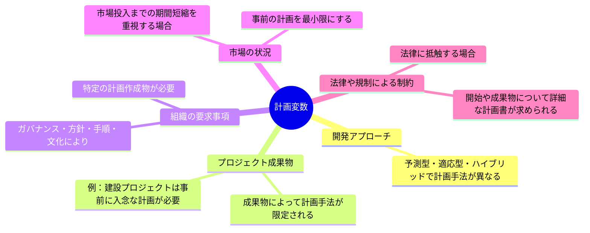

---

### 🧱 計画の主な要素

計画の主な要素である、**デリバリー・見積り・スケジュール・予算**について説明します（本まとめでは前半にあたる「デリバリー」「見積り」「スケジュール」までを扱います）。

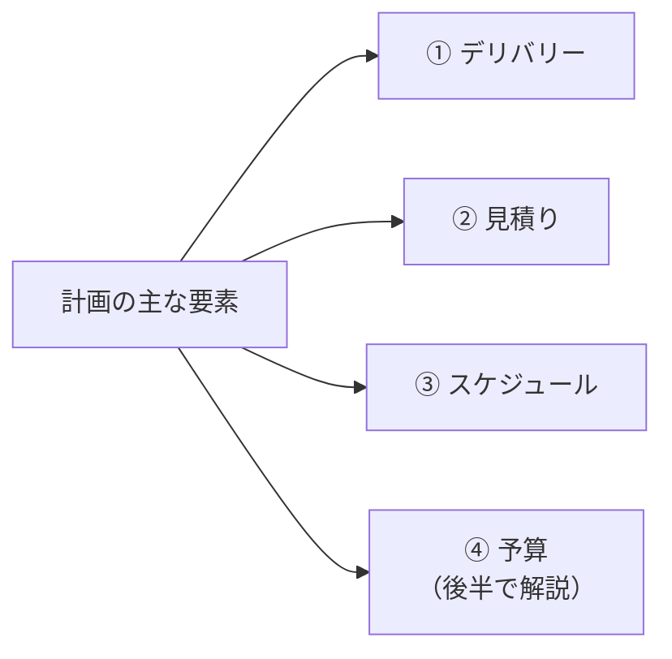

---

#### 1. デリバリー

計画は、**ビジネス・ケース**、**ステークホルダーの要求事項**、**プロジェクトとプロダクトのスコープ**を理解することから始まります。

| 開発アプローチ | 内容 |
|---|---|
| ①予測型 | 事前のプロジェクト成果物の概要レベルから始めて、より詳細へと要素分解する。一般に**WBS（Work Breakdown Structure）**を作成する |
| ②反復型や漸進型 | 概要のテーマやエピックを**フィーチャー**へ要素分解し、さらに**ユーザー・ストーリー**などのバックログ項目に分解する |
| ③優先順位 | 多額の投資が行われる前に、独自性・重要性・リスク・新規性のある作業を優先的に行うように設定する |

```mermaid
flowchart TD
    subgraph 予測型
        direction TB
        W1[プロジェクト成果物<br/>概要レベル] --> W2[要素分解] --> W3[WBS]
    end
    subgraph 反復型・漸進型
        direction TB
        Ep[テーマ/エピック] --> Fe[フィーチャー] --> US[ユーザー・ストーリー<br/>バックログ項目]
    end
```

---

#### 2. 見積り

**見積り**とは、プロジェクトのコスト、資源、作業工数、所要期間などの変数の予測される数値や成果を定量的に査定することです。

- 具体的には、作業工数・所要期間・コスト・人員・物的資源などがある
- プロジェクトの進展に伴い、現在の情報や状況に基づき見積りが変更されることがある
- 見積りは「**推測**」とも言われる（将来のある時点で消費される時間や予算を推定するもの）
- 日本のビジネス慣行では、この推定が「**確定見積り**」として約束事になっているのが特徴

> プロジェクトの進捗は、見積りに関する次の**4つの項目**（振れ幅・正確さ・精密さ・信頼度）に影響を及ぼします。

##### ① 振れ幅（図7-1：コスト見積りの振れ幅）

情報が少ないプロジェクトの開始時には、見積りの振れ幅が広くなる傾向があります。図7-1は有名な**バリー・W・ベームのコスト見積りの図**で、プロジェクトの進捗に連れて振れ幅が少なくなっていく様子を表しています。

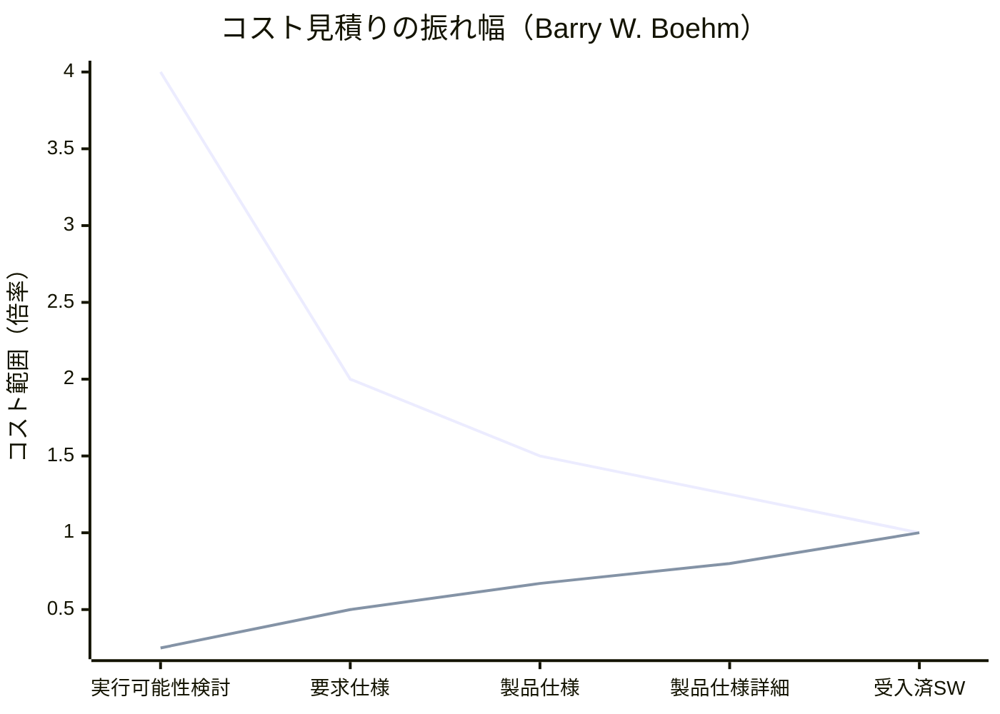

- 縦軸：コスト範囲（0.25X〜4X）
- 横軸：フェーズの進行（実行可能性検討 → 要求仕様 → 製品仕様 → 製品仕様詳細 → 受入済SW）
- フェーズが進むほど上下の線が収束し、見積りの精度が高まる

##### ② 正確さ

正確さとは見積りの**正しさ**で、正確さが低いほど取りうる値の幅が大きいことを意味します。プロジェクト開始時の見積りは、途中で作成された見積りよりも正確さが低いとも言えます。

##### ③ 精密さ

見積りに関連する**厳密さの度合い**のこと。「今週中に」よりも「2日間」の見積りのほうが精密。

> 📌 **図7-2：正確さが低く精密さが高い例**（出典：PMBOKガイド）
>
> 的の中心から離れた一箇所に矢が密集して刺さっているイメージ。矢（見積り結果）は互いに近い場所に集まっている＝**精密**だが、的の中心（真の値）からは外れている＝**正確ではない**。「精密＝ばらつきが小さい」と「正確＝真の値に近い」は別の概念であることを示す図。

##### ④ 信頼度

過去の類似プロジェクトでの作業経験は、信頼度に役立ちます。新しい技術要素では、見積りへの信頼度は低くなります。

##### ⑤ その他の見積り要素

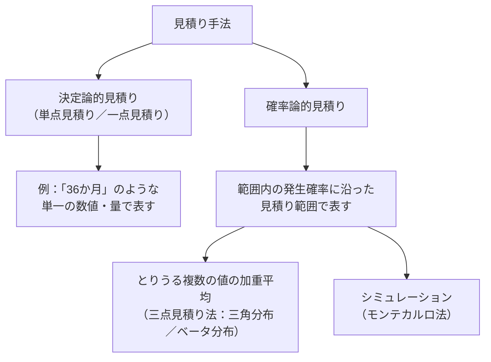

**三点見積り法（図7-3）**：楽観値・最頻値・悲観値の3点から期待値を算出する。

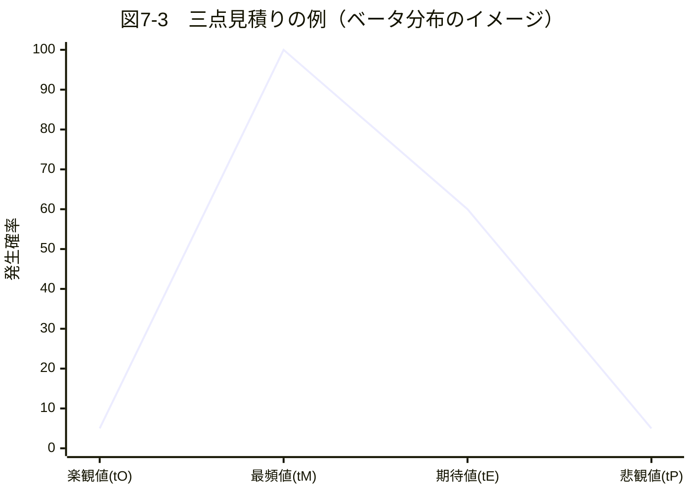

| 計算式 | 内容 |
|---|---|
| ベータ分布による期待値 ＝（楽観値 ＋ 最頻値×4 ＋ 悲観値）÷ 6 | 三角分布より精度が高いと言われる |
| 三角分布による期待値 ＝（楽観値 ＋ 最頻値 ＋ 悲観値）÷ 3 | シンプルな平均による算出 |

**絶対的見積りと相対的見積り**

| 種類 | 内容 |
|---|---|
| 絶対的見積り | 特定の情報であり、実際の数値で表す |
| 相対的見積り | 他の見積りと比較した表示であり、特定のコンテキスト内でだけ意味を持つ |

- 適応型で使われる**ユーザー・ストーリー**にポイントを付与する場合には相対的な数値を割り当てる
- ツールの例：**プランニング・ポーカー**（図7-4／トランプ・カード形状のツール）
  - 対象とするユーザー・ストーリーを調べ、最も小さいものを1点として他のストーリーには比較した数値を適用する
  - 数値には**フィボナッチ数列**が使われ、64種類のストーリー・ポイントが割り当てられる
  - 新しく追加されたストーリーの見積りには、前回の作業に割り当てられたポイントと比較した数値を割り当てる

**フローベースの見積り**

サイクル・タイムとスループットを決定して見積もる手法。

| 用語 | 内容 |
|---|---|
| サイクル・タイム | 1ユニットが、あるプロセスを通過するまでにかかった合計経過時間 |
| スループット | 特定の時間内にプロセスを完了できる品目数 |

この2つの数値から、指定された作業量の残作業見積りを行う。

**不確かさの予測の調整**

見積りは本質的に不確かなので、**リスクとしてマネジメントする必要**がある。見積りの振れ幅分のリスク対策を追加することが望ましい。

---

#### 3. スケジュール

スケジュールは、所要期間、依存関係、その他の計画情報など、プロジェクトの活動を実行するための**モデル**です。予測型でも適応型でもスケジュール計画を策定します。

##### ①予測型における段階的なスケジューリング・プロセス


##### ②順序設定：プレシデンス・ダイアグラム法

アクティビティ間の論理的な順序設定技法で、4つの関係を図7-5のように表現します。論理的順序関係をすべてのアクティビティに適用してネットワーク図（図7-6：プレシデンス・ダイアグラム／先行図）を描きます。これに所要期間などの情報を追加すれば「**クリティカル・パス**」が算出され明確になります。

> クリティカル・パスはプロジェクト全体のスケジュール・ボトルネックを表し、プロジェクトの総作業期間を決めます。ステークホルダーが希望するデリバリーにそぐわない場合には、何らかの短縮技法が必要になります。

**図7-5　論理的順序関係**

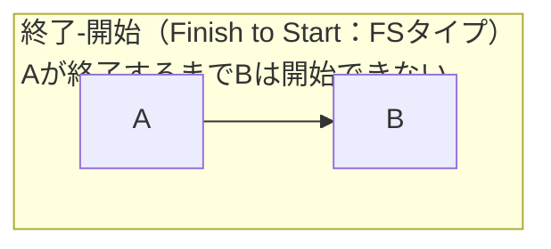

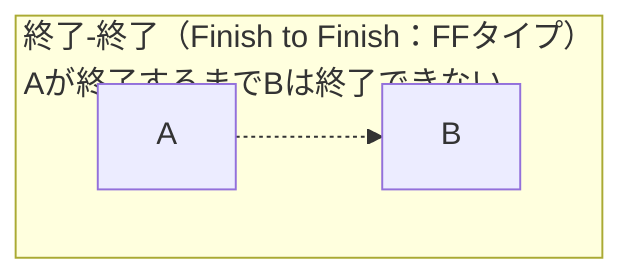

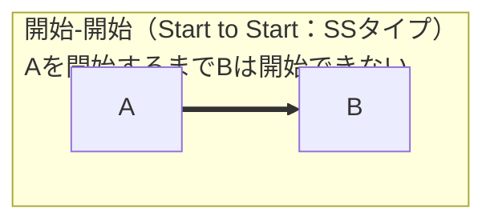

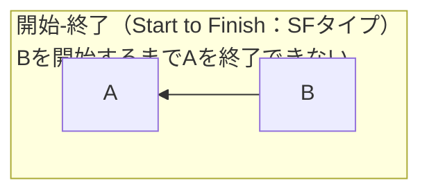

**図7-6　ネットワーク図の例**

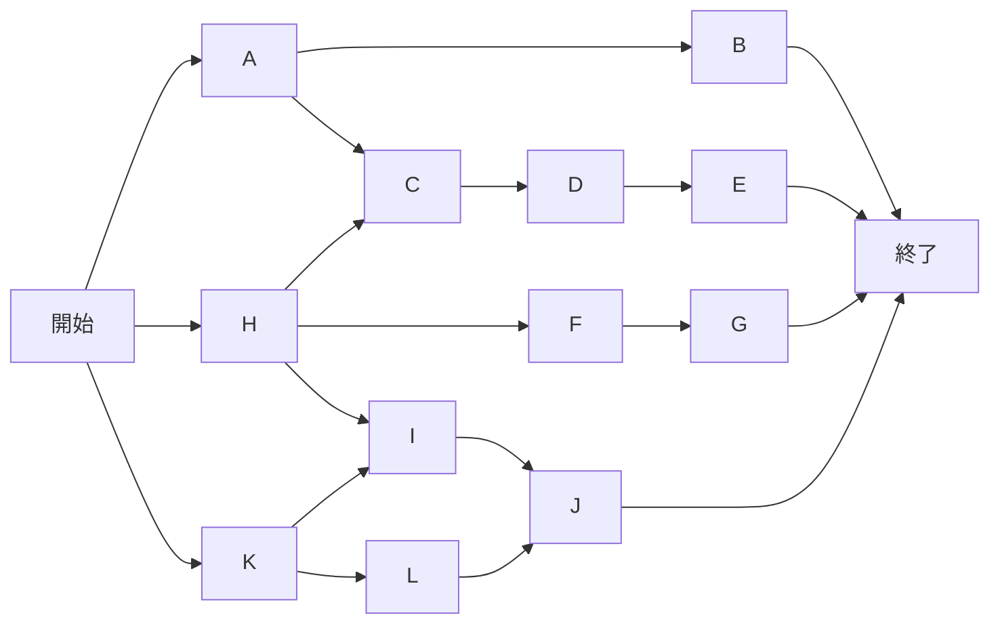
*(A〜L：アクティビティ)*

##### ③短縮技法

スコープを削減せずにスケジュールを短縮する技法には、次の2つがあります。

| 技法 | 内容 | 留意点 |
|---|---|---|
| **クラッシング** | クリティカル・アクティビティ（クリティカル・パス上のアクティビティ）に最小資源追加で期間を短縮する（例：人員追加、残業、デリバリー迅速化のための追加支払い） | 予算に関するリスクを考慮する必要がある |
| **ファスト・トラッキング** | 通常は順番に実施されるアクティビティやタスクを所要期間の一部で並行して実行する | 作業順序の変更になるため、資源の可用性・作業や成果物の品質等についてのリスクを考慮する必要がある |

**リードとラグ（図7-7）**：スケジュール・ネットワーク・パス（経路）に沿って、リードやラグを適用することで最適化を図る。

例：A(10) は、アクティビティAの所要期間が10日であることを示す。

| 表記 | 意味 |
|---|---|
| FS − 5 | Aの終了予定の5日前にBを始める（＝**リード**） |
| FS ＋ 5 | Aの終了後5日後にBを開始する（＝**ラグ**） |

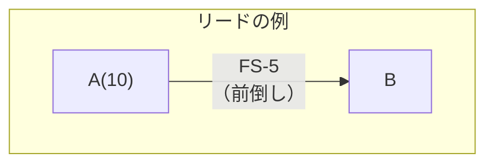

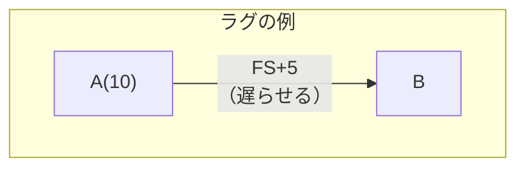

| 用語 | 内容 |
|---|---|
| **リード** | 先行アクティビティが終了する前に後続アクティビティを開始するなど、後続アクティビティの作業を前倒ししている部分。手戻りリスクが考えられるためリスク対策が必要 |
| **ラグ** | 後続アクティビティを意図をもって遅らせることで、先行アクティビティの終了後の一定時間経過後に後続アクティビティを開始させるようにスケジュールする（例：土壌が固まるまでの時間、ペンキが乾くまでの時間） |

> 💡 リードを活用し、ラグは最小にすることが望ましいとされます。

##### ④依存関係

スケジュールを短縮するときは、アクティビティ間の依存関係の性質を判断することが重要です。依存関係には次の4種類があります。

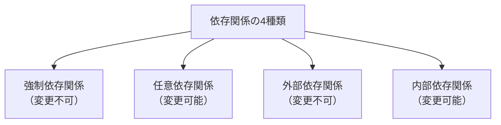

| 種類 | 内容 | 変更可否 |
|---|---|---|
| 強制依存関係 | 契約で要求されていたり、作業の性質上必然的に存在する関係（例：土台を作らない限り上物は作れない） | 通常変更不可 |
| 任意依存関係 | ベストプラクティスまたはプロジェクトの選好に基づいた関係 | 自由に変更できる（※変更するとクリティカル・パスが変わる可能性に注意） |
| 外部依存関係 | プロジェクト・アクティビティと非プロジェクト・アクティビティとの関係（例：ハードウエア入手まで総合テストが実施できない） | 通常変更不可 |
| 内部依存関係 | プロジェクト内部の都合による関係（例：複数作業を兼任する場合の「同時実行不可」の制約） | 変更できる |

##### ⑤暫定スケジュール

一旦スケジュールができあがっても、スコープや予算との調整が必要になるので、それまでは**暫定スケジュール**とします。スコープ・予算・スケジュールの3つが確定した時点で、それら3つを**ベースライン**（総称して**パフォーマンス測定ベースライン**）と呼び、管理基準とします。

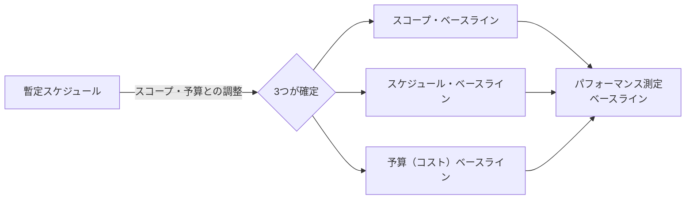

##### ⑥適応型におけるスケジューリング（「スクラム」の例）

**リリース計画**
基本的なフィーチャーと機能のデリバリー計画で、一回のリリースの期間は顧客のビジネス・ニーズに基づいて設定される。各リリースには複数のイテレーション（スプリント）が設定され、イテレーションごとに事業価値やステークホルダーへの価値を創出する。

**スプリント計画**
一回のスプリントの期間は、考え方としてWBSのワークパッケージの管理サイクルに相当する。通常4週間で設定し、ユーザー・ストーリーの追加頻度や変更要求の頻度が多くなることが見込まれる場合には短く設定する。

**タイムボックス**
一回のスプリントには「計画と見積り」「実行」「レビューと振り返り」が必ず設定される。これらの所要期間は固定されて「**タイムボックス**」と呼ばれる。

> 📐 **4週間スプリントの正味作業時間の計算例**
>
> | 項目 | 計算 | 結果 |
> |---|---|---|
> | スプリント全体 | 4週間 ＝ 20日 | 20日 |
> | 計画と見積り | 初日8時間 | −1日相当 |
> | レビュー | 最終日午前4時間 | −0.5日相当 |
> | 振り返り | 最終日午後4時間 | −0.5日相当 |
> | 「計画と見積り」＋「レビューと振り返り」 | 合計 | 2日間 |
> | 実行に使える日数 | 20日 − 2日 | **18日間** |
> | 実行の総時間 | 18日 × 8時間 | 144時間 |
> | デイリー・スタンドアップ・ミーティング分を差し引く | 15分 × 18日 ＝ 270分 ＝ 4.5時間 | 144 − 4.5 ≒ **140時間** |
> | オーバーヘッド分30%を考慮 | 140時間 × 70% | ≒ **98時間** |
> | オーバーヘッド分20%の場合 | 140時間 × 80% | ≒ **112時間** |
> | **結論** | | **4週間スプリントの正味作業時間はおよそ100時間** |

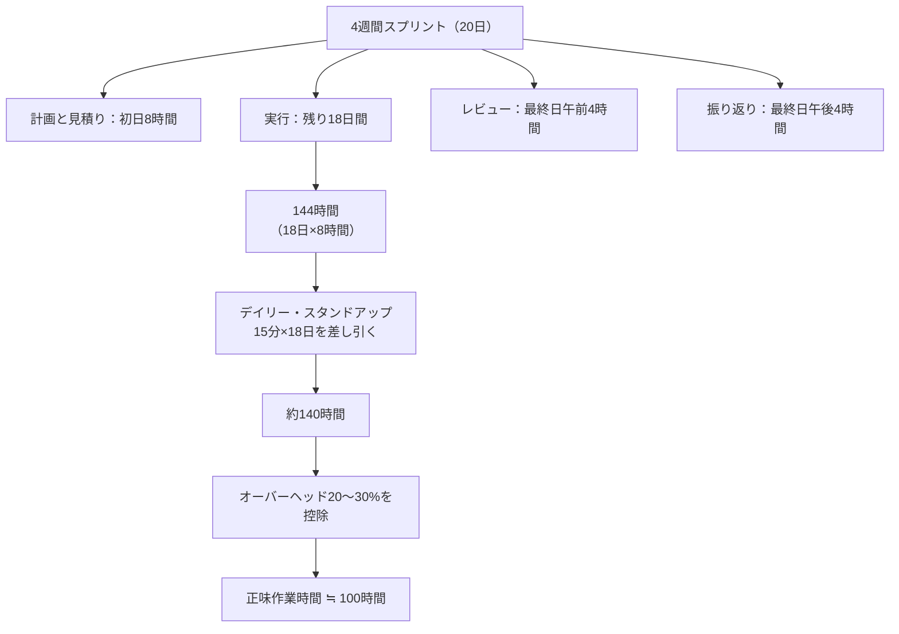

なぜこのような計算をしているのかというと、プロダクト・バックログから優先順位に従って引き抜いた複数のユーザー・ストーリーを完成させるためのタスクの作業時間見積りから、どのユーザー・ストーリーを完了できるのかについて分析し、**プロダクト・オーナーにコミットするため**です。コミットしたユーザー・ストーリーを**スプリント・バックログ**とします。

- ひとつのユーザー・ストーリーの規模が大きすぎて一回のスプリントに収まらない場合には、そのユーザー・ストーリーをさらに細かく分解する
- タスクの所要期間見積りを行うのは、実際に作業を担当するメンバー自身
- 実際には「計画と見積り」の中で、チーム内で作業時間見積りを行って、担当するメンバーの力量に合わせて確定する

> 📝 この様子は次の図7-8に示されています。

### 図7-8　リリース計画とスプリント計画

リリース計画（3ヶ月ごとにリリース1・2・3）の中に複数のイテレーション（＝スプリント／4週間）が設定され、各イテレーションは優先順位付きフィーチャー（あるいはユーザー・ストーリー）に分解され、さらにスプリント計画の中でタスクへとブレークダウンされ、時間見積りが行われる。

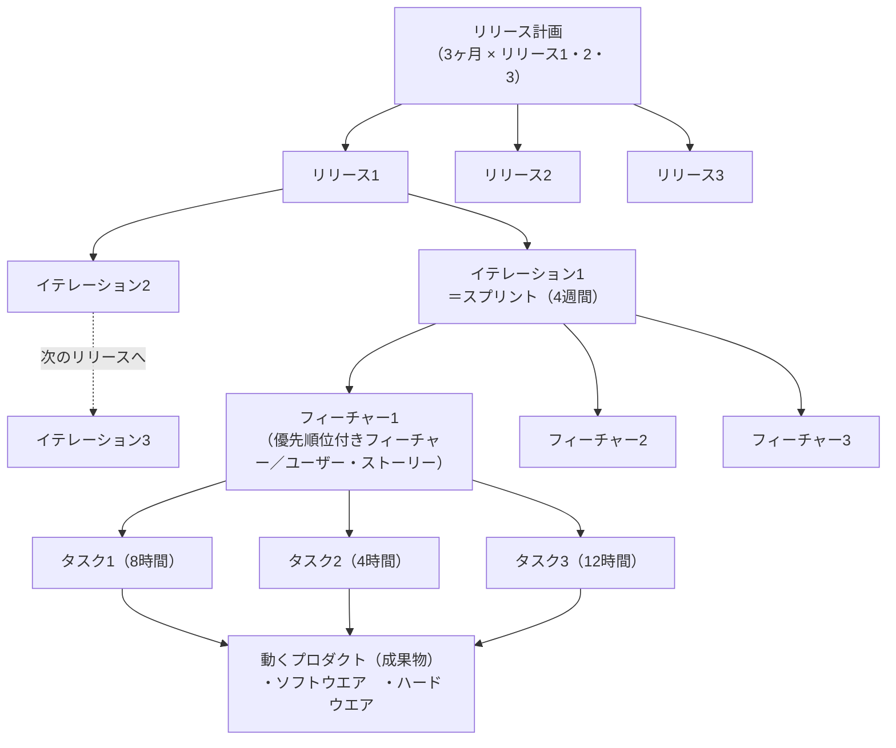

コミットしても完成できなかったユーザー・ストーリーは、当然、最終日のレビューには間に合いません。レビューはあくまで**完了したユーザー・ストーリー**を対象としているので、できあがった分だけのレビューを行います。


---

### ⑦ 作業工数と所要期間の関係

スケジュールを調整する場合に、**クラッシング**を採用して期間短縮を図ることがありますが、対象となる作業の特性によって効果が違います。

| 作業の種類 | 内容 |
|---|---|
| **可変時間作業** | 人員を追加することで期間を短縮可能な作業。この手法が機能する程度には限界があり、それを超えると人員の追加がかえって期間延長につながることがある |
| **固定時間作業** | 人員を追加しても期間短縮ができない作業（例：テストの実行、従業員トレーニングなど） |

いずれにしても、人員の追加による所要期間の短縮量を判断するための決まった公式はありません。

> 📖 **ブルックスの法則**
> フレデリック・ブルックスが1975年に発刊した『The Mythical Man-Month（邦題：人月の神話）』によると、**「遅れているソフトウェア・プロジェクトへの要員追加は、プロジェクトをさらに遅らせるだけである」**とあります。これを一般に**ブルックスの法則**と呼びます。

#### 図7-9　プロジェクト遅延対策

```mermaid
flowchart TD
    subgraph PLAN["計画"]
        direction LR
        PA[作業A] --> PB[作業B] --> PC[作業C]
        PC -.-> M(("🔺マイルストーン"))
    end
    subgraph ACTUAL["実績"]
        direction LR
        AA["作業A<br/>（実施済み・遅延発生）"] --> AB["作業B<br/>（残作業期間）"] --> AC["作業C<br/>（残作業期間）"]
    end
    PLAN --> D[差異分析]
    ACTUAL --> D
    D --> T[対策]
    T --> SC[スケジュール・コントロール]
```

レビュー時点で作業Aが予定より遅れていることが判明。バッファーはすでに使い果たしている状況。作業Cをキャンセルしてよければ問題はないが、そうはいかない。「人を入れろ！」と号令がかかることもあるが、PMBOKガイド流に言えば、人・モノ・カネという資源を追加する**「クラッシング」**か、並行作業とする**「ファスト・トラッキング」**が対策として考えられる。正解はなく、作業の特性にもよるので、対策例（ソフトウエア開発の場合）を挙げる。

| 対象 | 対処 |
|---|---|
| **①作業Aへの対処** | 専門家の技術支援および外部阻害要因からの遮断（**サーバント・リーダーシップ**）が必要。単に人員を追加すると、ブルックスの法則どおり遅れが増すだけ |
| **②作業Bへの対処** | Aの終了を待たずに開始するが、Aの作業結果によっては手戻りがあるので慎重に行う。当初の作業期間見積りを長めに変更する。人を追加しようと作業分割しても、その分割作業のために余計な時間がかかるため、時間とのトレードオフを考慮する必要がある |
| **③作業Cへの対処** | 作業分割を行って人員を追加し、Bの終了を待たずに、Bの進捗を見ながら開始する |
| **④全体** | 人員増加ができない状況ならば、スケジュールと資源とのトレードオフを考えざるを得ない。つまり遅れを認めて次善の策を考える |

---

### 4. 予算

予算作成は、見積り情報からコストを見積もり、必要なコストを集約して、さらにコストの発生時期に合わせて時系列に並べて**支出計画**を策定することです。この支出計画に累積値を含めてグラフ化すると、典型的な予測型では「S」のように見えるので**「Sカーブ」**とも言います。

> あまり「S」の形にはなっていませんが、プロジェクトの立上げと計画ではコスト微増、実行段階で増え始め、終結近くで減り始めている様子がわかります。要するに作業員数の増減によって人件費が変化しているのです。

#### 図7-10　コスト・ベースライン

```mermaid
xychart-beta
    title "図7-10　コスト・ベースライン（イメージ）"
    x-axis [1月, 2月, 3月, 4月, 5月, 6月, 7月, 8月, 9月, 10月, 11月, 12月]
    y-axis "累積金額" 0 --> 250
    line [30, 30, 30, 120, 120, 120, 200, 200, 200, 200, 200, 200]
    line [5, 10, 20, 40, 70, 110, 150, 180, 200, 210, 215, 218]
```

- 赤い階段状の線：**資金調達**（承認された資金の段階的な追加）
- 黒いS字カーブ：**コスト・ベースライン**（累積実行コスト）
- グラフ上部の資金調達とコスト・ベースラインの差：**マネジメント予備**

累積値はプロジェクトへの投資額の累積であり、その分の価値創出を期待している、という観点で**出来高の管理基準**となります。つまりコスト・ベースラインが設定されるわけです。

- このベースライン全体を見ながら、特定の予算期間に承認された資金と予定されている作業とのバランスを取る
- 予算期間に資金の制限があるときには、作業スケジュールの変更が必要になることがある（例：期末に予定されている作業に必要な資金が充てられない場合、その作業のスケジュールを変更する＝第6版では**「資金限度額による調整」**と呼ぶ）

コスト・ベースラインには、不確かさに備えて**コンティンジェンシー予備費**を含める必要があります（通常、個別リスクのための引当金の性格）。さらに、スコープ内の作業に関する想定外の作業に備えて**マネジメント予備**を確保しますが、これは**コスト・ベースライン外の予算**で、**プロジェクト・マネジャーの管理範囲ではありません**。プロジェクト進捗中にコスト・ベースラインを超えてしまって容易に戻せないような場合には、スポンサーへエスカレーションして、マネジメント予備からベースラインへの資金追加を申請することができます。

> ⚠️ ちなみに第7版の図（PMBOKガイド第7版P63）は正しくありませんので注意してください。図7-11のコスト構造を参照してください。

#### 図7-11　プロジェクト予算構成

```mermaid
flowchart TD
    Total["プロジェクト総予算"] --> CB["コスト・ベースライン"]
    Total --> MR["マネジメント予備<br/>（PMの管理範囲外）"]
    CB --> WP["ワークパッケージ・コスト見積り"]
    CB --> WPC["ワークパッケージの<br/>コンティンジェンシー予備"]
    WP --> AC["アクティビティ・コスト見積り"]
    WP --> ACC["アクティビティの<br/>コンティンジェンシー予備"]
```

| 階層 | 構成 |
|---|---|
| プロジェクト総予算 | ＝ コスト・ベースライン ＋ マネジメント予備 |
| コスト・ベースライン | ＝ ワークパッケージ・コスト見積り ＋ ワークパッケージのコンティンジェンシー予備 |
| ワークパッケージ・コスト見積り | ＝ アクティビティ・コスト見積り ＋ アクティビティのコンティンジェンシー予備 |

---

### 5. プロジェクト・チームの編成と構造

チームの編成計画は、作業に必要な**スキル・セット**の特定から始まります。重要な要素は、同様プロジェクトでの**熟練度**や**経験年数**です。

- 独自性を考えるとなかなか適切な人が見つからず、組織外からのベンダーに依頼することが往々にしてある → その場合、**コスト・バランス**の検討と、社外への**トレーニング計画**も必要
- 作業場所についても、理想は**同一場所（コロケーション）**
  - 同じ部屋で一緒に活動していると、わざわざミーティング等の時間を取らなくても**「浸透（Osmotic）コミュニケーション」**のメリットを享受できる
  - **浸透コミュニケーションとは**：自分以外の人たちがディスカッションに直接参加していなくても、会話を聴いたり雰囲気を感じたりするときに、自然とコミュニケーションが取れている状態
- いろいろな条件により分散せざるを得ないことがある。在宅勤務などのように物理的に分散しているチームを**バーチャル・チーム**と言う
  - メンバーは異なる都市、タイムゾーン、国に居住していることがあるので、人々をつなぐためにITを活用する必要があり、そのための時間やコストを計画に盛り込むことが大切

> 💡 「バーチャル：Virtual」という用語は一般に「仮想」というように使われますが、辞書には「実際に」とか「事実上」という意味も出ています。ここでは**「離れていても実際にはひとつのチームである」**というように使います。

---

### 6. コミュニケーション

コミュニケーションは、ステークホルダーと効果的に関わる上で**最も重要な要素**です。

- よく失敗プロジェクトの原因を聞くと「コミュニケーションが悪くって…」というコメントが口をつく
- 逆に成功プロジェクトの要因には「コミュニケーションが良かったんです」というコメントが返ってくる
- 特に日本国内のプロジェクトでは、同一民族・同一言語という特性があるので、細かいコミュニケーション計画は不要だった時代があった
- 最近は「言った、言わない」というようなコミュニケーションの問題が顕在化し、訴訟になってしまったケースも
- 昨今は「多様性」を重んじるようになり、コミュニケーション計画の重要性が増してきた

**コミュニケーション計画のポイント**

```mermaid
mindmap
  root((コミュニケーション<br/>計画))
    誰が情報を必要としているのか
    どのような情報を各ステークホルダーが必要とするのか
    なぜステークホルダーと情報を共有する必要があるのか
    情報を提供する最善の方法は何か
    いつ・どのような頻度で情報が必要とされるのか
    誰が必要な情報を持っているのか
```

> これらの問いに答えるように計画を立てるのですが、ほとんどが**「ステークホルダー・エンゲージメント計画」**と重複したり整合をとったりする必要がある項目ばかりです。

**コミュニケーションに使用される情報カテゴリー**

- 内部情報と外部情報
- 機密情報と公開情報
- 一般情報と詳細情報　など

> 機密情報や機微情報の取り扱いには相応の注意や仕組みが必要になります。

---

### 7. 物的資源

物的資源とは、「人」以外の資源であってプロジェクト作業に必要な**「モノ」**のことです（例：資材、機器、ソフトウエア、テスト環境、ライセンスなど）。

- ほとんどの場合は外部から入手する必要がある
- 基本的な発注契約を使う単純なものから、複数の大規模な調達活動のマネジメント・調整・統合といった複雑なものまである
- 資材の配送・移動・保管・廃棄のリード・タイムや、現場への資材到着から完成したプロダクトの納入まで**資材の在庫を追跡する手段**を考慮する必要がある
- 大量の資材が必要な場合は、注文から納入・使用までのタイミングを戦略的に考え計画する必要がある（例：一括注文と保管コストの比較評価、グローバル・ロジスティックス、プロジェクトの継続可能性、残作業を考慮した物的資産のマネジメントなど）

---

### 8. 調達

人的資源にしろ物的資源にしろ、組織外部から獲得しようとする場合には、**調達活動**がプロジェクト中にいつでも行われ終了します。

#### 図7-12　調達活動

```mermaid
flowchart LR
    subgraph Phase["プロジェクト・フェーズ"]
        direction LR
        Kickoff[立上げ] --> Plan[計画] --> Exec[実行] --> Close[終結]
    end
    subgraph ItemA["品目A（早期に開始）"]
        direction LR
        PA1[調達計画] --> PA2[実行] --> PA3[管理]
    end
    subgraph ItemB["品目B（品目Aよりやや遅れて開始）"]
        direction LR
        PB1[調達計画] --> PB2[実行] --> PB3[管理]
    end
```

図7-12では、品目ごとに3つのプロセスがまとまって稼働するように描かれています。それは調達活動の基盤が**「契約」**にあるので、契約ごとのプロセスにならざるを得ないからです。

| プロセス | 内容 |
|---|---|
| 調達計画 | 契約の準備活動 |
| 調達実行 | 契約締結 |
| 調達管理 | 契約に基づく管理活動 |

調達計画では、スコープの概要が明らかになったら**内外製分析**を行って、内製よりも外製の方が良いと判断されたら外注契約のための準備を行います。

---

### 9. 変更

変更は、プロジェクト期間を通じて発生します。原因には、リスク事象の発生、プロジェクト環境の変化、顧客要求、その他さまざまな理由がありますが、**必ずしも変更要求のすべてに対応するわけではありません**。しかしながら正当な理由があれば対応するのは当然です。

そのためにプロジェクト期間を通じて計画を適応させるプロセスを準備する必要があります。

```mermaid
flowchart LR
    A[変更要求の発生<br/>リスク事象・環境変化・顧客要求 等] --> B{正当な理由が<br/>あるか}
    B -->|Yes| C[変更管理プロセス]
    C --> D[バックログの再優先順位付け]
    C --> E[ベースラインの再設定]
    B -->|No| F[対応しない]
```

さらに、契約上の要素を持つプロジェクトは、契約変更のために定められたプロセスに従う必要があります。通常このプロセスは**契約書に明記**します。

---

### 10. メトリックス

計画・デリバリー・測定のパフォーマンス領域は**「メトリックス」**で結ばれています。そこに**「重要なことだけ測定せよ」**というセリフがあります。つまり、何をどのような頻度で測定するかを決めることが大切です。

「メトリックス」を確立する場合には、管理基準の**しきい値**を設定しなければなりません。要するにベースラインからの差異の許容範囲を決めることです。

**スケジュールの例**

> スケジュール・ベースラインのしきい値を±3％に設定したとする。これはスケジュール進捗管理の基準からの逸脱の限界を表す（＝この範囲内での進み・遅れは問題にしない）。そうすると納期というマイルストンに間に合わなくなりそうだが、プロジェクト内部での納期目標をしきい値分早くセットする。例えば100日間のプロジェクトでしきい値を±3％とするなら、3日間前倒しで設定する。その3日は**プロジェクト・バッファー**として機能する。管理サイクルでのレビュー時には、クリティカル・パスの進捗について差異分析を行い、傾向分析の結果とともに対策の元とする。

```mermaid
flowchart LR
    A["100日間のプロジェクト<br/>しきい値 ±3%"] --> B["3日前倒しで<br/>内部納期目標を設定"]
    B --> C["3日間 ＝<br/>プロジェクト・バッファー"]
    C --> D["レビュー時に<br/>クリティカル・パスの差異分析"]
    D --> E[傾向分析・対策]
```

**コストの例**

> コスト・ベースラインの場合は、−5％、＋10％程度に設定することが多い。しきい値が＋5％であることを「予算を5％まで超過してもよい」と考えがちだが誤り。予算額は組織の財務部門や会計部門に届けられて承認されているものなので、通常のコスト管理の中ではその値を超過することは許されない。プロジェクト予算を申請する場合には＋5％の額で申請して、運用はその額をしきい値の上限にすればよい。当然、**アーンド・バリュー法**にも応用でき、傾向分析と合わせることで赤字にする可能性は少なくなる。

- いずれにしてもスケジュールと予算のパフォーマンスに関するメトリックスは、**組織の標準**によって決まる
- プロダクトについてのメトリックスは開発中の成果物に関連するので、スコープ管理として、管理サイクルと整合させたワークパッケージの進捗管理を実行する
- さらに品質のメトリックスを設定すると、スケジュールとコストに影響を与えるため、品質コストを十分に考慮に入れて、テスト計画や検査計画を立てる必要がある

---

### 11. 整合

計画活動と作成物（文書）は、プロジェクト期間を通じて**常に統合**されなければなりません。例えば、メトリックスの項で述べたスコープと品質に関わる文書類は必ず整合していなくてはなりません。プロジェクトのタイプに応じて文書類を追加します。

プロジェクトのベースラインである**プロジェクトマネジメント計画書**は、プロジェクトの進捗にあわせて更新され、他の文書類と整合した上に、常に最新版になっていなければなりません。「計画に沿って活動する」ことを原則にしている予測型では、基本中の基本といえます。このことは**「計画プロセスには終わりがない」**と言われる所以です。

#### 図7-13　プロジェクト計画の整合

```mermaid
flowchart LR
    A["プロジェクトマネジメント<br/>計画書作成"] --> D[定義] --> I[統合] --> App[承認]
    App --> Sub[補助計画書作成]
    Sub --> Exec[実行]
    Exec -->|変更・調整| U["プロジェクトマネジメント<br/>計画書更新版"]
    U -.フィードバック.-> Exec
    Exec --> End[終結]
```

- プロジェクトの作業が、同時にリリースする他のプロジェクトと並行して行われることがある。この場合、プロジェクト作業のタイミングは、関連するプロジェクトの作業や定常業務のニーズに整合させる必要がある
- 大規模プロジェクトでは、プロジェクトマネジメント計画書に多くの文書類を統合するが、小規模プロジェクトでは詳細なプロジェクトマネジメント計画書は非効率になる
- 要するにプロジェクトの特性に見合った計画書の規模にするべき。タイミング、頻度、計画の程度には関係なく、プロジェクト各側面との**整合をとり、統合すること**には変わりない

---

## 活動のためのツールと技法

この領域には数多くのモデルやツールと技法があるので、前項の中で紹介してきましたが、PMBOKガイドに記載のある方法について名称だけを紹介します。

### 図7-14　計画パフォーマンス領域でよく使われる方法

| 分類 | 方法 |
|---|---|
| **データ収集・分析方法** | 代替案分析、前提条件・制約条件分析、ビジネス正当性分析、品質コスト、デシジョン・ツリー分析、アーンド・バリュー分析、期待金額価値、インフルエンス・ダイアグラム、ライフサイクル・アセスメント、内外製分析、発生確率・影響度マトリックス、プロセス分析、回帰分析、感度分析、シミュレーション、ステークホルダー分析、SWOT分析、バリュー・ストリーム・マッピング、What-Ifシナリオ分析 |
| **見積り方法** | 親和性グルーピング、類推見積り、ファンクションポイント、複数点見積り、パラメトリック見積り、相対見積り、単点見積り、ストーリー・ポイント見積り、ワイドバンド・デルファイ |
| **会議とイベントの方法** | バックログの洗練、入札説明会、デイリー・スタンドアップ、イテレーション計画、教訓、計画、リリース計画、レトロスペクティブ |
| **その他** | インパクト・マッピング、タイムボックス |

---

## 7-2 活動結果の評価

この節では、計画パフォーマンス領域の活動をどう評価するかについて説きます。

### ✅ 期待される成果の確認

最初に提示したこの領域の活動に期待される成果を確認してみましょう。

| # | 期待される成果 |
|---|---|
| ① | プロジェクトは、組織化され、調整され、計画的に進む |
| ② | プロジェクトの成果を提供するための総合的なアプローチがある |
| ③ | プロジェクトの進展に伴い、実施目的である成果物と成果を生み出すために、情報は詳細化される |
| ④ | この状況に見合うだけの時間を計画に費やす |
| ⑤ | 計画は、ステークホルダーの期待をマネジメントするのに十分である |
| ⑥ | 新たなニーズ、あるいはニーズや状況の変化に基づいて、プロジェクト期間を通じて計画を適合させるプロセスがある |

### 🔍 成果についてのチェック項目

これら6項目について、具体的な評価の例を挙げてみましょう。

| # | 対応する成果 | 評価の例 |
|---|---|---|
| ① | プロジェクトは組織化され計画的に進む | 予測型プロジェクトでは、計画書に沿って作業し、必要に応じてタイムリーに更新されていることを品質監査やプロジェクト監査にて確認する |
| ② | 成果を提供するための総合的アプローチ | 事業価値実現サイクルのような仕組みがあり、機能している |
| ③ | 情報は詳細化される | 段階的詳細化を示す文書類が構成管理されている |
| ④ | 状況に見合った計画時間 | 初期の計画策定の時間は、予測型の場合、全体の数％以内である。この値は組織の経験に基づいて決める |
| ⑤ | ステークホルダーの期待をマネジメントするのに十分な計画 | 計画内容は、ステークホルダーにとってわかりやすく最小限の量である |
| ⑥ | 計画を適合させるプロセスがある | 予測型では堅牢な変更管理プロセスが構築されている。適応型では、プロダクト・バックログの洗練が継続してなされている |

```mermaid
flowchart TD
    A["① 計画的な進捗"] --> A1["品質監査・プロジェクト監査で<br/>計画書との整合とタイムリーな更新を確認"]
    B["② 総合的アプローチ"] --> B1["事業価値実現サイクルの<br/>仕組みが機能しているか確認"]
    C["③ 情報の詳細化"] --> C1["段階的詳細化を示す<br/>文書類の構成管理を確認"]
    D["④ 計画時間の妥当性"] --> D1["初期計画時間が全体の数%以内か<br/>（組織の経験値に基づく）"]
    E["⑤ 計画の十分性"] --> E1["ステークホルダーにとって<br/>わかりやすく最小限の量か"]
    F["⑥ 適合プロセスの有無"] --> F1["予測型：変更管理プロセスの堅牢性<br/>適応型：バックログ洗練の継続性"]
```

> 📝 これらの項目を参考にして、実際のプロジェクトのためのアイデアを出してください。

---

*出典：PMBOK®ガイド 第7版 関連書籍「第7章 8つの活動領域の勘どころ④ 計画パフォーマンス領域」（p.96〜p.118）よりまとめ*
